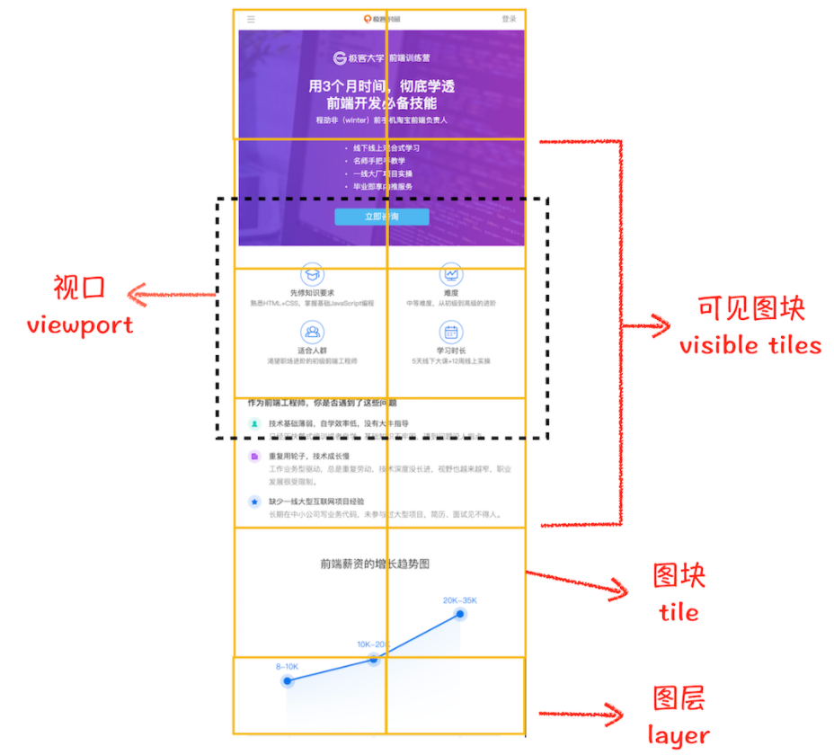
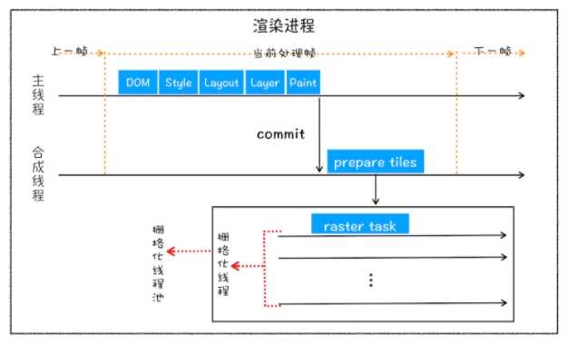
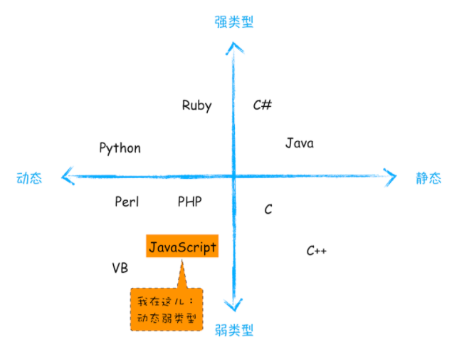

# Browser Tools

## 浏览器的工作原理与前端难题

### 工作经历介绍

我是 2005 年开始工作的，基于对新技术的兴趣与敏感性，2008 年 Chromium 项目一开源，我便第一时间下载体验。随后，在创业阶段的我基于 Chromium 和 IE 发布了一款双核浏览器：太阳花。

这是国内第一款双核浏览器，使用它，除了能享受到 Chrome 的快捷之外，还能兼容只支持 IE 的站点。开发过程中最大的挑战是如何**在 Chromium 中集成 IE 模块**，为此我花了大量时间来研究 Chromium 的进程架构以及渲染流程，好在功夫不负有心人，最终发布的产品也很对得起我的努力，在没有任何宣传的情况下，日活达到了 20 多万。

在 2011 年，我就去了盛大创新院，参与研发 WebOS 项目。WebOS 的愿景是基于 WebKit 内核打造一个能和安卓并存的操作系统。我在团队中负责 HTML5 特性的实现，比如实现 Web Workers、Application Cache、LocalStorage、IndexedDB、CSS3 部分动画效果等。这些工作经历让我对浏览器的整个渲染流程，以及 HTML5 的发展趋势有了更加深入的认知。不过遗憾的是，这个项目没能最终上线。

再之后，我去了顺网科技。顺网科技是一家网吧服务提供商，在顺网我和团队打造了一款给全国网吧使用的“F1 浏览器”，日启量达到 2000 万。由于网吧的电脑环境异常复杂，页面劫持经常发生，所以对页面安全提出来更高的要求；再加上每天千万级别的启动量，所以页面的加载速度和流畅度也至关重要，它们直接决定了用户的流失程度。这段工作经历，让我对浏览器安全有了全新的理解，同时又对页面性能的优化有了系统性的认知。


### 浏览器的发展历史

1995 年，美国网景公司因“网景浏览器”的发布而快速崛起，之后网景试图开发一个依靠浏览器的网络操作系统。这引起了微软的注意和警惕，于是同年微软发布 Windows 95，并捆绑了 IE，大获成功，到 2002 年，微软就已经占据了浏览器市场 80% 的份额。

直到 2008 年 Chrome 浏览器横空出世，这种垄断局面才算被打破。Chrome 浏览器完全颠覆了之前浏览器的架构设计，在速度和安全性上占据了绝对优势，市场份额占比剧增（据 StatCounter 2019 年的统计数据显示，Chrome 占据了 63% 市场份额）。

在 2010 年底，Google 还推出了一款网络操作系统——ChromeOS。

可以看到，浏览器自诞生之日起，其地位就一直很重要，而且这种重要性还在不断加强。我从浏览器的发展历程中梳理出了**三个大的进化路线，希望能让你了解目前的 Web 应用到底能做什么，以及未来能适用于那些新领域**。


#### 应用程序 Web 化

随着云计算的普及和 HTML5 技术的快速发展，越来越多的应用转向了浏览器 / 服务器（B/S）架构，这种改变让浏览器的重要性与日俱增，视频、音频、游戏几大核心场景也都在往 Web 的使用场景切换。


#### Web 应用移动化

对于移动设备应用，Web 天生具有开放的基因，虽然在技术层面还有问题尚待解决（比如，渲染流程过于复杂且性能不及原生应用、离线时用户无法使用、无法接收消息推送、移动端没有一级入口），但 Google 推出了 PWA 方案来整合 Web 和本地程序各自的优势。

顺便说一句，PWA 也是我个人非常期待的方案。


#### Web 操作系统化

在我看来，Web 操作系统有两层含义：一是利用 Web 技术构建一个纯粹的操作系统，如 ChromeOS；二是浏览器的底层结构往操作系统架构方向发展，在整个架构演化的大背景下会牵涉诸多改变，下面列举一些我认为相对重要的改变。

- Chrome 朝着 SOA 的方向演化，未来很多模块都会以服务的形式提供给上层应用使用；
- 在浏览器中引入多种编程语言的支持，比如新支持的 WebAssembly；
- 简化渲染流程，使得渲染过程更加直接高效；
- 加大对系统设备特性的支持；
- 提供对复杂 Web 项目开发的支持。

也就是说，**浏览器已经逐步演化成了操作系统之上的“操作系统”**。


### 学习浏览器工作原理

前面站在大厂的视角，回顾了浏览器的发展历程，梳理了浏览器的进化路线，分析了浏览器发展的大趋势。那接下来，我们再一起看看，开发者为什么需要了解浏览器的工作原理。

#### 评估 Web 开发项目的可行性

随着 Web 特性的极大丰富和浏览器性能的提升，越来越多的项目可以用 Web 来开发。所以，了解浏览器是如何工作的，能够让你更加准确地决策是否可以采用 Web 来开发项目。

举个例子，去年我做了一个健身房虚拟教练项目，时间紧，任务重，其中有大量的高速渲染动画和快速交互的场景需求。如果采用传统的 C++ 来开发界面，那基本上不可能按时交付，而且后期的维护也会非常麻烦。于是我决定采用 Web 方案来开发界面，因为采用 Web 方案可以降低开发成本，缩短交付周期。最终利用这个方案，我实现了这个项目的提前交付，并且效果也很喜人，大家对实现的效果非常满意。

对于这个例子，我认为我所做的最正确的事就是**选对了方案**，但反过来想，如果我对浏览器和 HTML5 的内容不了解，那可能我很容易就放弃了这个最优方案。


#### 更高维度审视页面

作为一名合格的开发者，你还要具备一项重要的技能，那就是：**要能站在用户体验角度来考虑页面性能**。我们看下面几个常见的用户体验指标。

- 当用户请求一个网站时，如果在 1 秒内看不到关键内容，用户会产生任务被中断的感觉。
- 当用户点击某些按钮时，如果 100ms 内无法响应，用户会感受到延迟。
- 如果 Web 中的动画没有达到 60fps，用户会感受到动画的卡顿。

这里的页面加载时长、用户交互反馈时长、Web 动画中的帧数都决定了用户体验的流畅度，并最终决定了用户体验的效果。在用户体验尤其重要的今天，我们必须能够有效地解决这些体验问题，以免给产品造成不可挽回的伤害。

但通常，这些指标是由一系列的复杂因素导致的。如果你要开发流畅的页面，或者诊断 Web 页面中的性能问题，那你就需要了解 URL 是怎么变成页面的，只有弄懂这些之后，你才可以站在全局的角度定位问题或者写出高效的代码。

你当然可以把浏览器看成一个黑盒，左边输入一个 URL，经过黑盒处理之后，右边返回你预期的效果。如果你对黑盒一无所知，你倒依然可以写前端代码，也可以使用很多最佳实践的策略来优化代码，这就如同不了解操作系统的工作原理同样可以在操作系统上写应用一样。

但如果你理解了这个黑盒子是如何工作的，那情况就不同了。你可以站在更高的维度审视你的项目，通过全视野快速定位项目中不合理的地方。比如，首屏的显示就涉及了 DNS、HTTP、DOM 解析、CSS 阻塞、JavaScript 阻塞等技术因素，其中一项没处理好就可能导致整个页面的延时。

而如果你了解了浏览器的工作原理，更加可以把这些知识点串成线，连成网，最终形成自己的知识体系，练就像专家一样思考问题、解决问题的能力。


#### 把握技术的本质

从 2011 年到现在，前端技术出现了大爆炸式增长，各种新技术层出不穷。我认为**Node.js 是前端发展的一个核心推动力**。Node.js 是基于 Chrome 的 JavaScript 引擎 V8 来实现的，它的特点是可以脱离浏览器环境来执行 JavaScript，于是大家惊讶地发现，原来也可以使用 JavaScript 写服务器程序呀！

尽管 Node.js 的诞生时间不长，但其周边已经形成了一个庞大的生态系统。与此同时，各种新标准、新技术纷至沓来，前端生态空前繁荣。

为什么 Node.js 能如此快速地发展？根本原因还是浏览器功能以及整个前端的开发环境，不足以支撑日益增长的需求，所以“变化”是这段时期的主旋律。这种变化直接扩大了前端工程师的知识半径，**这也导致很多前端开发工程师变成了爆栈工程师**。

虽然前端技术变化快，不过我觉得这里有更大的机遇，谁能快速抓住变化，谁就能收获这波变化带来的红利。

我相信，随着脚本执行效率的提高、页面渲染性能的提升和开发工具链的完善，接下来的前端会进入一个相对平稳的阶段。通俗地理解就是：**等到核心技术足以支撑核心需求，那么前端生态会进入一个相对稳定的状态**。

如果了解了浏览器的工作机制，那么你可以梳理出来前端技术的发展脉络，更加深刻地理解当前的技术，同时你也会清楚其不足之处，以及演化方向。那么接下来，我们看看前端技术是如何针对这些核心诉求做演进的？


##### 脚本执行速度问题

比如针对 JavaScript 设计缺陷和执行效率的问题，可以从以下两个途径去解决：

- 不断修订和更新语言本身，这样你就应该知道 ES6、ES7、ES8，或者 TypeScript 出现的必要性。这种修订对目前生态环境的改动是最小的，所以推行起来会比较容易。
- 颠覆性地使用新的语言，这就是 WebAssembly 出现的原因。WebAssembly 需要经过编译器编译，所以体积小、执行速度快，使用它能大幅提升语言的执行效率，但是语言本身的完善，和生态的构建都是需要花很长时间来打造的。


##### 前端模块化开发

比如，随着 Web 应用在各个领域的深入，Web 工程的复杂程度也越来越高，这就产生了模块化开发的需求，于是相应出现了 WebComponents 标准。

我们所熟悉的 React 和 Vue 都在渐进地适应 WebComponents 标准，同时各种前端框架的最佳实践也会反过来影响 WebComponents 标准的制定。

如果理解了浏览器工作原理，那么你会对 WebComponents 中涉及的 Shawdow DOM、HTML Templates 等技术有更深刻的理解。


##### 渲染效率问题

同样，如果理解浏览器的渲染流程，那么你应该知道目前页面的渲染依然存在很大缺陷，然后你就清楚如何避开这些问题，从而开发出更加高效的 Web 应用。与此同时，Chrome 团队也在着手改善这些缺陷，比如正在开发的下一代布局方案 LayoutNG，还有渲染瘦身方案 Slim Paint，其目的都是让渲染变得更加简单和高效。


## Chrome 架构

无论你是想要设计高性能 Web 应用，还是要优化现有的 Web 应用，你都需要了解浏览器中的网络流程、页面渲染过程，JavaScript 执行流程，以及 Web 安全理论，而这些功能是分散在浏览器的各个功能组件中的。

通过浏览器的多进程架构的学习，你就可以把这些分散的知识点串起来，组成一张网，从而让自己能站在更高的维度去理解 Web 应用。

### Chrome 浏览器

因此，**学习浏览器的多进程架构是很有必要的**。需要说明的是，**所有的分析都是基于 Chrome 浏览器的**。

那么多浏览器，为什么偏偏选择 Chrome 浏览器呢？

- 因为 Chrome、微软的 Edge 以及国内的大部分主流浏览器，都是基于 Chromium 二次开发而来；
- 而 Chrome 是 Google 的官方发行版，特性和 Chromium 基本一样，只存在一些产品层面差异；
- 再加上 Chrome 是目前世界上使用率最高的浏览器，所以**Chrome 最具代表性**。

一起看下，Chrome 打开一个页面需要启动多少进程？

- 点击 Chrome 浏览器右上角的“选项”菜单，选择“更多工具”子菜单，点击“任务管理器”，这将打开 Chrome 的任务管理器的窗口，如下图：


和 Windows 任务管理器一样，Chrome 任务管理器也是用来展示运行中 Chrome 使用的进程信息的。从图中可以看到，Chrome 启动了 4 个进程，你也许会好奇，只是打开了 1 个页面，为什么要启动这么多进程呢？

- 目前 Chrome 的最新版本，已经启动 8 个进程了，扩展了实用程序，添加了备用渲染程序。


### 进程和线程

#### 什么是并行处理

计算机中的并行处理就是同一时刻处理多个任务，比如我们要计算下面这三个表达式的值，并显示出结果。

```js
A = 1+2
B = 20/5
C = 7*8
```

在编写代码的时候，我们可以把这个过程拆分为四个任务：

- **任务 1** 是计算 A=1+2；
- **任务 2** 是计算 B=20/5；
- **任务 3** 是计算 C=7*8；
- **任务 4** 是显示最后计算的结果。

正常情况下程序可以使用**单线程**来处理，也就是分四步按照顺序分别执行这四个任务。

如果采用**多线程**，会怎么样呢？我们只需分“两步走”：第一步，使用三个线程同时执行前三个任务；第二步，再执行第四个显示任务。

通过对比分析，你会发现用单线程执行需要四步，而使用多线程只需要两步。因此，**使用并行处理能大大提升性能**。


#### 线程 VS 进程

多线程可以并行处理任务，但是**线程是不能单独存在的，它是由进程来启动和管理的**。

**一个进程就是一个程序的运行实例**。详细解释就是，启动一个程序的时候，操作系统会为该程序创建一块内存，用来存放代码、运行中的数据和一个执行任务的主线程，我们把这样的一个运行环境叫**进程**。

为了让你更好地理解上述计算过程，我画了下面这张对比图：


从图中可以看到，**线程是依附于进程的，而进程中使用多线程并行处理能提升运算效率**。

总结来说，进程和线程之间的关系有以下 4 个特点。


##### 进程中的任意一线程执行出错，都会导致整个进程的崩溃

我们可以模拟以下场景：

```js
A = 1+2
B = 20/0
C = 7*8
```

我把上述三个表达式稍作修改，在计算 B 的值的时候，我把表达式的分母改成 0，当线程执行到 B = 20/0 时，由于分母为 0，线程会执行出错，这样就会导致整个进程的崩溃，当然另外两个线程执行的结果也没有了。


##### 线程之间共享进程中的数据

如下图所示，线程之间可以对进程的公共数据进行读写操作。


从上图可以看出，线程 1、线程 2、线程 3 分别把执行的结果写入 A、B、C 中，然后线程 2 继续从 A、B、C 中读取数据，用来显示执行结果。


##### 当一个进程关闭之后，操作系统会回收进程所占用的内存

当一个进程退出时，操作系统会回收该进程所申请的所有资源；即使其中任意线程因为操作不当导致内存泄漏，当进程退出时，这些内存也会被正确回收。

比如之前的 IE 浏览器，支持很多插件，而这些插件很容易导致内存泄漏，这意味着只要浏览器开着，内存占用就有可能会越来越多，但是当关闭浏览器进程时，这些内存就都会被系统回收掉。


##### 进程之间的内容相互隔离

进程隔离是为保护操作系统中进程互不干扰的技术，每一个进程只能访问自己占有的数据，也就避免出现进程 A 写入数据到进程 B 的情况。

正是因为进程之间的数据是严格隔离的，所以一个进程如果崩溃了，或者挂起了，是不会影响到其他进程的。

如果进程之间需要进行数据的通信，这时候，就需要使用用于进程间通信（IPC）的机制了。


### 单进程浏览器时代

顾名思义，**单进程浏览器是指浏览器的所有功能模块都是运行在同一个进程里**，这些模块包含了网络、插件、JavaScript 运行环境、渲染引擎和页面等。

其实早在 2007 年之前，市面上浏览器都是单进程的。单进程浏览器的架构如下图所示：


如此多的功能模块运行在一个进程里，是导致单进程浏览器**不稳定**、**不流畅**和**不安全**的一个主要因素。

#### 不稳定

早期浏览器需要借助于**插件**来实现诸如 Web 视频、Web 游戏等各种强大的功能，但是插件是最容易出问题的模块，并且还运行在浏览器进程之中，所以一个插件的意外崩溃会引起整个浏览器的崩溃。

除了插件之外，**渲染引擎模块**也是不稳定的，通常一些复杂的 JavaScript 代码就有可能引起渲染引擎模块的崩溃。和插件一样，渲染引擎的崩溃也会导致整个浏览器的崩溃。


#### 不流畅

从上面的“单进程浏览器架构示意图”可以看出，所有页面的渲染模块、JavaScript 执行环境以及插件都是运行在同一个线程中的，这就意味着同一时刻只能有一个模块可以执行。

比如，下面这个无限循环的脚本：

```js
function freeze() {
	while (1) {
		console.log("freeze");
	}
}
freeze();
```

如果让这个脚本运行在一个单进程浏览器的页面里，你感觉会发生什么？

因为这个脚本是无限循环的，所以当其执行时，它会独占整个线程，这样导致其他运行在该线程中的模块就没有机会被执行。因为浏览器中所有的页面都运行在该线程中，所以这些页面都没有机会去执行任务，这样就会导致整个浏览器失去响应，变卡顿。这块内容要继续往深的地方讲就到页面的事件循环系统了。

除了上述**脚本**或者**插件**会让单进程浏览器变卡顿外，**页面的内存泄漏**也是单进程变慢的一个重要原因。通常浏览器的内核都是非常复杂的，运行一个复杂点的页面再关闭页面，会存在内存不能完全回收的情况，这样导致的问题是使用时间越长，内存占用越高，浏览器会变得越慢。


#### 不安全

这里依然可以从插件和页面脚本两个方面来解释该原因。

插件可以使用 C/C++ 等代码编写，通过插件可以获取到操作系统的任意资源，当你在页面运行一个插件时也就意味着这个插件能完全操作你的电脑。如果是个恶意插件，那么它就可以释放病毒、窃取你的账号密码，引发安全性问题。

至于页面脚本，它可以通过浏览器的漏洞来获取系统权限，这些脚本获取系统权限之后也可以对你的电脑做一些恶意的事情，同样也会引发安全问题。

以上这些就是当时浏览器的特点，不稳定，不流畅，而且不安全。想象一下这样的场景：当你正在用浏览器打开多个页面时，突然某个页面崩溃了或者失去响应，随之而来的是整个浏览器的崩溃或者无响应，然后你发现你给老板写的邮件页面也随之消失了，这时你的心情会不会和页面一样崩溃呢？


### 多进程浏览器时代

#### 早期多进程架构

你可以先看看下面这张图，这是 2008 年 Chrome 发布时的进程架构。


从图中可以看出，Chrome 的页面是运行在单独的渲染进程中的，同时页面里的插件也是运行在单独的插件进程之中，而进程之间是通过 IPC 机制进行通信（如图中虚线部分）。

**如何解决不稳定的问题。**由于进程是相互隔离的，所以当一个页面或者插件崩溃时，影响到的仅仅是当前的页面进程或者插件进程，并不会影响到浏览器和其他页面，这就完美地解决了页面或者插件的崩溃会导致整个浏览器崩溃，也就是不稳定的问题。

**不流畅的问题是如何解决的。**同样，JavaScript 也是运行在渲染进程中的，所以即使 JavaScript 阻塞了渲染进程，影响到的也只是当前的渲染页面，而并不会影响浏览器和其他页面，因为其他页面的脚本是运行在它们自己的渲染进程中的。所以当我们再在 Chrome 中运行上面那个死循环的脚本时，没有响应的仅仅是当前的页面。

对于内存泄漏的解决方法那就更简单了，因为当关闭一个页面时，整个渲染进程也会被关闭，之后该进程所占用的内存都会被系统回收，这样就轻松解决了浏览器页面的内存泄漏问题。

**两个安全问题是怎么解决的**。采用多进程架构的额外好处是可以使用**安全沙箱**，你可以把沙箱看成是操作系统给进程上了一把锁，沙箱里面的程序可以运行，但是不能在你的硬盘上写入任何数据，也不能在敏感位置读取任何数据，例如你的文档和桌面。Chrome 把插件进程和渲染进程锁在沙箱里面，这样即使在渲染进程或者插件进程里面执行了恶意程序，恶意程序也无法突破沙箱去获取系统权限。


#### 目前多进程架构

不过 Chrome 的发展是滚滚向前的，相较之前，目前的架构又有了很多新的变化。我们先看看最新的 Chrome 进程架构，你可以参考下图：


从图中可以看出，最新的 Chrome 浏览器包括：1 个浏览器（Browser）主进程、1 个 GPU 进程、1 个网络（NetWork）进程、多个渲染进程和多个插件进程。

下面我们来逐个分析下这几个进程的功能。

- **浏览器进程**。主要负责界面显示、用户交互、子进程管理，同时提供存储等功能。
- **渲染进程**。核心任务是将 HTML、CSS 和 JavaScript 转换为用户可以与之交互的网页，排版引擎 Blink 和 JavaScript 引擎 V8 都是运行在该进程中，默认情况下，Chrome 会为每个 Tab 标签创建一个渲染进程。出于安全考虑，渲染进程都是运行在沙箱模式下。
- **GPU 进程**。其实，Chrome 刚开始发布的时候是没有 GPU 进程的。而 GPU 的使用初衷是为了实现 3D CSS 的效果，只是随后网页、Chrome 的 UI 界面都选择采用 GPU 来绘制，这使得 GPU 成为浏览器普遍的需求。最后，Chrome 在其多进程架构上也引入了 GPU 进程。
- **网络进程**。主要负责页面的网络资源加载，之前是作为一个模块运行在浏览器进程里面的，直至最近才独立出来，成为一个单独的进程。
- **插件进程**。主要是负责插件的运行，因插件易崩溃，所以需要通过插件进程来隔离，以保证插件进程崩溃不会对浏览器和页面造成影响。

现在你应该就可以回答文章开头提到的问题了：仅仅打开了 1 个页面，为什么有 4 个进程？因为打开 1 个页面至少需要 1 个网络进程、1 个浏览器进程、1 个 GPU 进程以及 1 个渲染进程，共 4 个；如果打开的页面有运行插件的话，还需要再加上 1 个插件进程。

不过凡事都有两面性，虽然多进程模型提升了浏览器的稳定性、流畅性和安全性，但同样不可避免地带来了一些问题：

- **更高的资源占用**。因为每个进程都会包含公共基础结构的副本（如 JavaScript 运行环境），这就意味着浏览器会消耗更多的内存资源。
- **更复杂的体系架构**。浏览器各模块之间耦合性高、扩展性差等问题，会导致现在的架构已经很难适应新的需求了。

对于上面这两个问题，Chrome 团队一直在寻求一种弹性方案，既可以解决资源占用高的问题，也可以解决复杂的体系架构的问题。


#### 未来面向服务的架构

为了解决这些问题，在 2016 年，Chrome 官方团队使用“**面向服务的架构**”（Services Oriented Architecture，简称**SOA**）的思想设计了新的 Chrome 架构。

也就是说 Chrome 整体架构会朝向现代操作系统所采用的“面向服务的架构” 方向发展，原来的各种模块会被重构成独立的服务（Service），每个服务（Service）都可以在独立的进程中运行，访问服务（Service）必须使用定义好的接口，通过 IPC 来通信，从而**构建一个更内聚、松耦合、易于维护和扩展的系统**，更好实现 Chrome 简单、稳定、高速、安全的目标。

Chrome 最终要把 UI、数据库、文件、设备、网络等模块重构为基础服务，类似操作系统底层服务，下面是 Chrome“面向服务的架构”的进程模型图。


目前 Chrome 正处在老的架构向服务化架构过渡阶段，这将是一个漫长的迭代过程。

Chrome 正在逐步构建 Chrome 基础服务（Chrome Foundation Service），如果你认为 Chrome 是“便携式操作系统”，那么 Chrome 基础服务便可以被视为该操作系统的“基础”系统服务层。

同时 Chrome 还提供灵活的弹性架构，在强大性能设备上会以多进程的方式运行基础服务，但是如果在资源受限的设备上（如下图），Chrome 会将很多服务整合到一个进程中，从而节省内存占用。


### 总结

本文我主要是从 Chrome 进程架构的视角，分析了浏览器的进化史。

最初的浏览器都是单进程的，它们不稳定、不流畅且不安全，之后出现了 Chrome，创造性地引入了多进程架构，并解决了这些遗留问题。

随后 Chrome 试图应用到更多业务场景，如移动设备、VR、视频等，为了支持这些场景，Chrome 的架构体系变得越来越复杂，这种架构的复杂性倒逼 Chrome 开发团队必须进行架构的重构，最终 Chrome 团队选择了面向服务架构（SOA）形式，这也是 Chrome 团队现阶段的一个主要任务。

鉴于目前架构的复杂性，要完整过渡到面向服务架构，估计还需要好几年时间才能完成。不过 Chrome 开发是一个渐进的过程，新的特性会一点点加入进来，这也意味着我们随时能看到 Chrome 新的变化。

总体说来，**Chrome 是以一个非常快速的速度在进化，越来越多的业务和应用都逐渐转至浏览器来开发，身为开发人员，我们不能坐视不管，而应该紧跟其步伐，收获这波技术红利**。


### 思考

回顾浏览器的进化路线，你认为推动浏览器发展的主要动力是什么？（需求，时代的进步）


## IP、UDP、TCP 协议

在衡量 Web 页面性能的时候有一个重要的指标叫“**FP（First Paint）**”，是**指从页面加载到首次开始绘制的时长**。这个指标直接影响了用户的跳出率，更快的页面响应意味着更多的 PV、更高的参与度，以及更高的转化率。

那什么影响 FP 指标呢？其中一个重要的因素是**网络加载速度**。

要想优化 Web 页面的加载速度，你需要对网络有充分的了解。而理解网络的关键是要对网络协议有深刻的认识，不管你是使用 HTTP，还是使用 WebSocket，它们都是基于 TCP/IP 的，如果你对这些原理有足够了解，也就清楚如何去优化 Web 性能，或者能更轻松地定位 Web 问题了。此外，TCP/IP 的设计思想还有助于拓宽你的知识边界，从而在整体上提升你对项目的理解和解决问题的能力。

因此，我会给你**重点介绍在 Web 世界中的 TCP/IP 是如何工作的**。

**互联网，实际上是一套理念和协议组成的体系架构**。其中，协议是一套众所周知的规则和标准，如果各方都同意使用，那么它们之间的通信将变得毫无障碍。

互联网中的数据是通过数据包来传输的。如果发送的数据很大，那么该数据就会被拆分为很多小数据包来传输。比如你现在听的音频数据，是拆分成一个个小的数据包来传输的，并不是一个大的文件一次传输过来的。

在网络中，一个文件通常会被拆分为很多数据包来进行传输，而数据包在传输过程中又有很大概率丢失或者出错。**那么如何保证页面文件能被完整地送达浏览器呢？**


### IP

数据包要在互联网上进行传输，就要符合**网际协议**（Internet Protocol，简称**IP**）标准。

互联网上不同的在线设备都有唯一的地址，地址只是一个数字，这和大部分家庭收件地址类似，你只需要知道一个家庭的具体地址，就可以往这个地址发送包裹，这样物流系统就能把物品送到目的地。

**计算机的地址就称为 IP 地址，访问任何网站实际上只是你的计算机向另外一台计算机请求信息。**

如果要想把一个数据包从主机 A 发送给主机 B，那么在传输之前，数据包上会被附加上主机 B 的 IP 地址信息，这样在传输过程中才能正确寻址。额外地，数据包上还会附加上主机 A 本身的 IP 地址，有了这些信息主机 B 才可以回复信息给主机 A。这些附加的信息会被装进一个叫 IP 头的数据结构里。

IP 头是 IP 数据包开头的信息，包含 IP 版本、源 IP 地址、目标 IP 地址、生存时间等信息。如果你要详细了解 IP 头信息，可以参考[该链接](https://zh.wikipedia.org/wiki/传输控制协议)。

为了方便理解，我先把网络简单分为三层结构，如下图：


下面我们一起来看下一个数据包从主机 A 到主机 B 的旅程：

- 上层将含有“极客时间”的数据包交给网络层；
- 网络层再将 IP 头附加到数据包上，组成新的 **IP 数据包**，并交给底层；
- 底层通过物理网络将数据包传输给主机 B；
- 数据包被传输到主机 B 的网络层，在这里主机 B 拆开数据包的 IP 头信息，并将拆开来的数据部分交给上层；
- 最终，含有“极客时间”信息的数据包就到达了主机 B 的上层了。


### UDP

IP 是非常底层的协议，只负责把数据包传送到对方电脑，但是对方电脑并不知道把数据包交给哪个程序，是交给浏览器还是交给王者荣耀？

因此，需要基于 IP 之上开发能和应用打交道的协议，最常见的是“**用户数据包协议**（User Datagram Protocol）”，简称**UDP**。

UDP 中一个最重要的信息是**端口号**，端口号其实就是一个数字，每个想访问网络的程序都需要绑定一个端口号。通过端口号 UDP 就能把指定的数据包发送给指定的程序了，所以**IP 通过 IP 地址信息把数据包发送给指定的电脑，而 UDP 通过端口号把数据包分发给正确的程序**。

和 IP 头一样，端口号会被装进 UDP 头里面，UDP 头再和原始数据包合并组成新的 UDP 数据包。UDP 头中除了目的端口，还有源端口号等信息。

为了支持 UDP 协议，我把前面的三层结构扩充为四层结构，在网络层和上层之间增加了传输层，如下图所示：


下面我们一起来看下一个数据包从主机 A 旅行到主机 B 的路线：

- 上层将含有“极客时间”的数据包交给传输层；
- 传输层会在数据包前面附加上**UDP 头**，组成新的 UDP 数据包，再将新的 UDP 数据包交给网络层；
- 网络层再将 IP 头附加到数据包上，组成新的 IP 数据包，并交给底层；
- 数据包被传输到主机 B 的网络层，在这里主机 B 拆开 IP 头信息，并将拆开来的数据部分交给传输层；
- 在传输层，数据包中的 UDP 头会被拆开，**并根据 UDP 中所提供的端口号，把数据部分交给上层的应用程序**；
- 最终，含有“极客时间”信息的数据包就旅行到了主机 B 上层应用程序这里。

在使用 UDP 发送数据时，有各种因素会导致数据包出错，虽然 UDP 可以校验数据是否正确，但是对于错误的数据包，UDP 并不提供重发机制，只是丢弃当前的包，而且 UDP 在发送之后也无法知道是否能达到目的地。

虽说**UDP 不能保证数据可靠性，但是传输速度却非常快**，所以 UDP 会应用在一些关注速度、但不那么严格要求数据完整性的领域，如在线视频、互动游戏（王者荣耀）等。


### TCP

对于浏览器请求，或者邮件这类要求数据传输可靠性（reliability）的应用，如果使用 UDP 来传输会存在**两个问题**：

- 数据包在传输过程中容易丢失；
- 大文件会被拆分成很多小的数据包来传输，这些小的数据包会经过不同的路由，并在不同的时间到达接收端，而 UDP 协议并不知道如何组装这些数据包，从而把这些数据包还原成完整的文件。

基于这两个问题，我们引入 TCP 了。**TCP（Transmission Control Protocol，传输控制协议）是一种面向连接的、可靠的、基于字节流的传输层通信协议**。相对于 UDP，TCP 有下面两个特点:

- 对于数据包丢失的情况，TCP 提供重传机制；
- TCP 引入了数据包排序机制，用来保证把乱序的数据包组合成一个完整的文件。

和 UDP 头一样，TCP 头除了包含了目标端口和本机端口号外，还提供了用于排序的序列号，以便接收端通过序号来重排数据包。

下面看看 TCP 下的单个数据包的传输流程：


通过上图你应该可以了解一个数据包是如何通过 TCP 来传输的。TCP 单个数据包的传输流程和 UDP 流程差不多，不同的地方在于，通过 TCP 头的信息保证了一块大的数据传输的完整性。

下面我们再看下**完整的 TCP 连接过程**，通过这个过程你可以明白 TCP 是如何保证**重传机制和数据包的排序**功能的。

从下图可以看出，一个完整的 TCP 连接的生命周期包括了“**建立连接**”“**传输数据**”和“**断开连接**”三个阶段。


- **首先，建立连接阶段**。这个阶段是通过“三次握手”来建立客户端和服务器之间的连接。TCP 提供面向连接的通信传输。**面向连接**是指在数据通信开始之前先做好两端之间的准备工作。所谓**三次握手**，是指在建立一个 TCP 连接时，客户端和服务器总共要发送三个数据包以确认连接的建立。
- **其次，传输数据阶段**。在该阶段，**接收端需要对每个数据包进行确认操作**，也就是接收端在接收到数据包之后，需要发送确认数据包给发送端。所以当发送端发送了一个数据包之后，在规定时间内没有接收到接收端反馈的确认消息，则判断为数据包丢失，并触发发送端的重发机制。同样，一个大的文件在传输过程中会被拆分成很多小的数据包，这些数据包到达接收端后，接收端会按照 TCP 头中的序号为其排序，从而保证组成完整的数据。
- **最后，断开连接阶段**。数据传输完毕之后，就要终止连接了，涉及到最后一个阶段“四次挥手”来保证双方都能断开连接。

到这里你应该就明白了，TCP 为了保证数据传输的可靠性，牺牲了数据包的传输速度，因为“三次握手”和“数据包校验机制”等把传输过程中的**数据包的数量提高了一**倍。


### 总结

好了，这一节就到这里，下面我来做一个简单的总结。

- 互联网中的数据是通过数据包来传输的，数据包在传输过程中容易丢失或出错。
- IP 负责把数据包送达目的主机。
- UDP 负责把数据包送达具体应用。
- 而 TCP 保证了数据完整地传输，它的连接可分为三个阶段：建立连接、传输数据和断开连接。

其实了解 TCP 协议，是为了全方位了解 HTTP，包括其实际功能和局限性，之后才会更加深刻地理解为什么要推出 HTTP/2，以及为什么要推出 QUIC 协议，也就是未来的 HTTP/3。


### 思考

HTTP 协议是基于 TCP 协议的，问题是：你怎么理解 HTTP 和 TCP 的关系？


## HTTP 协议

TCP 协议保证数据完整传输，一个 TCP 连接过程包括了建立连接、传输数据和断开连接三个阶段。

而 HTTP 协议，正是建立在 TCP 连接基础之上的。**HTTP 是一种允许浏览器向服务器获取资源的协议，是 Web 的基础**，通常由浏览器发起请求，用来获取不同类型的文件，例如 HTML 文件、CSS 文件、JavaScript 文件、图片、视频等。

此外，**HTTP 也是浏览器使用最广的协议**。

不知道你是否有过下面这些疑问：

1. 为什么通常在第一次访问一个站点时，打开速度很慢，当再次访问这个站点时，速度就很快了？
2. 当登录过一个网站之后，下次再访问该站点，就已经处于登录状态了，这是怎么做到的呢？

这一切的秘密都隐藏在 HTTP 的请求过程中。通过分析一个 HTTP 请求过程中每一步的状态来了解完整的 HTTP 请求过程。


### 浏览器发起 HTTP 请求

如果你在浏览器地址栏里键入极客时间网站的地址：http://time.geekbang.org/index.html， 那么接下来，浏览器会完成哪些动作呢？

#### 构建请求

首先，浏览器构建**请求行**信息（如下所示），构建好后，浏览器准备发起网络请求。

```http
GET /index.html HTTP1.1
```


#### 查找缓存

在真正发起网络请求之前，浏览器会先在浏览器缓存中查询是否有要请求的文件。其中，**浏览器缓存是一种在本地保存资源副本，以供下次请求时直接使用的技术**。

当浏览器发现请求的资源已经在浏览器缓存中存有副本，它会拦截请求，返回该资源的副本，并直接结束请求，而不会再去源服务器重新下载。这样做的好处有：

- 缓解服务器端压力，提升性能（获取资源的耗时更短了）；
- 对于网站来说，缓存是实现快速资源加载的重要组成部分。

当然，如果缓存查找失败，就会进入网络请求过程了。


#### 准备 IP 地址和端口

在了解网络请求之前，我们需要先看看 HTTP 和 TCP 的关系。

因为浏览器使用**HTTP 协议作为应用层协议**，用来封装请求的文本信息；并使用**TCP/IP 作传输层协议**将它发到网络上，所以在 HTTP 工作开始之前，浏览器需要通过 TCP 与服务器建立连接。也就是说**HTTP 的内容是通过 TCP 的传输数据阶段来实现的**，你可以结合下图更好地理解这二者的关系。


那接下来你可以思考这么“一连串”问题：

- HTTP 网络请求的第一步是做什么呢？结合上图看，是和服务器建立 TCP 连接。
- 那建立连接的信息都有了吗？建立 TCP 连接的第一步就是需要准备 IP 地址和端口号。
- 那怎么获取 IP 地址和端口号呢？这得看看我们现在有什么，我们有一个 URL 地址，那么是否可以利用 URL 地址来获取 IP 和端口信息呢？

数据包都是通过 IP 地址传输给接收方的。由于 IP 地址是数字标识，比如极客时间网站的 IP 是 39.106.233.176, 难以记忆，但使用极客时间的域名（time.geekbang.org）就好记多了，所以基于这个需求又出现了一个服务，负责把域名和 IP 地址做一一映射关系。这套域名映射为 IP 的系统就叫做“**域名系统**”，简称**DNS**（Domain Name System）。

所以，这样一路推导下来，你会发现在**第一步浏览器会请求 DNS 返回域名对应的 IP**。当然浏览器还提供了**DNS 数据缓存服务**，如果某个域名已经解析过了，那么浏览器会缓存解析的结果，以供下次查询时直接使用，这样也会减少一次网络请求。

拿到 IP 之后，接下来就需要获取端口号了。通常情况下，如果 URL 没有特别指明端口号，那么 HTTP 协议默认是 80 端口，HTTPS 协议默认是 443 端口。


#### 等待 TCP 队列

现在已经把端口和 IP 地址都准备好了，那么下一步是不是可以建立 TCP 连接了呢？

答案依然是“不行”。Chrome 有个机制，同一个域名同时**最多只能建立 6 个 TCP 连接**，如果在同一个域名下同时有 10 个请求发生，那么其中 4 个请求会进入排队等待状态，直至进行中的请求完成。

当然，如果当前请求数量少于 6，会直接进入下一步，建立 TCP 连接。


#### 建立 TCP 连接

排队等待结束之后，终于可以快乐地和服务器握手了，在 HTTP 工作开始之前，浏览器通过 TCP 与服务器建立连接。


#### 发送 HTTP 请求

一旦建立了 TCP 连接，浏览器就可以和服务器进行通信了。而 HTTP 中的数据正是在这个通信过程中传输的。

你可以结合下图来理解，浏览器是如何发送请求信息给服务器的。


首先浏览器会向服务器发送**请求行**，它包括了**请求方法、请求 URI（Uniform Resource Identifier）和 HTTP 版本协议**。

发送请求行，就是告诉服务器浏览器需要什么资源，最常用的请求方法是**Get**。比如，直接在浏览器地址栏键入极客时间的域名（time.geekbang.org），这就是告诉服务器要 Get 它的首页资源。

另外一个常用的请求方法是**POST**，它用于发送一些数据给服务器，比如登录一个网站，就需要通过 POST 方法把用户信息发送给服务器。如果使用 POST 方法，那么浏览器还要准备数据给服务器，这里准备的数据是通过**请求体**来发送。

在浏览器发送请求行命令之后，还要以**请求头**形式发送其他一些信息，把浏览器的一些基础信息告诉服务器。比如包含了浏览器所使用的操作系统、浏览器内核等信息，以及当前请求的域名信息、浏览器端的 Cookie 信息，等等。


### 服务器处理 HTTP 请求

历经千辛万苦，HTTP 的请求信息终于被送达了服务器。接下来，服务器会根据浏览器的请求信息来准备相应的内容。

#### 返回请求

一旦服务器处理结束，便可以返回数据给浏览器了。你可以通过工具软件 curl 来查看返回请求数据，具体使用方法是在命令行中输入以下命令：

```sh
curl -i  https://time.geekbang.org/
```

注意这里加上了`-i`是为了返回响应行、响应头和响应体的数据，返回的结果如下图所示，你可以结合这些数据来理解服务器是如何响应浏览器的。


首先服务器会返回**响应行**，包括协议版本和状态码。

但并不是所有的请求都可以被服务器处理的，那么一些无法处理或者处理出错的信息，怎么办呢？服务器会通过请求行的**状态码**来告诉浏览器它的处理结果，比如：

- 最常用的状态码是 200，表示处理成功；
- 如果没有找到页面，则会返回**404**。

随后，正如浏览器会随同请求发送请求头一样，服务器也会随同响应向浏览器发送**响应头**。响应头包含了服务器自身的一些信息，比如服务器生成返回数据的时间、返回的数据类型（JSON、HTML、流媒体等类型），以及服务器要在客户端保存的 Cookie 等信息。

发送完响应头后，服务器就可以继续发送**响应体**的数据，通常，响应体就包含了 HTML 的实际内容。

以上这些就是服务器响应浏览器的具体过程。


#### 断开连接

通常情况下，一旦服务器向客户端返回了请求数据，它就要关闭 TCP 连接。不过如果浏览器或者服务器在其头信息中加入了：

```http
Connection:Keep-Alive 
```

那么 TCP 连接在发送后将仍然保持打开状态，这样浏览器就可以继续通过同一个 TCP 连接发送请求。**保持 TCP 连接可以省去下次请求时需要建立连接的时间，提升资源加载速度**。

比如，一个 Web 页面中内嵌的图片就都来自同一个 Web 站点，如果初始化了一个持久连接，你就可以复用该连接，以请求其他资源，而不需要重新再建立新的 TCP 连接。


#### 重定向

到这里似乎请求流程快结束了，不过还有一种情况你需要了解下，比如当你在浏览器中打开 geekbang.org 后，你会发现最终打开的页面地址是 https://www.geekbang.org。

这两个 URL 之所以不一样，是因为涉及到了一个**重定向操作**。跟前面一样，你依然可以使用 curl 来查看下请求 geekbang.org 会返回什么内容？

在控制台输入如下命令：

```sh
curl -I geekbang.org
```

注意这里输入的参数是`-I`，和`-i`不一样，`-I`表示只需要获取响应头和响应行数据，而不需要获取响应体的数据，最终返回的数据如下图所示：


从图中你可以看到，响应行返回的状态码是 301，状态 301 就是告诉浏览器，我需要重定向到另外一个网址，而需要重定向的网址正是包含在响应头的 Location 字段中，接下来，浏览器获取 Location 字段中的地址，并使用该地址重新导航，这就是一个完整重定向的执行流程。

这也就解释了为什么输入的是 geekbang.org，最终打开的却是 https://www.geekbang.org 了。

不过也不要认为这种跳转是必然的。如果你打开 https://12306.cn，你会发现这个站点是打不开的。这是因为 12306 的服务器并没有处理跳转，所以必须要手动输入完整的 https://www.12306.com 才能打开页面。


### 问题解答

相信你现在已经了解了 HTTP 的请求流程，那现在我们再回过头来看看文章开头提出的问题。

#### 为什么很多站点第二次打开速度会很快？（Cache）

如果第二次页面打开很快，主要原因是第一次加载页面过程中，缓存了一些耗时的数据。

那么，哪些数据会被缓存呢？从上面介绍的核心请求路径可以发现，**DNS 缓存**和**页面资源缓存**这两块数据是会被浏览器缓存的。其中，DNS 缓存比较简单，它主要就是在浏览器本地把对应的 IP 和域名关联起来。

我们重点看下浏览器资源缓存，下面是缓存处理的过程：


首先，我们看下服务器是通过什么方式让浏览器缓存数据的？

从上图的第一次请求可以看出，当服务器返回**HTTP 响应头**给浏览器时，浏览器是**通过响应头中的 Cache-Control 字段来设置是否缓存该资源**。通常，我们还需要为这个资源设置一个缓存过期时长，而这个时长是通过 Cache-Control 中的 Max-age 参数来设置的，比如上图设置的缓存过期时间是 2000 秒。

```http
Cache-Control:Max-age=2000
```

这也就意味着，在该缓存资源还未过期的情况下, 如果再次请求该资源，会直接返回缓存中的资源给浏览器。

但如果缓存过期了，浏览器则会继续发起网络请求，并且在**HTTP 请求头**中带上：

```http
If-None-Match:"4f80f-13c-3a1xb12a"
```

服务器收到请求头后，会根据 If-None-Match 的值来判断请求的资源是否有更新。

- 如果没有更新，就**返回 304 状态码**，相当于服务器告诉浏览器：“这个缓存可以继续使用，这次就不重复发送数据给你了。”
- 如果资源有更新，服务器就直接返回最新资源给浏览器。

关于缓存的具体细节可以参考这篇 [HTTP 缓存](https://developer.mozilla.org/zh-CN/docs/Web/HTTP/Caching_FAQ) 。

简要来说，很多网站第二次访问能够秒开，是因为这些网站把很多资源都缓存在了本地，浏览器缓存直接使用本地副本来回应请求，而不会产生真实的网络请求，从而节省了时间。同时，DNS 数据也被浏览器缓存了，这又省去了 DNS 查询环节。


#### 登录状态是如何保持的？(Cookie)

通过上面的介绍，你已经了解了缓存是如何工作的。下面我们再一起看下登录状态是如何保持的。

- 用户打开登录页面，在登录框里填入用户名和密码，点击确定按钮。点击按钮会触发页面脚本生成用户登录信息，然后调用 POST 方法提交用户登录信息给服务器。
- 服务器接收到浏览器提交的信息之后，查询后台，验证用户登录信息是否正确，如果正确的话，会生成一段表示用户身份的字符串，并把该字符串写到响应头的 Set-Cookie 字段里，如下所示，然后把响应头发送给浏览器。

```http
Set-Cookie: UID=3431uad;
```

- 浏览器在接收到服务器的响应头后，开始解析响应头，如果遇到响应头里含有 Set-Cookie 字段的情况，浏览器就会把这个字段信息保存到本地。比如把`UID=3431uad`保持到本地。
- 当用户再次访问时，浏览器会发起 HTTP 请求，但在发起请求之前，浏览器会读取之前保存的 Cookie 数据，并把数据写进请求头里的 Cookie 字段里（如下所示），然后浏览器再将请求头发送给服务器。

```http
Cookie: UID=3431uad;
```

- 服务器在收到 HTTP 请求头数据之后，就会查找请求头里面的“Cookie”字段信息，当查找到包含`UID=3431uad`的信息时，服务器查询后台，并判断该用户是已登录状态，然后生成含有该用户信息的页面数据，并把生成的数据发送给浏览器。
- 浏览器在接收到该含有当前用户的页面数据后，就可以正确展示用户登录的状态信息了。

好了，通过这个流程你可以知道浏览器页面状态是通过使用 Cookie 来实现的。Cookie 流程可以参考下图：


简单地说，如果服务器端发送的响应头内有 Set-Cookie 的字段，那么浏览器就会将该字段的内容保持到本地。当下次客户端再往该服务器发送请求时，客户端会自动在请求头中加入 Cookie 值后再发送出去。服务器端发现客户端发送过来的 Cookie 后，会去检查究竟是从哪一个客户端发来的连接请求，然后对比服务器上的记录，最后得到该用户的状态信息。


### 总结

画了下面这张详细的“HTTP 请求示意图”，用来展现浏览器中的 HTTP 请求所经历的各个阶段。


从图中可以看到，浏览器中的 HTTP 请求从发起到结束一共经历了如下八个阶段：构建请求、查找缓存、准备 IP 和端口、等待 TCP 队列、建立 TCP 连接、发起 HTTP 请求、服务器处理请求、服务器返回请求和断开连接。

通过 HTTP 请求路径解答了两个经常会碰到的问题，一个涉及到了 Cache 流程，另外一个涉及到如何使用 Cookie 来进行状态管理。


### 思考

思考题：结合今天所讲 HTTP 请求的各个阶段，如果一个页面的网络加载时间过久，你是如何分析卡在哪个阶段的？

- 本地网络环境差
- NDS 解析慢
- 服务器响应慢
- 本地浏览器渲染慢


## 浏览器的导航流程

“在浏览器里，从输入 URL 到页面展示，这中间发生了什么？ ”这是一道经典的面试题，能比较全面地考察应聘者知识的掌握程度，其中涉及到了网络、操作系统、Web 等一系列的知识。

就一起来探索下这个流程，下图是“从输入 URL 到页面展示完整流程示意图”：


从图中可以看出，**整个过程需要各个进程之间的配合**，先来快速回顾下浏览器进程、渲染进程和网络进程的主要职责。

- 浏览器进程主要负责用户交互、子进程管理和文件储存等功能。
- 网络进程是面向渲染进程和浏览器进程等提供网络下载功能。
- 渲染进程的主要职责是把从网络下载的 HTML、JavaScript、CSS、图片等资源解析为可以显示和交互的页面。因为渲染进程所有的内容都是通过网络获取的，会存在一些恶意代码利用浏览器漏洞对系统进行攻击，所以运行在渲染进程里面的代码是不被信任的。 Chrome 会让渲染进程运行在安全沙箱里，就是为了保证系统的安全。

结合上图来看下这个完整的流程，把其中几个核心的节点用蓝色背景标记出来。这个过程可以大致描述为如下：

- 首先，用户从浏览器进程里**输入请求信息**；
- 然后，网络进程**发起 URL 请求**；
- 服务器响应 URL 请求之后，浏览器进程就又要开始**准备渲染进程**了；
- 渲染进程准备好之后，需要先向渲染进程提交页面数据，我们称之为**提交文档**阶段；
- 渲染进程接收完文档信息之后，便开始**解析页面和加载子资源**，完成页面的渲染。

这其中，**用户发出 URL 请求到页面开始解析的这个过程，就叫做导航**。


### 从输入 URL 到页面展示

知道了浏览器的几个主要进程的职责之后，那么接下来，我们就从浏览器的地址栏开始讲起。

#### 用户输入

当用户在地址栏中输入一个查询关键字时，地址栏会判断输入的关键字是**搜索内容**，还是**请求的 URL**。

- 如果是搜索内容，地址栏会使用浏览器默认的搜索引擎，来合成新的带搜索关键字的 URL。
- 如果判断输入内容符合 URL 规则，比如输入的是 time.geekbang.org，那么地址栏会根据规则，把这段内容加上协议，合成为完整的 URL，如 https://time.geekbang.org。

当用户输入关键字并键入回车之后，浏览器便进入下图的状态：


从图中可以看出，当浏览器刚开始加载一个地址之后，标签页上的图标便进入了加载状态。但此时图中页面显示的依然是之前打开的页面内容，并没立即替换为极客时间的页面。因为需要等待**提交文档阶段，页面内容才会被替换**。


#### URL 请求过程

接下来，便进入了页面资源请求过程。这时，浏览器进程会通过进程间通信（IPC）把 URL 请求发送至网络进程，网络进程接收到 URL 请求后，会在这里发起真正的 URL 请求流程。

那具体流程是怎样的呢？

首先，网络进程会查找本地缓存是否缓存了该资源。如果有缓存资源，那么直接返回资源给浏览器进程；如果在缓存中没有查找到资源，那么直接进入网络请求流程。这请求前的第一步是要进行 DNS 解析，以获取请求域名的服务器 IP 地址。如果请求协议是 HTTPS，那么还需要建立 TLS 连接。

接下来就是利用 IP 地址和服务器建立 TCP 连接。连接建立之后，浏览器端会构建请求行、请求头等信息，并把和该域名相关的 Cookie 等数据附加到请求头中，然后向服务器发送构建的请求信息。

服务器接收到请求信息后，会根据请求信息生成响应数据（包括响应行、响应头和响应体等信息），并发给网络进程。等网络进程接收了响应行和响应头之后，就开始解析响应头的内容了。（下面将服务器返回的响应头和响应行统称为响应头。）


##### 重定向（statue code）

在接收到服务器返回的响应头后，网络进程开始解析响应头，如果发现返回的状态码是 301 或者 302，那么说明服务器需要浏览器重定向到其他 URL。这时网络进程会从响应头的 Location 字段里面读取重定向的地址，然后再发起新的 HTTP 或者 HTTPS 请求，一切又重头开始了。

比如，我们在终端里输入以下命令：

```sh
curl -I http://time.geekbang.org/
```

`curl -I + URL`的命令是接收服务器返回的响应头的信息。执行命令后，我们看到服务器返回的响应头信息如下：


从图中可以看出，极客时间服务器会通过重定向的方式把所有 HTTP 请求转换为 HTTPS 请求。也就是说你使用 HTTP 向极客时间服务器请求时，服务器会返回一个包含有 301 或者 302 状态码响应头，并把响应头的 Location 字段中填上 HTTPS 的地址，这就是告诉了浏览器要重新导航到新的地址上。

下面我们再使用 HTTPS 协议对极客时间发起请求，看看服务器的响应头信息是什么样子的。

```sh
curl -I https://time.geekbang.org/
```

我们看到服务器返回如下信息：


从图中可以看出，服务器返回的响应头的状态码是 200，这是告诉浏览器一切正常，可以继续往下处理该请求了。

好了，以上是重定向内容的介绍。**在导航过程中，如果服务器响应行的状态码包含了 301、302 一类的跳转信息，浏览器会跳转到新的地址继续导航；如果响应行是 200，那么表示浏览器可以继续处理该请求**。


##### 响应数据类型处理（Content-Type）

在处理了跳转信息之后，我们继续导航流程的分析。URL 请求的数据类型，有时候是一个下载类型，有时候是正常的 HTML 页面，那么浏览器是如何区分它们呢？

答案是 Content-Type。

**Content-Type 是 HTTP 头中一个非常重要的字段， 它告诉浏览器服务器返回的响应体数据是什么类型**，然后浏览器会根据 Content-Type 的值来决定如何显示响应体的内容。

这里我们还是以极客时间为例，看看极客时间官网返回的 Content-Type 值是什么。在终端输入以下命令：

```sh
curl -I https://time.geekbang.org/
```

返回信息如下图：


从图中可以看到，响应头中的 Content-type 字段的值是 text/html，这就是告诉浏览器，服务器返回的数据是**HTML 格式**。

接下来我们再来利用 curl 来请求极客时间安装包的地址，如下所示：

```sh
curl -I https://res001.geekbang.org/apps/geektime/android/2.3.1/official/geektime_2.3.1_20190527-2136_offical.apk
```

请求后返回的响应头信息如下：


从返回的响应头信息来看，其 Content-Type 的值是 application/octet-stream，显示数据是**字节流类型**的，通常情况下，浏览器会按照**下载类型**来处理该请求。

如果服务器配置 Content-Type 不正确，比如将 text/html 类型配置成 application/octet-stream 类型，那么浏览器可能会曲解文件内容，比如会将一个本来是用来展示的页面，变成了一个下载文件。

所以，不同 Content-Type 的后续处理流程也截然不同。

- 如果 Content-Type 字段的值被浏览器判断为**下载类型，那么该请求会被提交给浏览器的下载管理器，同时该 URL 请求的导航流程就此结束**。
- 但如果是**HTML，那么浏览器则会继续进行导航流程**。由于 Chrome 的页面渲染是运行在渲染进程中的，所以接下来就需要准备渲染进程了。


#### 准备渲染进程

##### 同一站点

默认情况下，Chrome 会为每个页面分配一个渲染进程，也就是说，每打开一个新页面就会配套创建一个新的渲染进程。但是，也有一些例外，在某些情况下，浏览器会让多个页面直接运行在同一个渲染进程中。

比如我从极客时间的首页里面打开了另外一个页面——前端训练营，我们看下图的 Chrome 的任务管理器截图：


从图中可以看出，打开的这三个页面都是运行在同一个渲染进程中，进程 ID 是 23601。

**那什么情况下多个页面会同时运行在一个渲染进程中呢？**

先了解下什么是同一站点（same-site）。

具体地讲，我们将“**同一站点**”定义为**根域名**（例如，geekbang.org）加上**协议**（例如，https:// 或者 http://），还包含了该根域名下的所有子域名和不同的端口，比如下面这三个：

```http
https://time.geekbang.org
https://www.geekbang.org
https://www.geekbang.org:8080
```

它们都是属于**同一站点**，因为它们的协议都是 HTTPS，而且根域名也都是 geekbang.org。

Chrome 的默认策略是，每个标签对应一个渲染进程。但**如果从一个页面打开了另一个新页面，而新页面和当前页面属于同一站点的话，那么新页面会复用父页面的渲染进程**。官方把这个默认策略叫 process-per-site-instance。


##### 非同一站点

那若新页面和当前页面不属于同一站点，情况又会发生什么样的变化呢？

比如我通过极客邦页面里的链接打开 InfoQ 的官网（https://www.infoq.cn/ ）， 因为 infoq.cn 和 geekbang.org 不属于同一站点，所以 infoq.cn 会使用一个新的渲染进程，你可以参考下图：


从图中任务管理器可以看出：

- 由于极客邦和极客时间的标签页拥有**相同的协议和根域名**，所以它们属于**同一站点**，并运行在同一个渲染进程中；
- 而 infoq.cn 的根域名不同于 geekbang.org，也就是说 InfoQ 和极客邦不属于同一站点，因此它们会运行在两个不同的渲染进程之中。


##### 小结

总结来说，打开一个新页面采用的**渲染进程策略**就是：

- 通常情况下，打开新的页面都会使用单独的渲染进程；
- 如果从 A 页面打开 B 页面，且 A 和 B 都属于**同一站点**的话，那么 B 页面复用 A 页面的渲染进程；如果是其他情况，浏览器进程则会为 B 创建一个新的渲染进程。

渲染进程准备好之后，还不能立即进入文档解析状态，因为此时的文档数据还在网络进程中，并没有提交给渲染进程，所以下一步就进入了提交文档阶段。


#### 提交文档

这里的“文档”是指 URL 请求的响应体数据。

- “提交文档”的消息是由浏览器进程发出的，渲染进程接收到“提交文档”的消息后，会和网络进程建立传输数据的“**管道**”。
- 等文档数据传输完成之后，渲染进程会返回“**确认提交**”的消息给浏览器进程。
- 浏览器进程在收到“确认提交”的消息后，会**更新浏览器界面状态**，包括了安全状态、地址栏的 URL、前进后退的历史状态，并更新 Web 页面。

更新内容如下图所示：


这也就解释了为什么在浏览器的地址栏里面输入了一个地址后，之前的页面没有立马消失，而是要加载一会儿才会更新页面。

到这里，一个完整的导航流程就“走”完了，这之后就要进入渲染阶段了。


#### 渲染阶段

一旦文档被提交，渲染进程便开始页面解析和子资源加载了，关于这个阶段的完整过程，会在下一篇文章中介绍。这里只需要先了解一旦页面生成完成，渲染进程会发送一个消息给浏览器进程，浏览器接收到消息后，会停止标签图标上的加载动画。如下所示：


至此，一个完整的页面就生成了。那文章开头的“从输入 URL 到页面展示，这中间发生了什么？”这个过程极其“串联”的问题也就解决了。


### 总结

简单总结下这篇文章的要点：

- 服务器可以根据响应头来控制浏览器的行为，如跳转、网络数据类型判断。
- Chrome 默认采用每个标签对应一个渲染进程，但是如果两个页面属于同一站点，那这两个标签会使用同一个渲染进程。
- 浏览器的导航过程涵盖了从用户发起请求到提交文档给渲染进程的中间所有阶段。

导航流程很重要，它是网络加载流程和渲染流程之间的一座桥梁，如果理解了导航流程，就能完整串起来整个页面显示流程，这对理解浏览器的工作原理起到了点睛的作用。


### 思考

小作业：在上一篇文章中我们介绍了 HTTP 请求过程，在本文我们又介绍了导航流程，那么如果再有面试官问你“从输入 URL 到页面展示，这中间发生了什么？”这个问题，你知道怎么回答了吗？可以用你自己的语言组织下，就当为你的面试做准备。

- 浏览器的导航流程
- 网络请求的过程


## 浏览器的渲染流程

浏览器的导航被提交后又会怎么样呢？

就进入了渲染阶段。这个阶段很重要，能熟练使用开发者工具，能够理解开发者工具里面大部分项目的含义，能优化页面卡顿问题，使用 JavaScript 优化动画流程，通过优化样式表来防止强制同步布局，等等。

通常，我们编写好 HTML、CSS、JavaScript 等文件，经过浏览器就会显示出漂亮的页面（如下图所示），但是你知道它们是如何转化成页面的吗？


从图中可以看出，左边输入的是 HTML、CSS、JavaScript 数据，这些数据经过中间渲染模块的处理，最终输出为屏幕上的像素。

这中间的**渲染模块**就是我们今天要讨论的主题。


### HTML、CSS 和 JavaScript 

为了能更好地理解下文，你可以先结合下图快速抓住 HTML、CSS 和 JavaScript 的含义：


从上图可以看出，**HTML 的内容是由标记和文本组成**。标记也称为**标签**，每个标签都有它自己的语意，浏览器会根据标签的语意来正确展示 HTML 内容。比如上面的`<p>`标签是告诉浏览器在这里的内容需要创建一个新段落，中间的文本就是段落中需要显示的内容。

如果需要改变 HTML 的字体颜色、大小等信息，就需要用到 CSS。CSS 又称为**层叠样式表，是由选择器和属性组成**，比如图中的 p 选择器，它会把 HTML 里面`<p>`标签的内容选择出来，然后再把选择器的属性值应用到`<p>`标签内容上。选择器里面有个 color 属性，它的值是 red，这是告诉渲染引擎把`<p>`标签的内容显示为红色。

至于**JavaScript（简称为 JS），使用它可以使网页的内容“动”起来**，比如上图中，可以通过 JavaScript 来修改 CSS 样式值，从而达到修改文本颜色的目的。


### 渲染模块

搞清楚 HTML、CSS 和 JavaScript 的含义后，那么接下来我们就正式开始分析渲染模块了。

由于渲染机制过于复杂，所以渲染模块在执行过程中会被划分为很多子阶段，输入的 HTML 经过这些子阶段，最后输出像素。我们把这样的一个处理流程叫做**渲染流水线**，其大致流程如下图所示：


按照渲染的时间顺序，流水线可分为如下几个子阶段：构建 DOM 树、样式计算、布局阶段、图层、绘制、分块、光栅化、合成和显示。

在介绍每个阶段的过程中，你应该重点关注以下三点内容：

- 开始每个子阶段都有其**输入的内容**；
- 然后每个子阶段有其**处理过程**；
- 最终每个子阶段会生成**输出内容**。

理解了这三部分内容，能让你更加清晰地理解每个子阶段。


### 一、构建 DOM 树

为什么要构建 DOM 树呢？

**这是因为浏览器无法直接理解和使用 HTML，所以需要将 HTML 转换为浏览器能够理解的结构——DOM 树**。

这里我们还需要简单介绍下什么是**树结构**，为了更直观地理解，你可以参考下面我画的几个树结构：


从图中可以看出，树这种结构非常像我们现实生活中的“树”，其中每个点我们称为**节点**，相连的节点称为**父子节点**。树结构在浏览器中的应用还是比较多的，比如下面我们要介绍的渲染流程，就在频繁地使用树结构。

接下来咱们还是言归正传，来看看 DOM 树的构建过程，你可以参考下图：


从图中可以看出，构建 DOM 树的**输入内容**是一个非常简单的 HTML 文件，然后经由 HTML 解析器解析，最终输出树状结构的 DOM。

为了更加直观地理解 DOM 树，你可以打开 Chrome 的“开发者工具”，选择“Console”标签来打开控制台，然后在控制台里面输入“document”后回车，这样你就能看到一个完整的 DOM 树结构，如下图所示：


图中的 document 就是 DOM 结构，你可以看到，DOM 和 HTML 内容几乎是一样的，但是和 HTML 不同的是，DOM 是保存在内存中树状结构，可以通过 JavaScript 来查询或修改其内容。

那下面就来看看如何通过 JavaScript 来修改 DOM 的内容，在控制台中输入：

```javascript
document.getElementsByTagName("p")[0].innerText = "black"
```

这行代码的作用是把第一个`<p>`标签的内容修改为 black，具体执行结果你可以参考下图：


从图中可以看出，在执行了一段修改第一个`<p>`标签的 JavaScript 代码后，DOM 的第一个 p 节点的内容成功被修改，同时页面中的内容也被修改了。

现在我们已经生成 DOM 树了，但是 DOM 节点的样式我们依然不知道，要让 DOM 节点拥有正确的样式，这就需要样式计算了。


### 二、样式计算（Recalculate Style）

样式计算的目的是为了计算出 DOM 节点中每个元素的具体样式，这个阶段大体可分为三步来完成。

#### 把 CSS 转换为浏览器能够理解的结构

那 CSS 样式的来源主要有哪些呢？你可以先参考下图：


从图中可以看出，CSS 样式来源主要有三种：

- 通过 link 引用的外部 CSS 文件
- `<style>`标记内的 CSS
- 元素的 style 属性内嵌的 CSS

和 HTML 文件一样，浏览器也是无法直接理解这些纯文本的 CSS 样式，所以**当渲染引擎接收到 CSS 文本时，会执行一个转换操作，将 CSS 文本转换为浏览器可以理解的结构——styleSheets**。

为了加深理解，你可以在 Chrome 控制台中查看其结构，只需要在控制台中输入 document.styleSheets，然后就看到如下图所示的结构：


从图中可以看出，这个样式表包含了很多种样式，已经把那三种来源的样式都包含进去了。需要知道渲染引擎会把获取到的 CSS 文本全部转换为 styleSheets 结构中的数据，并且该结构同时具备了查询和修改功能，这会为后面的样式操作提供基础。


#### 转换样式表中的属性值，使其标准化

现在已经把现有的 CSS 文本转化为浏览器可以理解的结构了，那么**接下来就要对其进行属性值的标准化操作**。

要理解什么是属性值标准化，你可以看下面这样一段 CSS 文本：

```css
body { font-size: 2em }
p {color:blue;}
span  {display: none}
div {font-weight: bold}
div  p {color:green;}
div {color:red; }
```

可以看到上面的 CSS 文本中有很多属性值，如 2em、blue、bold，这些类型数值不容易被渲染引擎理解，所以**需要将所有值转换为渲染引擎容易理解的、标准化的计算值**，这个过程就是属性值标准化。

那标准化后的属性值是什么样子的？


从图中可以看到，2em 被解析成了 32px，red 被解析成了 rgb(255,0,0)，bold 被解析成了 700……


#### 计算出 DOM 树中每个节点的具体样式

现在样式的属性已被标准化了，接下来就需要计算 DOM 树中每个节点的样式属性了，如何计算呢？

**这就涉及到 CSS 的继承规则和层叠规则了。**


##### 继承规则

首先是 CSS 继承。**CSS 继承就是每个 DOM 节点都包含有父节点的样式**。这么说可能有点抽象，我们可以结合具体例子，看下面这样一张样式表是如何应用到 DOM 节点上的。

```css
body { font-size: 20px }
p {color:blue;}
span  {display: none}
div {font-weight: bold;color:red}
div  p {color:green;}
```

这张样式表最终应用到 DOM 节点的效果如下图所示：


从图中可以看出，所有子节点都继承了父节点样式。比如 body 节点的 font-size 属性是 20，那 body 节点下面的所有节点的 font-size 都等于 20。

为了加深你对 CSS 继承的理解，你可以打开 Chrome 的“开发者工具”，选择第一个“element”标签，再选择“style”子标签，你会看到如下界面：


这个界面展示的信息很丰富，大致可描述为如下。

- 首先，可以选择要查看的**元素的样式（位于图中的区域 2 中）**，在图中的第 1 个区域中点击对应的元素，就可以在下面的区域查看该元素的样式了。比如这里我们选择的元素是`<p>`标签，位于 html.body.div. 这个路径下面。
- 其次，可以从**样式来源（位于图中的区域 3 中）**中查看样式的具体来源信息，看看是来源于样式文件，还是来源于 UserAgent 样式表。**这里需要特别提下 UserAgent 样式，它是浏览器提供的一组默认样式，如果你不提供任何样式，默认使用的就是 UserAgent 样式**。
- 最后，可以通过区域 2 和区域 3 来查看样式继承的具体过程。

以上就是 CSS 继承的一些特性，样式计算过程中，会根据 DOM 节点的继承关系来合理计算节点样式。


##### 层叠规则

样式计算过程中的第二个规则是样式层叠。

**层叠是 CSS 的一个基本特征，它是一个定义了如何合并来自多个源的属性值的算法。它在 CSS 处于核心地位，CSS 的全称“层叠样式表”正是强调了这一点**。


##### 小结

总之，样式计算阶段的目的是为了计算出 DOM 节点中每个元素的具体样式，在计算过程中需要遵守 CSS 的继承和层叠两个规则。这个阶段最终输出的内容是每个 DOM 节点的样式，并被保存在 ComputedStyle 的结构内。

如果你想了解每个 DOM 元素最终的计算样式，可以打开 Chrome 的“开发者工具”，选择第一个“element”标签，然后再选择“Computed”子标签，如下图所示：


上图红色方框中显示了 html.body.div.p 标签的 ComputedStyle 的值。你想要查看哪个元素，点击左边对应的标签就可以了。


### 三、布局阶段

现在，我们有 DOM 树和 DOM 树中元素的样式，但这还不足以显示页面，因为我们还不知道 DOM 元素的几何位置信息。

**那么接下来就需要计算出 DOM 树中可见元素的几何位置，我们把这个计算过程叫做布局**。

Chrome 在布局阶段需要完成两个任务：创建布局树和布局计算。

#### 创建布局树

DOM 树还含有很多不可见的元素，比如 head 标签，还有使用了 display:none 属性的元素。所以**在显示之前，我们还要额外地构建一棵只包含可见元素布局树**。

我们结合下图来看看布局树的构造过程


从上图可以看出，DOM 树中所有不可见的节点都没有包含到布局树中。

为了构建布局树，浏览器大体上完成了下面这些工作：

- 遍历 DOM 树中的所有可见节点，并把这些节点加到布局中；
- 而不可见的节点会被布局树忽略掉，如 head 标签下面的全部内容，再比如 body.p.span 这个元素，因为它的属性包含 dispaly:none，所以这个元素也没有被包进布局树。


#### 布局计算

现在我们有了一棵完整的布局树。那么接下来，就要计算布局树节点的坐标位置了。布局的计算过程非常复杂，我们这里先跳过不讲。

在执行布局操作的时候，会把布局运算的结果重新写回布局树中，所以布局树既是输入内容也是输出内容，这是布局阶段一个**不合理的地方**，因为在布局阶段并没有清晰地将输入内容和输出内容区分开来。

针对这个问题，Chrome 团队正在重构布局代码，下一代布局系统叫 LayoutNG，试图更清晰地分离输入和输出，从而让新设计的布局算法更加简单。


### 总结

画了下面这张比较完整的渲染流水线，结合这张图来回顾下今天的内容。


从图中可以看出，本节介绍了渲染流程的前三个阶段：DOM 生成、样式计算和布局。要点可大致总结为如下：

- 浏览器不能直接理解 HTML 数据，所以第一步需要将其转换为浏览器能够理解的 DOM 树结构；
- 生成 DOM 树后，还需要根据 CSS 样式表，来计算出 DOM 树所有节点的样式；
- 最后计算 DOM 元素的布局信息，使其都保存在布局树中。

到这里我们的每个节点都拥有了自己的样式和布局信息，那么后面几个阶段就要利用这些信息去展示页面了。


### 思考

思考题：如果下载 CSS 文件阻塞了，会阻塞 DOM 树的合成吗？会阻塞页面的显示吗？


### 四、分层

在 HTML 页面内容被提交给渲染引擎之后，渲染引擎首先将 HTML 解析为浏览器可以理解的 DOM；然后根据 CSS 样式表，计算出 DOM 树所有节点的样式；接着又计算每个元素的几何坐标位置，并将这些信息保存在布局树中。

现在我们有了布局树，而且每个元素的具体位置信息都计算出来了，那么接下来是不是就要开始着手绘制页面了？

答案依然是否定的。

因为页面中有很多复杂的效果，如一些复杂的 3D 变换、页面滚动，或者使用 z-indexing 做 z 轴排序等，为了更加方便地实现这些效果，**渲染引擎还需要为特定的节点生成专用的图层，并生成一棵对应的图层树**（LayerTree）。如果你熟悉 PS，相信你会很容易理解图层的概念，正是这些图层叠加在一起构成了最终的页面图像。

要想直观地理解什么是图层，你可以打开 Chrome 的“开发者工具”，选择“Layers”标签，就可以可视化页面的分层情况，如下图所示：


从上图可以看出，渲染引擎给页面分了很多图层，这些图层按照一定顺序叠加在一起，就形成了最终的页面，你可以参考下图：


现在你知道了**浏览器的页面实际上被分成了很多图层，这些图层叠加后合成了最终的页面**。下面我们再来看看这些图层和布局树节点之间的关系，如文中图所示：


通常情况下，**并不是布局树的每个节点都包含一个图层，如果一个节点没有对应的层，那么这个节点就从属于父节点的图层**。如上图中的 span 标签没有专属图层，那么它们就从属于它们的父节点图层。但不管怎样，最终每一个节点都会直接或者间接地从属于一个层。

需要满足什么条件，渲染引擎才会为特定的节点创建新的层呢？通常满足下面两点中任意一点的元素就可以被提升为单独的一个图层。


#### 拥有层叠上下文属性的元素

**第一点，拥有层叠上下文属性的元素会被提升为单独的一层。**

页面是个二维平面，但是层叠上下文能够让 HTML 元素具有三维概念，这些 HTML 元素按照自身属性的优先级分布在垂直于这个二维平面的 z 轴上。你可以结合下图来直观感受下：


从图中可以看出，明确定位属性的元素、定义透明属性的元素、使用 CSS 滤镜的元素等，都拥有层叠上下文属性。

若你想要了解更多层叠上下文的知识，可以[参考这篇文章](https://developer.mozilla.org/zh-CN/docs/Web/Guide/CSS/Understanding_z_index/The_stacking_context)。


#### 需要剪裁（clip）的地

**第二点，需要剪裁（clip）的地方也会被创建为图层。**

不过首先你需要了解什么是剪裁，结合下面的 HTML 代码：

```html
<style>
      div {
            width: 200;
            height: 200;
            overflow:auto;
            background: gray;
        } 
</style>
<body>
    <div >
        <p> 所以元素有了层叠上下文的属性或者需要被剪裁，那么就会被提升成为单独一层，你可以参看下图：</p>
        <p> 从上图我们可以看到，document 层上有 A 和 B 层，而 B 层之上又有两个图层。这些图层组织在一起也是一颗树状结构。</p>
        <p> 图层树是基于布局树来创建的，为了找出哪些元素需要在哪些层中，渲染引擎会遍历布局树来创建层树（Update LayerTree）。</p> 
    </div>
</body>
```

在这里我们把 div 的大小限定为 200 * 200 像素，而 div 里面的文字内容比较多，文字所显示的区域肯定会超出 200 * 200 的面积，这时候就产生了剪裁，渲染引擎会把裁剪文字内容的一部分用于显示在 div 区域，下图是运行时的执行结果：


出现这种裁剪情况的时候，渲染引擎会为文字部分单独创建一个层，如果出现滚动条，滚动条也会被提升为单独的层。你可以参考下图：


所以说，元素有了层叠上下文的属性或者需要被剪裁，满足这任意一点，就会被提升成为单独一层。


### 五、图层绘制

在完成图层树的构建之后，渲染引擎会对图层树中的每个图层进行绘制，那么接下来我们看看渲染引擎是怎么实现图层绘制的？

试想一下，如果给你一张纸，让你先把纸的背景涂成蓝色，然后在中间位置画一个红色的圆，最后再在圆上画个绿色三角形。你会怎么操作呢？

通常，你会把你的绘制操作分解为三步：

1. 绘制蓝色背景；
2. 在中间绘制一个红色的圆；
3. 再在圆上绘制绿色三角形。

渲染引擎实现图层的绘制与之类似，会把一个图层的绘制拆分成很多小的**绘制指令**，然后再把这些指令按照顺序组成一个**待绘制列表**，如下图所示：


从图中可以看出，绘制列表中的指令其实非常简单，就是让其执行一个简单的绘制操作，比如绘制粉色矩形或者黑色的线等。而绘制一个元素通常需要好几条绘制指令，因为每个元素的背景、前景、边框都需要单独的指令去绘制。所以在图层绘制阶段，输出的内容就是这些待绘制列表。

你也可以打开“开发者工具”的“Layers”标签，选择“document”层，来实际体验下绘制列表，如下图所示：


在该图中，区域 1 就是 document 的绘制列表，拖动区域 2 中的进度条可以重现列表的绘制过程。


### 六、栅格化（raster）操作

#### 合成线程

绘制列表只是用来记录绘制顺序和绘制指令的列表，而实际上绘制操作是由渲染引擎中的**合成线程**来完成的。你可以结合下图来看下渲染主线程和合成线程之间的关系：


如上图所示，当图层的绘制列表准备好之后，主线程会把该绘制列表**提交（commit）**给合成线程，那么接下来合成线程是怎么工作的呢？

#### 视口（viewport）

那我们得先来看看什么是视口，你可以参看下图：


通常一个页面可能很大，但是用户只能看到其中的一部分，我们把用户可以看到的这个部分叫做**视口**（viewport）。

在有些情况下，有的图层可以很大，比如有的页面你使用滚动条要滚动好久才能滚动到底部，但是通过视口，用户只能看到页面的很小一部分，所以在这种情况下，要绘制出所有图层内容的话，就会产生太大的开销，而且也没有必要。

#### 图块（tile）

基于这个原因，**合成线程会将图层划分为图块（tile）**，这些图块的大小通常是 256x256 或者 512x512，如下图所示：



#### 位图（栅格化）

然后**合成线程会按照视口附近的图块来优先生成位图，实际生成位图的操作是由栅格化来执行的。所谓栅格化，是指将图块转换为位图**。

而图块是栅格化执行的最小单位。渲染进程维护了一个**栅格化的线程池**，所有的图块栅格化都是在线程池内执行的，运行方式如下图所示：



#### GPU 栅格化

通常，栅格化过程都会使用 **GPU 来加速**生成，使用 GPU 生成位图的过程叫快速栅格化，或者 GPU 栅格化，生成的**位图被保存在 GPU 内存中**。

相信你还记得，GPU 操作是运行在 GPU 进程中，如果栅格化操作使用了 GPU，那么最终生成位图的操作是在 GPU 中完成的，这就涉及到了跨进程操作。具体形式你可以参考下图：


从图中可以看出，渲染进程把生成图块的指令发送给 GPU，然后在 GPU 中执行生成图块的位图，并保存在 GPU 的内存中。


### 七、合成和显示

一旦所有图块都被栅格化，合成线程就会生成一个绘制图块的命令——“DrawQuad”，然后将该命令提交给浏览器进程。

浏览器进程里面有一个叫 viz 的组件，用来接收合成线程发过来的 DrawQuad 命令，然后根据 DrawQuad 命令，将其页面内容绘制到内存中，最后再将内存显示在屏幕上。

到这里，经过这一系列的阶段，编写好的 HTML、CSS、JavaScript 等文件，经过浏览器就会显示出漂亮的页面了。


### 渲染流程总结

现在已经分析完了整个渲染流程，从 HTML 到 DOM、样式计算、布局、图层、绘制、栅格化、合成和显示。下面我用一张图来总结下这整个渲染流程：


结合上图，一个完整的渲染流程大致可总结为如下：

1. 渲染进程将 HTML 内容转换为能够读懂的**DOM 树**结构。
2. 渲染引擎将 CSS 样式表转化为浏览器可以理解的**styleSheets**，计算出 DOM 节点的样式。
3. 创建**布局树**，并计算元素的布局信息。
4. 对布局树进行分层，并生成**分层树**。
5. 为每个图层生成**绘制列表**，并将其提交到合成线程。
6. 合成线程将图层分成**图块**，并在**栅格化线程池**中将图块转换成位图。
7. 合成线程发送绘制图块命令**DrawQuad**给浏览器进程。
8. 浏览器进程根据 DrawQuad 消息**生成页面**，并**显示**到显示器上。


### 相关概念

有了上面介绍渲染流水线的基础，来看看三个和渲染流程相关的概念——**“重排”“重绘”和“合成”**。

#### 更新元素的几何属性（重排）

你可先参考下图：


从上图可以看出，如果你通过 JavaScript 或者 CSS 修改元素的几何位置属性，例如改变元素的宽度、高度等，那么浏览器会触发重新布局，解析之后的一系列子阶段，这个过程就叫**重排**。

无疑，**重排需要更新完整的渲染流程，所以开销也是最大的**。


#### 更新元素的绘制属性（重绘）

接下来，我们再来看看重绘，比如通过 JavaScript 更改某些元素的背景颜色，渲染流水线会怎样调整呢？

你可以参考下图：


从图中可以看出，如果修改了元素的背景颜色，那么布局阶段将不会被执行，因为并没有引起几何位置的变换，所以就直接进入了绘制阶段，然后执行之后的一系列子阶段，这个过程就叫**重绘**。

相较于重排操作，**重绘省去了布局和分层阶段，所以执行效率会比重排操作要高一些**。


#### 直接合成阶段（合成）

那如果你更改一个既不要布局也不要绘制的属性，会发生什么变化呢？渲染引擎将跳过布局和绘制，只执行后续的合成操作，我们把这个过程叫做**合成**。

具体流程参考下图：


在上图中，我们**使用了 CSS 的 transform 来实现动画效果**，这可以避开重排和重绘阶段，直接在非主线程上执行合成动画操作。这样的效率是最高的，因为是在非主线程上合成，并没有占用主线程的资源，另外也避开了布局和绘制两个子阶段，所以**相对于重绘和重排，合成能大大提升绘制效率**。

因此，可以使用这些概念去优化页面。


### 总结

通过本文的分析，可以看到，Chrome 的渲染流水线还是相当复杂晦涩，且难以理解，不过 Chrome 团队在不断添加新功能的同时，也在不断地重构一些子阶段，目的就是**让整体渲染架构变得更加简单和高效** 。

把复杂问题简单化的人都是具有大智慧的。


### 思考

在优化 Web 性能的方法中，减少重绘、重排是一种很好的优化方式，那么结合文中的分析，你能总结出来为什么减少重绘、重排能优化 Web 性能吗？那又有那些具体的实践方法能减少重绘、重排呢？


## JavaScript 变量提升

**只有理解了 JavaScrip 的执行上下文，才能更好地理解 JavaScript 语言本身**，比如变量提升、作用域和闭包等。不仅如此，理解执行上下文和调用栈的概念还能助你成为一名更合格的前端开发者。

本文主要是从 JavaScript 的顺序执行讲起，然后**一步步带你了解 JavaScript 是怎么运行的**。

### 变量提升（Hoisting）

接下来咱们先看段代码，你觉得下面这段代码输出的结果是什么？

```javascript
showName()
console.log(myname)
var myname = '极客时间'
function showName() {
    console.log('函数 showName 被执行');
}
```

使用过 JavaScript 开发的程序员应该都知道，JavaScript 是按顺序执行的。若按照这个逻辑来理解的话，那么：

- 当执行到第 1 行的时候，由于函数 showName 还没有定义，所以执行应该会报错；
- 同样执行第 2 行的时候，由于变量 myname 变量也未定义，所以同样也会报错。

然而实际执行结果却并非如此， 如下图：


第 1 行输出“函数 showName 被执行”，第 2 行输出“undefined”，这和前面想象中的顺序执行有点不一样啊！

通过上面的执行结果，你应该已经知道了函数或者变量可以在定义之前使用，那如果使用没有定义的变量或者函数，JavaScript 代码还能继续执行吗？为了验证这点，我们可以删除第 3 行变量 myname 的定义，如下所示：

```javascript
showName()
console.log(myname)
function showName() {
    console.log('函数 showName 被执行');
}
```

然后再次执行这段代码时，JavaScript 引擎就会报错，结果如下：


从上面两段代码的执行结果来看，我们可以得出如下三个结论。

1. 在执行过程中，若使用了未声明的变量，那么 JavaScript 执行会报错。
2. 在一个变量定义之前使用它，不会出错，但是该变量的值会为 undefined，而不是定义时的值。
3. 在一个函数定义之前使用它，不会出错，且函数能正确执行。

第一个结论很好理解，因为变量没有定义，这样在执行 JavaScript 代码时，就找不到该变量，所以 JavaScript 会抛出错误。

但是对于第二个和第三个结论，就挺让人费解的：

- 变量和函数为什么能在其定义之前使用？这似乎表明 JavaScript 代码并不是一行一行执行的。
- 同样的方式，变量和函数的处理结果为什么不一样？比如上面的执行结果，提前使用的 showName 函数能打印出来完整结果，但是提前使用的 myname 变量值却是 undefined，而不是定义时使用的“极客时间”这个值。

要解释上述两个问题，需要先了解下变量提升。


#### 变量的声明和赋值

不过在介绍变量提升之前，我们先通过下面这段代码，来看看什么是 JavaScript 中的**声明**和**赋值**。

```javascript
var myname = '极客时间'
```

这段代码你可以把它看成是两行代码组成的：

```javascript
var myname    // 声明部分
myname = '极客时间'  // 赋值部分
```

如下图所示：


#### 函数的声明和赋值

上面是**变量**的声明和赋值，那接下来我们再来看看**函数**的声明和赋值，结合下面这段代码：

```javascript
function foo(){
  console.log('foo')
}
 
var bar = function(){
  console.log('bar')
}
```

第一个函数 foo 是一个完整的函数声明，也就是说没有涉及到赋值操作；第二个函数是先声明变量 bar，再把`function(){console.log('bar')}`赋值给 bar。为了直观理解，你可以参考下图：


#### 变量提升

理解了声明和赋值操作，那接下来我们就可以聊聊变量提升了。

**所谓的变量提升，是指在 JavaScript 代码执行过程中，JavaScript 引擎把变量的声明部分和函数的声明部分提升到代码开头的“行为”。变量被提升后，会给变量设置默认值，这个默认值就是我们熟悉的 undefined。**

下面我们来模拟下实现：

```javascript
/*
* 变量提升部分
*/
// 把变量 myname 提升到开头，
// 同时给 myname 赋值为 undefined
var myname = undefined
// 把函数 showName 提升到开头
function showName() {
    console.log('showName 被调用');
}
 
/*
* 可执行代码部分
*/
showName()
console.log(myname)
// 去掉 var 声明部分，保留赋值语句
myname = '极客时间'
```

为了模拟变量提升的效果，我们对代码做了以下调整，如下图：


从图中可以看出，对原来的代码主要做了两处调整：

- 第一处是把声明的部分都提升到了代码开头，如变量 myname 和函数 showName，并给变量设置默认值 undefined；
- 第二处是移除原本声明的变量和函数，如`var myname = '极客时间'`的语句，移除了 var 声明，整个移除 showName 的函数声明。

通过这两步，就可以实现变量提升的效果。你也可以执行这段模拟变量提升的代码，其输出结果和第一段代码应该是完全一样的。

通过这段模拟的变量提升代码，相信你已经明白了可以在定义之前使用变量或者函数的原因——**函数和变量在执行之前都提升到了代码开头**。


### JavaScript 代码的执行流程

从概念的字面意义上来看，“变量提升”意味着变量和函数的声明会在物理层面移动到代码的最前面，正如我们所模拟的那样。但，这并不准确。

**实际上变量和函数声明在代码里的位置是不会改变的，而且是在编译阶段被 JavaScript 引擎放入内存中**。对，你没听错，一段 JavaScript 代码在执行之前需要被 JavaScript 引擎编译，**编译**完成之后，才会进入**执行**阶段。

大致流程你可以参考下图：


#### 编译阶段

那么编译阶段和变量提升存在什么关系呢？

回过头来看上面那段模拟变量提升的代码，把这段代码分成两部分。

**第一部分：变量提升部分的代码。**

```javascript
var myname = undefined
function showName() {
    console.log('函数 showName 被执行');
}
```

**第二部分：执行部分的代码。**

```javascript
showName()
console.log(myname)
myname = '极客时间'
```

下面我们就可以把 JavaScript 的执行流程细化，如下图所示：


从上图可以看出，输入一段代码，经过编译后，会生成两部分内容：**执行上下文（Execution context）和可执行代码**。

**执行上下文是 JavaScript 执行一段代码时的运行环境**，比如调用一个函数，就会进入这个函数的执行上下文，确定该函数在执行期间用到的诸如 this、变量、对象以及函数等。

关于执行上下文的细节，只需要知道，在执行上下文中存在一个**变量环境的对象**（Viriable Environment），该对象中保存了变量提升的内容，比如上面代码中的变量 myname 和函数 showName，都保存在该对象中。

你可以简单地把变量环境对象看成是如下结构：

```javascript
VariableEnvironment:
     myname -> undefined, 
     showName ->function : {console.log(myname)
```

了解完变量环境对象的结构后，接下来，我们再结合下面这段代码来分析下是如何生成变量环境对象的。

```javascript
showName()
console.log(myname)
var myname = '极客时间'
function showName() {
    console.log('函数 showName 被执行');
}
```

我们可以一行一行来分析上述代码：

- 第 1 行和第 2 行，由于这两行代码不是声明操作，所以 JavaScript 引擎不会做任何处理；
- 第 3 行，由于这行是经过 var 声明的，因此 JavaScript 引擎将在环境对象中创建一个名为 myname 的属性，并使用 undefined 对其初始化；
- 第 4 行，JavaScript 引擎发现了一个通过 function 定义的函数，所以它将函数定义存储到堆 (HEAP）中，并在环境对象中创建一个 showName 的属性，然后将该属性值指向堆中函数的位置（不了解堆也没关系，JavaScript 的执行堆和执行栈会在后续介绍）。

这样就生成了变量环境对象。接下来 JavaScript 引擎会把声明以外的代码编译为**字节码**，至于字节码的细节，会在后面做详细介绍，可以类比如下的模拟代码：

```javascript
showName()
console.log(myname)
myname = '极客时间'
```

好了，现在有了执行上下文和可执行代码了，那么接下来就到了执行阶段了。


#### 执行阶段

JavaScript 引擎开始执行“可执行代码”，按照顺序一行一行地执行。下面我们就来一行一行分析下这个执行过程：

- 当执行到 showName 函数时，JavaScript 引擎便开始在变量环境对象中查找该函数，由于变量环境对象中存在该函数的引用，所以 JavaScript 引擎便开始执行该函数，并输出“函数 showName 被执行”结果。
- 接下来打印“myname”信息，JavaScript 引擎继续在变量环境对象中查找该对象，由于变量环境存在 myname 变量，并且其值为 undefined，所以这时候就输出 undefined。
- 接下来执行第 3 行，把“极客时间”赋给 myname 变量，赋值后变量环境中的 myname 属性值改变为“极客时间”，变量环境如下所示：

```javascript
VariableEnvironment:
     myname -> " 极客时间 ", 
     showName ->function : {console.log(myname)
```

好了，以上就是一段代码的编译和执行流程。实际上，编译阶段和执行阶段都是非常复杂的，包括了词法分析、语法解析、代码优化、代码生成等，这些内容会在 编译器和解释器 中详细介绍。


### 代码中出现相同的变量或者函数

在执行一段 JavaScript 代码之前，会编译代码，并将代码中的函数和变量保存到执行上下文的变量环境中，那么如果代码中出现了重名的函数或者变量，JavaScript 引擎会如何处理？

我们先看下面这样一段代码：

```javascript
function showName() {
    console.log('极客邦');
}
showName();
function showName() {
    console.log('极客时间');
}
showName(); 
```

在上面代码中，我们先定义了一个 showName 的函数，该函数打印出来“极客邦”；然后调用 showName，并定义了一个 showName 函数，这个 showName 函数打印出来的是“极客时间”；最后接着继续调用 showName。

那么你能分析出来这两次调用打印出来的值是什么吗？

我们来分析下其完整执行流程：

- **首先是编译阶段**。遇到了第一个 showName 函数，会将该函数体存放到变量环境中。接下来是第二个 showName 函数，继续存放至变量环境中，但是变量环境中已经存在一个 showName 函数了，此时，**第二个 showName 函数会将第一个 showName 函数覆盖掉**。这样变量环境中就只存在第二个 showName 函数了。
- **接下来是执行阶段**。先执行第一个 showName 函数，但由于是从变量环境中查找 showName 函数，而变量环境中只保存了第二个 showName 函数，所以最终调用的是第二个函数，打印的内容是“极客时间”。第二次执行 showName 函数也是走同样的流程，所以输出的结果也是“极客时间”。

综上所述，**一段代码如果定义了两个相同名字的函数，那么最终生效的是最后一个函数**。


### 总结

简单总结主要内容：

- JavaScript 代码执行过程中，需要先做**变量提升**，之所以需要实现变量提升，是因为 JavaScript 代码在执行之前需要先**编译**。
- 在**编译阶段**，变量和函数会被存放到**变量环境**中，变量的默认值会被设置为 undefined；函数会设置一个属性，其值指向堆中的函数体；在代码**执行阶段**，JavaScript 引擎会从变量环境中去查找自定义的变量和函数。
- 如果在编译阶段，存在两个相同的函数，那么最终存放在变量环境中的是最后定义的那个，这是因为后定义的会**覆盖**掉之前定义的。

学习这些内容是让你清楚 JavaScript 的执行机制：**先编译，再执行**。

如果你了解了 JavaScript 执行流程，那么在编写代码时，就能避开一些陷阱；在分析代码过程中，也能通过分析 JavaScript 的执行过程来定位问题。


### 思考

最后，看下面这段代码：

```javascript
showName()
var showName = function() {
    console.log(2)
}
function showName() {
    console.log(1)
}
showName()
```

你能按照 JavaScript 的执行流程，来分析最终输出结果吗？

- 编译阶段：
  - 定义变量 showName = undefined
  - 定义函数 showName()
- 执行阶段：
  - 执行函数 showName()，输出 1
  - 执行变量赋值，showName = 新的函数，由于变量与函数名同名，此时 showName 就变为了函数
  - 再次执行函数 showName()，输出 2 


##  JavaScript 调用栈

### 创建执行上下文的条件

当一段代码被执行时，JavaScript 引擎先会对其进行编译，并创建执行上下文。但是并没有明确说明到底什么样的代码才算符合规范。

那么接下来我们就来明确下，哪些情况下代码才算是“一段”代码，才会在执行之前就进行编译并创建执行上下文。一般说来，有这么三种情况：

1. 当 JavaScript 执行全局代码的时候，会编译全局代码并创建**全局执行上下文**，而且在整个页面的生存周期内，全局执行上下文只有一份。
2. 当调用一个函数的时候，函数体内的代码会被编译，并创建**函数执行上下文**，一般情况下，函数执行结束之后，创建的函数执行上下文会被销毁。
3. 当使用 eval 函数的时候，**eval 的代码**也会被编译，并创建执行上下文。

进一步理解了执行上下文，在这基础之上继续深入，一起聊聊**调用栈**。学习调用栈至少有以下三点好处：

1. 可以帮助你了解 JavaScript 引擎背后的工作原理；
2. 让你有调试 JavaScript 代码的能力；
3. 帮助你搞定面试，因为面试过程中，调用栈也是出境率非常高的题目。

比如你在写 JavaScript 代码的时候，有时候可能会遇到**栈溢出**的错误，如下图所示：


那为什么会出现这种错误呢？这就涉及到了**调用栈**的内容。你应该知道 JavaScript 中有很多函数，经常会出现在一个函数中调用另外一个函数的情况，**调用栈就是用来管理函数调用关系的一种数据结构**。因此要先弄明白**函数调用**和**栈结构**。


### 函数调用过程

函数调用就是运行一个函数，具体使用方式是使用函数名称跟着一对小括号。下面我们看个简单的示例代码：

```javascript
var a = 2
function add(){
    var b = 10
    return  a+b
}
add()
```

这段代码很简单，先是创建了一个 add 函数，接着在代码的最下面又调用了该函数。

那么下面我们就利用这段简单的代码来解释下函数调用的过程。

在执行到函数 add() 之前，JavaScript 引擎会为上面这段代码创建全局执行上下文，包含了声明的函数和变量，你可以参考下图：


从图中可以看出，代码中全局变量和函数都保存在全局上下文的变量环境中。

执行上下文准备好之后，便开始执行全局代码，当执行到 add 这儿时，JavaScript 判断这是一个函数调用，那么将执行以下操作：

- 首先，从**全局执行上下文**中，取出 add 函数代码。
- 其次，对 add 函数的这段代码进行编译，并创建**该函数的执行上下文**和**可执行代码**。
- 最后，执行代码，输出结果。

完整流程你可以参考下图：

> 图中取出函数add之后，函数内部是b=10，图有错误！


就这样，当执行到 add 函数的时候，我们就有了两个执行上下文了——全局执行上下文和 add 函数的执行上下文。

也就是说在执行 JavaScript 时，可能会存在多个执行上下文，那么 JavaScript 引擎是如何管理这些执行上下文的呢？

答案是**通过一种叫栈的数据结构来管理的**。


### 栈结构

关于栈，可以结合这么一个贴切的例子来理解，一条单车道的单行线，一端被堵住了，而另一端入口处没有任何提示信息，堵住之后就只能后进去的车子先出来，这时这个堵住的单行线就可以被看作是一个**栈容器**，车子开进单行线的操作叫做**入栈**，车子倒出去的操作叫做**出栈**。

在车流量较大的场景中，就会发生反复的入栈、栈满、出栈、空栈和再次入栈，一直循环。

所以，栈就是类似于一端被堵住的单行线，车子类似于栈中的元素，栈中的元素满足**后进先出**的特点。

可以参看下图：


### JavaScript 调用栈

JavaScript 引擎正是利用栈的这种结构来管理执行上下文的。在执行上下文创建好后，JavaScript 引擎会将执行上下文压入栈中，通常把这种用来管理执行上下文的栈称为**执行上下文栈**，又称**调用栈**。

为便于你更好地理解调用栈，下面我们再来看段稍微复杂点的示例代码：

```javascript
var a = 2
function add(b,c){
    return b+c
}
function addAll(b,c){
    var d = 10
    result = add(b,c)
    return  a+result+d
}
addAll(3,6)
```

在上面这段代码中，你可以看到它是在 addAll 函数中调用了 add 函数，那在整个代码的执行过程中，调用栈是怎么变化的呢？

**第一步，创建全局上下文，并将其压入栈底**。如下图所示：


从图中你也可以看出，首先进行了js的编译，然后将变量 a、函数 add 和 addAll 都保存到了全局上下文的变量环境对象中。

全局执行上下文压入到调用栈后，JavaScript 引擎便开始执行全局代码了。首先会执行 a=2 的赋值操作，执行该语句会将全局上下文变量环境中 a 的值设置为 2。设置后的全局上下文的状态如下图所示：


接下来，**第二步是调用 addAll 函数**。当调用该函数时，JavaScript 引擎会编译该函数，并为其创建一个执行上下文，最后还将该函数的执行上下文压入栈中，如下图所示：


addAll 函数的函数执行上下文创建好之后，便进入了函数代码的执行阶段了，这里先执行的是 d=10 的赋值操作，执行语句会将 addAll 函数执行上下文中的 d 由 undefined 变成了 10。

然后接着往下执行，**第三步，当执行到 add 函数**调用语句时，同样会为其创建函数执行上下文，并将其压入调用栈，如下图所示：


当 add 函数返回时，该函数的执行上下文就会从栈顶弹出，并将 result 的值设置为 add 函数的返回值，也就是 9。如下图所示：


紧接着 addAll 执行最后一个相加操作后并返回，addAll 的执行上下文也会从栈顶部弹出，返回值为21，此时调用栈中就只剩下全局上下文了。最终如下图所示：


至此，整个 JavaScript 流程执行结束了。

现在你应该知道了**调用栈是 JavaScript 引擎追踪函数执行的一个机制**，当一次有多个函数被调用时，通过调用栈就能够追踪到哪个函数正在被执行以及各函数之间的调用关系。


### 如何利用好调用栈

在实际工作中，应该如何查看和利用好调用栈。

#### 利用浏览器查看调用栈的信息

##### 断点

当执行一段复杂的代码时，你可能很难从代码文件中分析其调用关系，这时候可以在你想要查看的函数中加入**断点**，然后当执行到该函数时，就可以查看该函数的调用栈了。

拿上面的那段代码做个演示，你可以打开“开发者工具”，点击“Source”标签，选择 JavaScript 代码的页面，然后在第 3 行加上断点，并刷新页面。你可以看到执行到 add 函数时，执行流程就暂停了，这时可以通过右边“call stack”来查看当前的调用栈的情况，如下图：

> 示例程序：EHackerMeCode\JavaScript\JsTest.html
>
> 指南：直接在浏览器打开JsTest.html文件就可以进行测试了！


从图中可以看出，右边的“call stack”下面显示出来了函数的调用关系：栈的最底部是 anonymous（匿名的），也就是全局的函数入口；中间是 addAll 函数；顶部是 add 函数。这就清晰地反映了函数的调用关系，所以**在分析复杂结构代码，或者检查 Bug 时，调用栈都是非常有用的**。


##### console.trace()

除了通过断点来查看调用栈，你还可以使用 console.trace() 来输出当前的函数调用关系，比如在示例代码中的 add 函数里面加上了 console.trace()，你就可以看到控制台输出的结果，如下图：


#### 栈溢出（Stack Overflow）

现在你知道了调用栈是一种用来管理执行上下文的数据结构，符合后进先出的规则。不过还有一点你要注意，**调用栈是有大小的**，当入栈的执行上下文超过一定数目，JavaScript 引擎就会报错，我们把这种错误叫做**栈溢出**。

特别是在你写**递归代码**的时候，就很容易出现栈溢出的情况。比如下面这段代码：

```javascript
function division(a,b){
    return division(a,b)
}
console.log(division(1,2))
```

当执行时，就会抛出栈溢出错误，如下图：


从上图可以看到，抛出的错误信息为：超过了最大栈调用大小（Maximum call stack size exceeded）。

那为什么会出现这个问题呢？这是因为当 JavaScript 引擎开始执行这段代码时，它首先调用函数 division，并创建执行上下文，压入栈中；然而，这个函数是**递归的，并且没有任何终止条件**，所以它会一直创建新的函数执行上下文，并反复将其压入栈中，但栈是有容量限制的，超过最大数量后就会出现栈溢出的错误。

理解了栈溢出原因后，你就可以使用一些方法来避免或者解决栈溢出的问题，比如把递归调用的形式改造成其他形式，或者使用**加入定时器**的方法来把当前任务拆分为其他很多小任务。


### 总结

总结内容如下：

- 每调用一个函数，JavaScript 引擎会为其创建执行上下文，并把该执行上下文压入调用栈，然后 JavaScript 引擎开始执行函数代码。
- 如果在一个函数 A 中调用了另外一个函数 B，那么 JavaScript 引擎会为 B 函数创建函数执行上下文，并将 B 函数的执行上下文压入栈顶。
- 当前函数执行完毕后，JavaScript 引擎会将该函数的函数执行上下文弹出栈。
- 当分配的调用栈空间被占满时，会引发“堆栈溢出”问题。

栈是一种非常重要的数据结构，是非常基础且重要的知识点，不光应用在 JavaScript 语言中，其他的编程语言，如 C/C++、Java、Python 等语言，在执行过程中也都使用了栈来管理函数之间的调用关系。


### 思考

最后，我给你留个思考题，你可以看下面这段代码：

```javascript
function runStack (n) {
    if (n === 0) return 100;
    return runStack( n- 2);
}
runStack(50000)
```

这是一段递归代码，可以通过传入参数 n，让代码递归执行 n 次，也就意味着调用栈的深度能达到 n，当输入一个较大的数时，比如 50000，就会出现栈溢出的问题，那么你能优化下这段代码，以解决栈溢出的问题吗？

- 可以直接更改递归调用的深度，满足最大的一个值，保证不会撑爆内存

- 更改代码逻辑，将递归变成循环

  - ```javascript
    // 方式一
    function runStack(n) {
        while (true) {
            if (n === 0) {
                return 100;
            }
    
            if (n === 1) { // 防止陷入死循环
                return 200;
            }
    
            n = n - 2;
        }
    }
    
    console.log(runStack(50000));
    
    // 方式二
    function runStack (n) {
      while (n > 0) {
        n -= 2
      }
      return 100
    }
    runStack(50000)
    ```


## JavaScript 块级作用域

**正是由于 JavaScript 存在变量提升这种特性，从而导致了很多与直觉不符的代码，这也是 JavaScript 的一个重要设计缺陷**。

虽然 ECMAScript6（以下简称 ES6）已经通过引入块级作用域并配合 let、const 关键字，来避开了这种设计缺陷，但是由于 JavaScript 需要保持向下兼容，所以变量提升在相当长一段时间内还会继续存在。


### 作用域（scope）

为什么 JavaScript 中会存在变量提升这个特性，而其他语言似乎都没有这个特性呢？要讲清楚这个问题，我们就得先从作用域讲起。

**作用域是指在程序中定义变量的区域，该位置决定了变量的生命周期。通俗地理解，作用域就是变量与函数的可访问范围，即作用域控制着变量和函数的可见性和生命周期。**

在 ES6 之前，ES 的作用域只有两种：全局作用域和函数作用域。

- **全局作用域**中的对象在代码中的任何地方都能访问，其生命周期伴随着页面的生命周期。
- **函数作用域**就是在函数内部定义的变量或者函数，并且定义的变量或者函数只能在函数内部被访问。函数执行结束之后，函数内部定义的变量会被销毁。

在 ES6 之前，JavaScript 只支持这两种作用域，其他语言则都普遍支持**块级作用域**。块级作用域就是使用一对大括号包裹的一段代码，比如函数、判断语句、循环语句，甚至单独的一个{}都可以被看作是一个块级作用域。

为了更好地理解块级作用域，你可以参考下面的一些示例代码：

```javascript
//if 块
if(1){}
 
//while 块
while(1){}
 
// 函数块
function foo(){
 
//for 循环块
for(let i = 0; i<100; i++){}
 
// 单独一个块
{}
```

如果一种语言支持块级作用域，那么其代码块内部定义的变量在代码块外部是访问不到的，并且等该代码块中的代码执行完成之后，代码块中定义的变量会被销毁。你可以看下面这段 C 代码：

```c
char* myname = " 极客时间 ";
void showName() {
  printf("%s \n",myname);
  if(0){
    char* myname = " 极客邦 ";
   }
}
 
int main(){
   showName();
   return 0;
}
```

上面这段 C 代码执行后，最终打印出来的是上面全局变量 myname 的值，之所以这样，是因为 C 语言是支持块级作用域的，所以 if 块里面定义的变量是不能被 if 块外面的语句访问到的。

和 Java、C/C++ 不同，**ES6 之前是不支持块级作用域的**，因为当初设计这门语言的时候，并没有想到 JavaScript 会火起来，所以只是按照最简单的方式来设计。

没有了块级作用域，再把作用域内部的变量统一提升无疑是最快速、最简单的设计，不过这也直接导致了函数中的变量无论是在哪里声明的，在编译阶段都会被提取到执行上下文的变量环境中，所以这些变量在整个函数体内部的任何地方都是能被访问的，这也就是 JavaScript 中的变量提升。


### 变量提升的问题

由于变量提升作用，使用 JavaScript 来编写和其他语言相同逻辑的代码，都有可能会导致不一样的执行结果。主要有以下两种原因。

#### 变量容易在不被察觉的情况下被覆盖掉

比如我们重新使用 JavaScript 来实现上面那段 C 代码，实现后的 JavaScript 代码如下：

```javascript
var myname = " 极客时间 "
function showName(){
  console.log(myname);
  if(0){
   var myname = " 极客邦 "
  }
  console.log(myname);
}
showName()
```

执行上面这段代码，打印出来的是 undefined，而并没有像前面 C 代码那样打印出来“极客时间”的字符串。为什么输出的内容是 undefined 呢？

首先当刚执行到 showName 函数调用时，执行上下文和调用栈的状态展示如下，最终的调用栈状态如下图所示：


showName 函数的执行上下文创建后，JavaScript 引擎便开始执行 showName 函数内部的代码了。首先执行的是：

```javascript
console.log(myname);
```

执行这段代码需要使用变量 myname，结合上面的调用栈状态图，你可以看到这里有两个 myname 变量：一个在全局执行上下文中，其值是“极客时间”；另外一个在 showName 函数的执行上下文中，其值是 undefined。那么到底该使用哪个呢？

做过 JavaScript 开发的同学都能回答出来答案：“当然是**先使用函数执行上下文里面的变量**啦！”的确是这样，这是因为在函数执行过程中，JavaScript 会优先从当前的执行上下文中查找变量，由于变量提升，当前的执行上下文中就包含了变量 myname，而值是 undefined，所以获取到的 myname 的值就是 undefined。

这输出的结果和其他大部分支持块级作用域的语言都不一样，比如上面 C 语言输出的就是全局变量，所以这会很容易造成误解，特别是在你会一些其他语言的基础之上，再来学习 JavaScript，你会觉得这种结果很不自然。


#### 本应销毁的变量没有被销毁

接下来我们再来看下面这段让人误解更大的代码：

```javascript
function foo(){
  for (var i = 0; i < 7; i++) {
  }
  console.log(i); 
}
foo()
```

如果你使用 C 语言或者其他的大部分语言实现类似代码，在 for 循环结束之后，i 就已经被销毁了，但是在 JavaScript 代码中，i 的值并未被销毁，所以最后打印出来的是 7。

这同样也是由变量提升而导致的，在创建执行上下文阶段，变量 i 就已经被提升了，所以当 for 循环结束之后，变量 i 并没有被销毁。

这依旧和其他支持块级作用域的语言表现是不一致的，所以必然会给一些人造成误解。


### ES6 解决变量提升缺陷（let & const）

为了解决上面的这些问题，**ES6 引入了 let 和 const 关键字**，从而使 JavaScript 也能像其他语言一样拥有了块级作用域。

关于 let 和 const 的用法，你可以参考下面代码：

```javascript
let x = 5
const y = 6
x = 7
y = 9 // 报错，const 声明的变量不可以修改
```

使用 let 关键字声明的变量是可以被改变的，而使用 const 声明的变量其值是不可以被改变的。但不管怎样，两者都可以生成块级作用域，为了简单起见，在下面的代码中，我统一使用 let 关键字来演示。

通过实际的例子来分析下，ES6 是如何通过块级作用域来解决上面的问题的？

先参考下面这段存在变量提升的代码：

```javascript
function varTest() {
  var x = 1;
  if (true) {
    var x = 2;  // 同样的变量!
    console.log(x);  // 2
  }
  console.log(x);  // 2
}
```

在这段代码中，有两个地方都定义了变量 x，第一个地方在函数块的顶部，第二个地方在 if 块的内部，由于 var 的作用范围是整个函数，所以在编译阶段，会生成如下的执行上下文：


从执行上下文的变量环境中可以看出，最终只生成了一个变量 x，函数体内所有对 x 的赋值操作都会直接改变变量环境中的 x 值。

所以上述代码最后通过 console.log(x) 输出的是 2，而对于相同逻辑的代码，其他语言最后一步输出的值应该是 1，因为在 if 块里面的声明不应该影响到块外面的变量。

既然支持块级作用域和不支持块级作用域的代码执行逻辑是不一样的，那么接下来我们就来改造上面的代码，让其支持块级作用域。

这个改造过程其实很简单，只需要**把 var 关键字替换为 let 关键字**，改造后的代码如下：

```javascript
function letTest() {
  let x = 1;
  if (true) {
    let x = 2;  // 不同的变量
    console.log(x);  // 2
  }
  console.log(x);  // 1
}
```

执行这段代码，其输出结果就和我们的预期是一致的。

这是因为 let 关键字是支持块级作用域的，所以在编译阶段，JavaScript 引擎并不会把 if 块中通过 let 声明的变量存放到变量环境中，这也就意味着在 if 块通过 let 声明的关键字，并不会提升到全函数可见。所以在 if 块之内打印出来的值是 2，跳出语块之后，打印出来的值就是 1 了。

这种就非常**符合我们的编程习惯了：作用块内声明的变量不影响块外面的变量**。


### JavaScript 支持块级作用域

ES 可以通过使用 let 或者 const 关键字来实现块级作用域，不过你是否有过这样的疑问：“在同一段代码中，ES6 是如何做到既要支持变量提升的特性，又要支持块级作用域的呢？”

那么接下来，我们就要**站在执行上下文的角度**来揭开答案。

你已经知道 JavaScript 引擎是通过变量环境实现函数级作用域的，那么 ES6 又是如何在函数级作用域的基础之上，实现对块级作用域的支持呢？你可以先看下面这段代码：

```javascript
function foo(){
    var a = 1
    let b = 2
    {
      let b = 3
      var c = 4
      let d = 5
      console.log(a)
      console.log(b)
    }
    console.log(b) 
    console.log(c)
    console.log(d)
}   
foo()
// 1
// 3
// 2
// 4
// Uncaught ReferenceError: d is not defined
```

当执行上面这段代码的时候，JavaScript 引擎会先对其进行编译并创建执行上下文，然后再按照顺序执行代码，现在的情况有点不一样，我们引入了 let 关键字，let 关键字会创建块级作用域，那么 let 关键字是如何影响执行上下文的呢？

接下来一步步分析上面这段代码的执行流程。

**第一步是编译并创建执行上下文**，下面是我画出来的执行上下文示意图，你可以参考下：


通过上图，我们可以得出以下结论：

- 函数内部通过 var 声明的变量，在编译阶段全都被存放到**变量环境**里面了。
- 通过 let 声明的变量，在编译阶段会被存放到**词法环境（Lexical Environment）**中。
- 在函数的作用域内部，通过 let 声明的变量并没有被存放到词法环境中。

接下来，**第二步继续执行代码**，当执行到代码块里面时，变量环境中 a 的值已经被设置成了 1，词法环境中 b 的值已经被设置成了 2，这时候函数的执行上下文就如下图所示：


从图中可以看出，当进入函数的作用域块时，作用域块中通过 let 声明的变量，会被存放在词法环境的一个单独的区域中，这个区域中的变量并不影响作用域块外面的变量，比如在作用域外面声明了变量 b，在该作用域块内部也声明了变量 b，当执行到作用域内部时，它们都是独立的存在。

其实，在词法环境内部，维护了一个**小型栈结构**，栈底是函数最外层的变量，进入一个作用域块后，就会把该作用域块内部的变量压到栈顶；当作用域执行完成之后，该作用域的信息就会从栈顶弹出，这就是词法环境的结构。需要注意下，我这里所讲的变量是指通过 let 或者 const 声明的变量。

再接下来，当执行到作用域块中的`console.log(a)`这行代码时，就需要在词法环境和变量环境中查找变量 a 的值了，具体查找方式是：沿着词法环境的栈顶向下查询，如果在词法环境中的某个块中查找到了，就直接返回给 JavaScript 引擎，如果没有查找到，那么继续在变量环境中查找。

这样一个变量查找过程就完成了，你可以参考下图：


从上图你可以清晰地看出变量查找流程，不过要完整理解查找变量或者查找函数的流程，就涉及到作用域链了。

当作用域块执行结束之后，其内部定义的变量就会从词法环境的栈顶弹出，最终执行上下文如下图所示：


通过上面的分析，已经理解了词法环境的结构和工作机制，块级作用域就是通过词法环境的栈结构来实现的，而变量提升是通过变量环境来实现，通过这两者的结合，JavaScript 引擎也就同时支持了变量提升和块级作用域了。


### 总结

简单总结如下内容：

由于 JavaScript 的变量提升存在着变量覆盖、变量污染等设计缺陷，所以 ES6 引入了块级作用域关键字来解决这些问题。

之后我们还通过对变量环境和词法环境的介绍，分析了 JavaScript 引擎是如何同时支持变量提升和块级作用域的。

既然聊到了作用域，那最后我们再简单聊下编程语言吧。语言是工具，而工具是用来创造价值的，至于能否创造价值或创造多大价值不完全由语言本身的特性决定。即便一门设计不那么好的语言，它也可能拥有非常好的生态，比如有完善的框架、非常多的落地应用，又或者能够给开发者带来更多的回报，这些都是评判因素。

站在语言层面来谈，每种语言其实都是在相互借鉴对方的优势，协同进化，比如 JavaScript 引进了作用域、迭代器和协程，其底层虚拟机的实现和 Java、Python 又是非常相似，也就是说如果你理解了 JavaScript 协程和 JavaScript 中的虚拟机，其实你也就理解了 Java、Python 中的协程和虚拟机的实现机制。


### 思考

下面给你留个思考题，看下面这样一段代码：

```javascript
let myname= '极客时间'
{
  console.log(myname) 
  let myname= '极客邦'
}
```

你能通过分析词法环境，得出来最终的打印结果吗？

- 块之外存在变量 myname='极客时间'
- 执行块内部的时候，由于使用let定义myname变量，导致没有执行到这一行的时候，不会定义myname变量，此时打印myname变量，就会报错Uncaught ReferenceError: Cannot access 'myname' before initialization
- 备注：
  - 创建，只有写了这个变量就表示已经被创建了
  - 初始化，需要将创建的变量，添加到执行上下文中的变量环境和词法环境中
  - 赋值，执行到这一行代码的时候，会给环境中变量一个确定的值


## JavaScript 作用域链和闭包

通过词法环境和变量环境来查找变量，这其中就涉及到**作用域链**的概念。

理解作用域链是理解闭包的基础，而闭包在 JavaScript 中几乎无处不在，同时作用域和作用域链还是所有编程语言的基础。

来聊聊**什么是作用域链**，并通过作用域链再来讲讲**什么是闭包**。

首先我们来看下面这段代码：

```javascript
function bar() {
    console.log(myName)
}
function foo() {
    var myName = " 极客邦 "
    bar()
}
var myName = " 极客时间 "
foo()
```

这段代码中的 bar 函数和 foo 函数打印出来的内容是什么？这就要分析下这两段代码的执行流程。

当这段代码执行到 bar 函数内部时，其调用栈的状态图如下所示：


从图中可以看出，全局执行上下文和 foo 函数的执行上下文中都包含变量 myName，那 bar 函数里面 myName 的值到底该选择哪个呢？

也许你的第一反应是按照调用栈的顺序来查找变量，查找方式如下：

1. 先查找栈顶是否存在 myName 变量，但是这里没有，所以接着往下查找 foo 函数中的变量。
2. 在 foo 函数中查找到了 myName 变量，这时候就使用 foo 函数中的 myName。

如果按照这种方式来查找变量，那么最终执行 bar 函数打印出来的结果就应该是“极客邦”。但实际情况并非如此，如果你试着执行上述代码，你会发现打印出来的结果是“极客时间”。要解释清楚这个问题，那么你就需要先搞清楚作用域链了。


### 作用域链

关于作用域链，很多人会感觉费解，但如果你理解了调用栈、执行上下文、词法环境、变量环境等概念，那么你理解起来作用域链也会很容易。

其实在每个执行上下文的变量环境中，都包含了一个**外部引用**，用来指向外部的执行上下文，我们把这个外部引用称为**outer**。

当一段代码使用了一个变量时，JavaScript 引擎首先会在“当前的执行上下文”中查找该变量，
比如上面那段代码在查找 myName 变量时，如果在当前的变量环境中没有查找到，那么 JavaScript 引擎会继续在 outer 所指向的执行上下文中查找。可以看下面这张图：


从图中可以看出，bar 函数和 foo 函数的 outer 都是指向全局上下文的，这也就意味着如果在 bar 函数或者 foo 函数中使用了外部变量，那么 JavaScript 引擎会去全局执行上下文中查找。我们把这个查找的链条就称为**作用域链**。

现在你知道变量是通过作用域链来查找的了，不过还有一个疑问没有解开，foo 函数调用的 bar 函数，那为什么 bar 函数的外部引用是全局执行上下文，而不是 foo 函数的执行上下文？

要回答这个问题，还需要知道什么是**词法作用域**。这是因为在 JavaScript 执行过程中，其作用域链是由词法作用域决定的。


### 词法作用域

**词法作用域就是指作用域是由代码中函数声明的位置来决定的，所以词法作用域是静态的作用域，通过它就能够预测代码在执行过程中如何查找标识符。**

可以看下面这张图：


从图中可以看出，词法作用域就是根据代码的位置来决定的，其中 main 函数包含了 bar 函数，bar 函数中包含了 foo 函数，因为 JavaScript 作用域链是由词法作用域决定的，所以整个词法作用域链的顺序是：foo 函数作用域—>bar 函数作用域—>main 函数作用域—> 全局作用域。

了解了词法作用域以及 JavaScript 中的作用域链，我们再回过头来看看上面的那个问题：在开头那段代码中，foo 函数调用了 bar 函数，那为什么 bar 函数的外部引用是全局执行上下文，而不是 foo 函数的执行上下文?

这是因为根据词法作用域，**foo 和 bar 的上级作用域都是全局作用域**，所以如果 foo 或者 bar 函数使用了一个它们没有定义的变量，那么它们会到全局作用域去查找。

也就是说，**词法作用域是代码阶段就决定好的，和函数是怎么调用的没有关系**。


### 块级作用域中的变量查找

通过全局作用域和函数级作用域来分析了作用域链，接下来看看块级作用域中变量是如何查找的？如果你使用了一个在当前作用域中不存在的变量，这时 JavaScript 引擎就需要按照作用域链在其他作用域中查找该变量，如果不了解该过程，那就会有很大概率写出不稳定的代码。

先看下面这段代码：

```javascript
function bar() {
    var myName = " 极客世界 "
    let test1 = 100
    if (1) {
        let myName = "Chrome 浏览器 "
        console.log(test)
    }
}
function foo() {
    var myName = " 极客邦 "
    let test = 2
    {
        let test = 3
        bar()
    }
}
var myName = " 极客时间 "
let myAge = 10
let test = 1
foo()
```

站在作用域链和词法环境的角度来分析下其执行过程。

ES6 是支持块级作用域的，当执行到代码块时，如果代码块中有 let 或者 const 声明的变量，那么变量就会存放到该函数的词法环境中。对于上面这段代码，当执行到 bar 函数内部的 if 语句块时，其调用栈的情况如下图所示：


现在是执行到 bar 函数的 if 语块之内，需要打印出来变量 test，那么就需要查找到 test 变量的值，其查找过程我已经在上图中使用序号 1、2、3、4、5 标记出来了。

首先是在 bar 函数的执行上下文中查找，但因为 bar 函数的执行上下文中没有定义 test 变量，所以根据词法作用域的规则，下一步就在 bar 函数的外部作用域中查找，也就是全局作用域。再接着进入词法环境查找，没有之后，进入变量环境查找，但是在词法环境中找到了，test = 1。


### 闭包

关于闭包，理解起来可能会是一道坎，特别是在你不太熟悉 JavaScript 这门语言的时候，接触闭包很可能会让你产生一些挫败感，因为你很难通过理解背后的原理来彻底理解闭包，从而导致学习过程中似乎总是似懂非懂。最要命的是，JavaScript 代码中还总是充斥着大量的闭包代码。

但理解了变量环境、词法环境和作用域链等概念，接下来再理解什么是 JavaScript 中的闭包就容易多了。结合下面这段代码来理解什么是闭包：

```javascript
function foo() {
    var myName = " 极客时间 "
    let test1 = 1
    const test2 = 2
    var innerBar = {
        getName:function(){
            console.log(test1)
            return myName
        },
        setName:function(newName){
            myName = newName
        }
    }
    return innerBar
}
var bar = foo()
bar.setName(" 极客邦 ")
bar.getName()
console.log(bar.getName())
```

首先我们看看当执行到 foo 函数内部的`return innerBar`这行代码时调用栈的情况，你可以参考下图：


从上面的代码可以看出，innerBar 是一个对象，包含了 getName 和 setName 的两个方法（通常我们把对象内部的函数称为方法）。可以看到，这两个方法都是在 foo 函数内部定义的，并且这两个方法内部都使用了 myName 和 test1 两个变量。

**根据词法作用域的规则，内部函数 getName 和 setName 总是可以访问它们的外部函数 foo 中的变量**，所以当 innerBar 对象返回给全局变量 bar 时，虽然 foo 函数已经执行结束，但是 **getName 和 setName 函数依然可以使用 foo 函数中的变量 myName 和 test1**。（===> 闭包）

所以当 foo 函数执行完成之后，其整个调用栈的状态如下图所示：


从上图可以看出，foo 函数执行完成之后，其执行上下文从栈顶弹出了，但是由于返回的 setName 和 getName 方法中使用了 foo 函数内部的变量 myName 和 test1，所以**这两个变量依然保存在内存中**。这像极了 setName 和 getName 方法背的一个专属背包，无论在哪里调用了 setName 和 getName 方法，它们都会背着这个 **foo 函数的专属背包**。（===> 闭包）

之所以是**专属**背包，是因为除了 setName 和 getName 函数之外，其他任何地方都是无法访问该背包的，我们就可以把这个背包称为 foo 函数的**闭包**。

现在我们终于可以给闭包一个正式的定义了。

**在 JavaScript 中，根据词法作用域的规则，内部函数总是可以访问其外部函数中声明的变量，当通过调用一个外部函数返回一个内部函数后，即使该外部函数已经执行结束了，但是内部函数引用外部函数的变量依然保存在内存中，我们就把这些变量的集合称为闭包。比如外部函数是 foo，那么这些变量的集合就称为 foo 函数的闭包**。

那这些闭包是如何使用的呢？当执行到 bar.setName 方法中的`myName = "极客邦"`这句代码时，JavaScript 引擎会沿着“当前执行上下文–>foo 函数闭包–> 全局执行上下文”的顺序来查找 myName 变量，你可以参考下面的调用栈状态图：


从图中可以看出，setName 的执行上下文中没有 myName 变量，foo 函数的闭包中包含了变量 myName，所以调用 setName 时，会修改 foo 闭包中的 myName 变量的值。

同样的流程，当调用 bar.getName 的时候，所访问的变量 myName 也是位于 foo 函数闭包中的。

可以通过“开发者工具”来看看闭包的情况，打开 Chrome 的“开发者工具”，在 bar 函数任意地方打上断点，然后刷新页面，可以看到如下内容：

> 示例程序：HackerMeCode\JavaScript\JsClosureTest.html
>
> 在浏览器打开即可。


从图中可以看出来，当调用 bar.getName 的时候，右边 **Scope 项**就体现出了作用域链的情况：Local 就是当前的 getName 函数的作用域，Closure(foo) 是指 foo 函数的闭包，最下面的 Global 就是指全局作用域，从“Local–>Closure(foo)–>Global”就是一个完整的作用域链。

所以说，你以后也可以通过 Scope 来查看实际代码作用域链的情况，这样调试代码也会比较方便。


### 闭包是怎么回收的

理解什么是闭包之后，再来简单聊聊闭包是什么时候销毁的。因为如果闭包使用不正确，会很容易造成**内存泄漏**的，关注闭包是如何回收的能让你正确地使用闭包。

- 如果引用闭包的函数是一个全局变量，那么闭包会一直存在直到页面关闭；但如果这个闭包以后不再使用的话，就会造成内存泄漏。
- 如果引用闭包的函数是一个局部变量，等函数销毁后，在下次 JavaScript 引擎执行垃圾回收时，判断闭包这块内容如果已经不再被使用了，那么 JavaScript 引擎的垃圾回收器就会回收这块内存。

所以在使用闭包的时候，你要尽量注意一个原则：**如果该闭包会一直使用，那么它可以作为全局变量而存在；但如果使用频率不高，而且占用内存又比较大的话，那就尽量让它成为一个局部变量**。

关于闭包是如何回收的还牵涉到了 **JavaScript 的垃圾回收机制**。


### 总结

回顾内容如下：

- 首先，介绍了什么是作用域链，我们把通过作用域查找变量的链条称为作用域链；作用域链是通过词法作用域来确定的，而词法作用域反映了代码的结构。
- 其次，介绍了在块级作用域中是如何通过作用域链来查找变量的。
- 最后，又基于作用域链和词法环境介绍了到底什么是闭包。

通过展开词法作用域，介绍了 JavaScript 中的作用域链和闭包；通过词法作用域，分析了在 JavaScript 的执行过程中，作用域链是已经注定好了，比如即使在 foo 函数中调用了 bar 函数，你也无法在 bar 函数中直接使用 foo 函数中的变量信息。

因此理解词法作用域对于理解 JavaScript 语言本身有着非常大帮助，比如有助于理解 this。另外，理解词法作用域对于理解其他语言也有很大的帮助，因为它们的逻辑都是一样的。


### 思考

关于词法作用域和闭包的思考题，修改了上面那段产生闭包的代码，如下所示：

```javascript
var bar = {
    myName:"time.geekbang.com",
    printName: function () {
        console.log(myName)
    }    
}
function foo() {
    let myName = " 极客时间 "
    return bar.printName
}
let myName = " 极客邦 "
let _printName = foo()
_printName()
bar.printName()
```

在上面这段代码中有三个地方定义了 myName，分析这段代码，你觉得这段代码在执行过程中会产生闭包吗？最终打印的结果是什么？

- 不会形成闭包，因为foo() 函数，返回的bar.printName中使用的myName变量，直接通过查找当前词法环境（没有）->查找当前变量环境（没有） -> 查找outer词法环境（找到了），来自于全局变量myName
- 最终打印出：
  - " 极客邦 "
  - " 极客邦 "


## JavaScript this

在词法作用域、作用域链以及闭包中，留了下面这样一段代码：

```javascript
var bar = {
    myName:"time.geekbang.com",
    printName: function () {
        console.log(myName)
    }    
}
function foo() {
    let myName = " 极客时间 "
    return bar.printName
}
let myName = " 极客邦 "
let _printName = foo()
_printName()
bar.printName()
```

在 printName 函数里面使用的变量 myName 是属于全局作用域下面的，所以最终打印出来的值都是“极客邦”。这是因为 JavaScript 语言的作用域链是由词法作用域决定的，而词法作用域是由代码结构来确定的。

不过按照常理来说，调用`bar.printName`方法时，该方法内部的变量 myName 应该使用 bar 对象中的，因为它们是一个整体，大多数面向对象语言都是这样设计的，比如我用 C++ 改写了上面那段代码，如下所示：

```c++
#include <iostream>
using namespace std;
class Bar{
    public:
    char* myName;
    Bar(){
      myName = "time.geekbang.com";
    }
    void printName(){
       cout<< myName <<endl;
    }  
} bar;
 
char* myName = " 极客邦 ";
int main() {
	bar.printName();
	return 0;
}
```

在这段 C++ 代码中，我同样调用了 bar 对象中的 printName 方法，最后打印出来的值就是 bar 对象的内部变量 myName 值——“time.geekbang.com”，而并不是最外面定义变量 myName 的值——“极客邦”，所以**在对象内部的方法中使用对象内部的属性是一个非常普遍的需求**。但是 JavaScript 的作用域机制并不支持这一点，基于这个需求，JavaScript 又搞出来另外一套**this 机制**。

所以，在 JavaScript 中可以**使用 this 实现在 printName 函数中访问到 bar 对象的 myName 属性**了。具体该怎么操作呢？你可以调整 printName 的代码，如下所示：

```javascript
printName: function () {
    console.log(this.myName)
}    
```

需要区分清楚**作用域链**和**this**是两套不同的系统，它们之间基本没太多联系。明确这点，可以避免你在学习 this 的过程中，和作用域产生一些不必要的关联。


### JavaScript 中的 this 

关于 this，先从执行上下文说起，执行上下文中包含了变量环境、词法环境、外部环境，但其实还有一个 this 没有提及，具体你可以参考下图：


从图中可以看出，**this 是和执行上下文绑定的**，也就是说每个执行上下文中都有一个 this。执行上下文主要分为三种——全局执行上下文、函数执行上下文和 eval 执行上下文，所以对应的 this 也只有这三种——全局执行上下文中的 this、函数中的 this 和 eval 中的 this。

由于 eval 我们使用的不多，所以本文对此就不做介绍了。

接下来重点讲解下**全局执行上下文中的 this**和**函数执行上下文中的 this**。


### 全局执行上下文中的 this

在控制台中输入`console.log(this)`来打印出来全局执行上下文中的 this，最终输出的是 window 对象。

所以可以得出这样一个结论：全局执行上下文中的 this 是指向 window 对象的。这也是 this 和作用域链的唯一交点，

- 作用域链的最底端包含了 window 对象，
- 全局执行上下文中的 this 也是指向 window 对象。


### 函数执行上下文中的 this

全局对象中的 this 是指向 window 对象了，接下来重点分析函数执行上下文中的 this。先看下面这段代码：

```javascript
function foo(){
    console.log(this)
}
foo()
```

我们在 foo 函数内部打印出来 this 值，执行这段代码，打印出来的也是 window 对象，这说明在默认情况下调用一个函数，其**函数执行上下文中的 this 也是指向 window 对象**的。

估计你会好奇，那能不能设置执行上下文中的 this 来指向其他对象呢？答案是肯定的。通常情况下，有下面三种方式来设置函数执行上下文中的 this 值。


#### 函数的 call 方法

你可以通过函数的**call**方法来设置函数执行上下文的 this 指向，比如下面这段代码，我们就并没有直接调用 foo 函数，而是调用了 foo 的 call 方法，并将 bar 对象作为 call 方法的参数。

```javascript
let bar = {
  myName : " 极客邦 ",
  test1 : 1
}
function foo(){
  this.myName = " 极客时间 "
}
foo.call(bar)
console.log(bar)
console.log(myName)
```

执行这段代码，然后观察输出结果，就能发现 foo 函数内部的 this 已经指向了 bar 对象，因为通过打印 bar 对象，可以看出 bar 的 myName 属性已经由“极客邦”变为“极客时间”了，同时在全局执行上下文中打印 myName，JavaScript 引擎提示该变量未定义。

其实除了 call 方法，你还可以使用**bind**和**apply**方法来设置函数执行上下文中的 this，它们在使用上还是有一些区别的。


#### 对象调用方法

要改变函数执行上下文中的 this 指向，除了通过函数的 call 方法来实现外，还可以通过对象调用的方式，比如下面这段代码：

```javascript
var myObj = {
  name : " 极客时间 ", 
  showThis: function(){
    console.log(this)
  }
}
myObj.showThis()
```

在这段代码中，我们定义了一个 myObj 对象，该对象是由一个 name 属性和一个 showThis 方法组成的，然后再通过 myObj 对象来调用 showThis 方法。执行这段代码，你可以看到，最终输出的 this 值是指向 myObj 的。

可以得出这样的结论：**使用对象来调用其内部的一个方法，该方法的 this 是指向对象本身的**。

其实，你也可以认为 JavaScript 引擎在执行`myObject.showThis()`时，将其转化为了：

```javascript
myObj.showThis.call(myObj)
```

接下来我们稍微改变下调用方式，把 showThis 赋给一个全局对象，然后再调用该对象，代码如下所示：

```javascript
var myObj = {
  name : " 极客时间 ",
  showThis: function(){
    this.name = " 极客邦 "
    console.log(this)
  }
}
var foo = myObj.showThis
foo()
```

执行这段代码，你会发现 this 又指向了全局 window 对象。

所以通过以上两个例子的对比，你可以得出下面这样两个结论：

- **在全局环境中调用一个函数，函数内部的 this 指向的是全局变量 window。**
- **通过一个对象来调用其内部的一个方法，该方法的执行上下文中的 this 指向对象本身。**


#### 构造函数

可以像这样设置构造函数中的 this，如下面的示例代码：

```javascript
function CreateObj(){
  this.name = " 极客时间 "
}
var myObj = new CreateObj()
```

在这段代码中，我们使用 new 创建了对象 myObj，那你知道此时的构造函数 CreateObj 中的 this 到底指向了谁吗？

其实，当执行 new CreateObj() 的时候，JavaScript 引擎做了如下四件事：

- 首先创建了一个空对象 tempObj；
- 接着调用 CreateObj.call 方法，并将 tempObj 作为 call 方法的参数，这样当 CreateObj 的执行上下文创建时，它的 this 就指向了 tempObj 对象；
- 然后执行 CreateObj 函数，此时的 CreateObj 函数执行上下文中的 this 指向了 tempObj 对象；
- 最后返回 tempObj 对象。

为了直观理解，我们可以用代码来演示下：

```javascript
  var tempObj = {}
  CreateObj.call(tempObj)
  return tempObj
```

这样，我们就通过 new 关键字构建好了一个新对象，并且构造函数中的 this 其实就是新对象本身。

关于 new 的具体细节你可以参考[这篇文章](https://developer.mozilla.org/zh-CN/docs/Web/JavaScript/Reference/Operators/new)。


### this 的设计缺陷及应对方案

this 并不是一个很好的设计，因为它的很多使用方法都冲击人的直觉，在使用过程中存在着非常多的坑。

#### 嵌套函数中的 this 不会从外层函数中继承

##### this 继承问题

这是一个严重的设计错误，并影响了后来的很多开发者，让他们“前赴后继”迷失在该错误中。我们还是结合下面这样一段代码来分析下：

```javascript
var myObj = {
  name : " 极客时间 ", 
  showThis: function(){
    console.log(this)
    function bar(){
        console.log(this)
    }
    bar()
  }
}
myObj.showThis()
```

我们在这段代码的 showThis 方法里面添加了一个 bar 方法，然后接着在 showThis 函数中调用了 bar 函数，那么现在的问题是：bar 函数中的 this 是什么？

如果你是刚接触 JavaScript，那么你可能会很自然地觉得，bar 中的 this 应该和其外层 showThis 函数中的 this 是一致的，都是指向 myObj 对象的，这很符合人的直觉。

但实际情况却并非如此，执行这段代码后，你会发现**函数 bar 中的 this 指向的是全局 window 对象，而函数 showThis 中的 this 指向的是 myObj 对象**。这就是 JavaScript 中非常容易让人迷惑的地方之一，也是很多问题的源头。


##### self 变量技巧

**可以通过一个小技巧来解决这个问题**，比如在 showThis 函数中**声明一个变量 self 用来保存 this**，然后在 bar 函数中使用 self，代码如下所示：

```javascript
var myObj = {
  name : " 极客时间 ", 
  showThis: function(){
    console.log(this)
    var self = this
    function bar(){
      self.name = " 极客邦 "
    }
    bar()
  }
}
myObj.showThis()
console.log(myObj.name)
console.log(window.name)
```

执行这段代码，你可以看到它输出了我们想要的结果，最终 myObj 中的 name 属性值变成了“极客邦”。其实，这个方法的的本质是**把 this 体系转换为了作用域的体系**。


##### 箭头函数技巧

其实，**可以使用 ES6 中的箭头函数来解决这个问题**，结合下面代码：

```javascript
var myObj = {
  name : " 极客时间 ", 
  showThis: function(){
    console.log(this)
    var bar = ()=>{
      this.name = " 极客邦 "
      console.log(this)
    }
    bar()
  }
}
myObj.showThis()
console.log(myObj.name)
console.log(window.name)
```

执行这段代码，会发现它也输出了我们想要的结果，也就是箭头函数 bar 里面的 this 是指向 myObj 对象的。这是因为 ES6 中的箭头函数并不会创建其自身的执行上下文，所以**箭头函数中的 this 取决于它的外部函数**。


##### 小结

通过上面的讲解，你现在应该知道了 this 没有作用域的限制，这点和变量不一样，所以嵌套函数不会从调用它的函数中继承 this，这样会造成很多不符合直觉的代码。要解决这个问题，你可以有两种思路：

- 第一种是把 this 保存为一个 self 变量，再利用变量的作用域机制传递给嵌套函数。
- 第二种是继续使用 this，但是要把嵌套函数改为箭头函数，因为箭头函数没有自己的执行上下文，所以它会继承调用函数中的 this。


#### 普通函数中的 this 默认指向全局对象 window

在默认情况下调用一个函数，其执行上下文中的 this 是默认指向全局对象 window 的。

不过这个设计也是一种缺陷，因为在实际工作中，我们并不希望函数执行上下文中的 this 默认指向全局对象，因为这样会打破数据的边界，造成一些误操作。如果要让函数执行上下文中的 this 指向某个对象，最好的方式是通过 call 方法来显示调用。

这个问题可以通过**设置 JavaScript 的“严格模式”**来解决。在严格模式下，默认执行一个函数，其函数的执行上下文中的 this 值是 undefined，这就解决上面的问题了。


### 总结

回顾内容如下：

首先，在使用 this 时，为了避坑，你要谨记以下三点：

1. 当函数作为对象的方法调用时，函数中的 this 就是该对象；
2. 当函数被正常调用时，在严格模式下，this 值是 undefined，非严格模式下 this 指向的是全局对象 window；
3. 嵌套函数中的 this 不会继承外层函数的 this 值。

最后，提一下箭头函数，因为箭头函数没有自己的执行上下文，所以箭头函数的 this 就是它外层函数的 this。

JavaScript 的各种缺陷，比如变量提升带来的问题、this 带来问题等。了解一门语言的缺陷并不是为了否定它，相反是为了能更加深入地了解它。在谈论缺陷的过程中，结合 JavaScript 的工作流程分析了出现这些缺陷的原因，以及避开这些缺陷的方法。


### 思考

你可以观察下面这段代码：

```javascript
let userInfo = {
  name:"jack.ma",
  age:13,
  sex:"male",
  updateInfo:function(){
    // 模拟 xmlhttprequest 请求延时
    setTimeout(function(){
      console.log(this)
      this.name = "pony.ma"
      this.age = 39
      this.sex = "female"
    },100)
  }
}
 
userInfo.updateInfo()
```

我想通过 updateInfo 来更新 userInfo 里面的数据信息，但是这段代码存在一些问题，你能修复这段代码吗？

- updateInfo() 函数内部的this指向的是全局对象window

- 修复方式一：使用self变量技巧

  - ```javascript
    let userInfo = {
      name:"jack.ma",
      age:13,
      sex:"male",
      updateInfo:function(){
        let self = this;
          
        // 模拟 xmlhttprequest 请求延时
        setTimeout(function(){
          console.log(self)
          self.name = "pony.ma"
          self.age = 39
          self.sex = "female"
        },100)
      }
    }
     
    userInfo.updateInfo()
    ```

- 修复方式二：箭头函数技巧

  - ```javascript
    let userInfo = {
      name:"jack.ma",
      age:13,
      sex:"male",
      updateInfo:function(){
        // 模拟 xmlhttprequest 请求延时
        setTimeout(()=> {
          console.log(this)
          this.name = "pony.ma"
          this.age = 39
          this.sex = "female"
        },100)
      }
    }
     
    userInfo.updateInfo()
    ```


## JavaScript 栈空间和堆空间

对于前端开发者来说，JavaScript 的内存机制是一个不被经常提及的概念 ，因此很容易被忽视。甚至有些同学根本就不知道 JavaScript 的内存机制是什么。

如果你想成为行业专家，并打造高性能前端应用，那么就必须要搞清楚**JavaScript 的内存机制**了。

其实，要搞清楚 JavaScript 的内存机制并不是一件很困难的事，在JavaScript 中的数据在内存中的存放、JavaScript 处理垃圾回收以及 V8 执行代码 中，将通过内存机制的介绍，循序渐进带你走进 JavaScript 内存的世界。

虽然 JavaScript 并不需要直接去管理内存，但是在实际项目中为了能避开一些不必要的坑，还是需要了解数据在内存中的存储方式。


### 让人疑惑的代码

首先，我们先看下面这两段代码：

```javascript
function foo(){
    var a = 1
    var b = a
    a = 2
    console.log(a)
    console.log(b)
}
foo()

function foo(){
    var a = {name:" 极客时间 "}
    var b = a
    a.name = " 极客邦 " 
    console.log(a)
    console.log(b)
}
foo()
```

若执行上述这两段代码，你知道它们输出的结果是什么吗？下面我们就来一个一个分析下。

执行第一段代码，打印出来 a 的值是 2，b 的值是 1，这没什么难以理解的。

再执行第二段代码，会发现，仅仅改变了 a 中 name 的属性值，但是最终 a 和 b 打印出来的值都是`{name:"极客邦"}`。这就和预期的不一致了，因为我们想改变的仅仅是 a 的内容，但 b 的内容也同时被改变了。


### JavaScript 是什么类型的语言

每种编程语言都具有内建的数据类型，但它们的数据类型常有不同之处，使用方式也很不一样，比如 C 语言在定义变量之前，就需要确定变量的类型，你可以看下面这段 C 代码：

```c
int main()
{
   int a = 1;
   char* b = " 极客时间 ";
   bool c = true;
   return 0;
}
```

上述代码声明变量的特点是：在声明变量之前需要先定义变量类型。**我们把这种在使用之前就需要确认其变量数据类型的称为静态语言**。

**相反地，我们把在运行过程中需要检查数据类型的语言称为动态语言**。比如所讲的 JavaScript 就是动态语言，因为在声明变量之前并不需要确认其数据类型。

虽然 C 语言是静态，但是在 C 语言中，我们可以把其他类型数据赋予给一个声明好的变量，如：

```c
c = a
```

前面代码中，我们把 int 型的变量 a 赋值给了 bool 型的变量 c，这段代码也是可以编译执行的，因为在赋值过程中，C 编译器会把 int 型的变量悄悄转换为 bool 型的变量，我们通常把这种偷偷转换的操作称为**隐式类型转换**。而**支持隐式类型转换的语言称为弱类型语言，不支持隐式类型转换的语言称为强类型语言**。在这点上，C 和 JavaScript 都是弱类型语言。

对于各种语言的类型，你可以参考下图：




### JavaScript 的数据类型

现在知道了，**JavaScript 是一种弱类型的、动态的语言**。那这些特点意味着什么呢？

- **弱类型**，意味着不需要告诉 JavaScript 引擎这个或那个变量是什么数据类型，JavaScript 引擎在运行代码的时候自己会计算出来。
- **动态**，意味着你可以使用同一个变量保存不同类型的数据。

那么接下来，我们再来看看 JavaScript 的数据类型，你可以看下面这段代码：

```javascript
var bar
bar = 12 
bar = " 极客时间 "
bar = true
bar = null
bar = {name:" 极客时间 "}
```

从上述代码中你可以看出，我们声明了一个 bar 变量，然后可以使用各种类型的数据值赋予给该变量。

在 JavaScript 中，如果你想要查看一个变量到底是什么类型，可以使用“typeof”运算符。具体使用方式如下所示：

```javascript
var bar
console.log(typeof bar)  //undefined
bar = 12 
console.log(typeof bar) //number
bar = " 极客时间 "
console.log(typeof bar)//string
bar = true
console.log(typeof bar) //boolean
bar = null
console.log(typeof bar) //object
bar = {name:" 极客时间 "}
console.log(typeof bar) //object
```

执行这段代码，可以看到打印出来了不同的数据类型，有 undefined、number、boolean、object 等。

其实 JavaScript 中的数据类型一种有 8 种，它们分别是：


了解这些类型之后，还有三点需要你注意一下。

第一点，使用 typeof 检测 Null 类型时，返回的是 Object。这是当初 JavaScript 语言的一个 Bug，一直保留至今，之所以一直没修改过来，主要是为了兼容老的代码。

第二点，Object 类型比较特殊，它是由上述 7 种类型组成的一个包含了 key-value 对的数据类型。如下所示：

```javascript
let myObj = {
    name:'极客时间',
    update:function(){....}
}
```

从中你可以看出来，Object 是由 key-value 组成的，其中的 vaule 可以是任何类型，包括函数，这也就意味着你可以通过 Object 来存储函数，Object 中的函数又称为方法，比如上述代码中的 update 方法。

第三点，把前面的 7 种数据类型称为**原始类型**，把最后一个对象类型称为**引用类型**，之所以把它们区分为两种不同的类型，是因为它们在内存中存放的位置不一样。


### 内存空间

要理解 JavaScript 在运行过程中数据是如何存储的，得先搞清楚其存储空间的种类。下面是我画的 JavaScript 的内存模型，你可以参考下：


从图中可以看出， 在 JavaScript 的执行过程中， 主要有三种类型内存空间，分别是**代码空间、栈空间**和**堆空间**。

其中的代码空间主要是存储可执行代码的，主要来说说栈空间和堆空间。


#### 栈空间和堆空间

这里的栈空间就是之前反复提及的调用栈，是用来存储执行上下文的。为了搞清楚栈空间是如何存储数据的，还是先看下面这段代码：

```javascript
function foo(){
    var a = " 极客时间 "
    var b = a
    var c = {name:" 极客时间 "}
    var d = c
}
foo()
```

当执行一段代码时，需要先编译，并创建执行上下文，然后再按照顺序执行代码。当执行到第 3 行代码时，其调用栈的状态，你可以参考下面这张调用栈状态图：


从图中可以看出来，当执行到第 3 行时，变量 a 和变量 b 的值都被保存在执行上下文中，而执行上下文又被压入到栈中，可以认为变量 a 和变量 b 的值都是存放在栈中的。

接下来继续执行第 4 行代码，由于 JavaScript 引擎判断右边的值是一个引用类型，这时候处理的情况就不一样了，JavaScript 引擎并不是直接将该对象存放到变量环境中，而是将它**分配到堆空间里面**，分配后该对象会有一个在“堆”中的地址，然后再将该数据的地址写进 c 的变量值，最终分配好内存的示意图如下所示：


从上图可以清晰地观察到，对象类型是存放在堆空间的，在栈空间中只是保留了对象的引用地址，当 JavaScript 需要访问该数据的时候，是通过栈中的引用地址来访问的，相当于多了一道转手流程。

现在应该知道了**原始类型的数据值都是直接保存在“栈”中的，引用类型的值是存放在“堆”中的**。为什么一定要分“堆”和“栈”两个存储空间呢？所有数据直接存放在“栈”中不就可以了吗？

答案是不可以的。

这是因为 JavaScript 引擎需要用栈来维护程序执行期间上下文的状态，如果栈空间大了话，所有的数据都存放在栈空间里面，那么会影响到上下文切换的效率，进而又影响到整个程序的执行效率。

比如文中的 foo 函数执行结束了，JavaScript 引擎需要离开当前的执行上下文，只需要将指针下移到上个执行上下文的地址就可以了，foo 函数执行上下文栈区空间全部回收，具体过程你可以参考下图：


所以**通常情况下，栈空间都不会设置太大，主要用来存放一些原始类型的小数据**。而引用类型的数据占用的空间都比较大，所以这一类数据会被存放到堆中，**堆空间很大，能存放很多大的数据**，不过缺点是**分配内存和回收内存**都会占用一定的时间。

解释了程序在执行过程中为什么需要堆和栈两种数据结构后，我们还是回到示例代码那里，看看它最后一步将变量 c 赋值给变量 d 是怎么执行的？

在 JavaScript 中，赋值操作和其他语言有很大的不同，**原始类型的赋值会完整复制变量值，而引用类型的赋值是复制引用地址**。

所以`d=c`的操作就是把 c 的引用地址赋值给 d，你可以参考下图：


从图中可以看到，变量 c 和变量 d 都指向了同一个堆中的对象，所以这就很好地解释了文章开头的那个问题，通过 c 修改 name 的值，变量 d 的值也跟着改变，归根结底它们是同一个对象。


#### 再谈闭包

作用域内的原始类型数据会被存储到栈空间，引用类型会被存储到堆空间，基于这两点的认知，探讨下闭包的内存模型。

关于闭包的一段代码为例：

```javascript
function foo() {
    var myName = " 极客时间 "
    let test1 = 1
    const test2 = 2
    var innerBar = { 
        setName:function(newName){
            myName = newName
        },
        getName:function(){
            console.log(test1)
            return myName
        }
    }
    return innerBar
}
var bar = foo()
bar.setName(" 极客邦 ")
bar.getName()
console.log(bar.getName())
```

当执行这段代码的时候，你应该有过这样的分析：由于变量 myName、test1、test2 都是原始类型数据，所以在执行 foo 函数的时候，它们会被压入到调用栈中；当 foo 函数执行结束之后，调用栈中 foo 函数的执行上下文会被销毁，其内部变量 myName、test1、test2 也应该一同被销毁。

当 foo 函数的执行上下文销毁时，由于 foo 函数产生了闭包，所以变量 myName 和 test1 并没有被销毁，而是保存在内存中，那么应该如何解释这个现象呢？

要解释这个现象，得站在内存模型的角度来分析这段代码的执行流程。

1. 当 JavaScript 引擎执行到 foo 函数时，首先会编译，并创建一个空执行上下文。
2. 在编译过程中，遇到内部函数 setName，JavaScript 引擎还要对内部函数做一次快速的词法扫描，发现该内部函数引用了 foo 函数中的 myName 变量，由于是内部函数引用了外部函数的变量，所以 JavaScript 引擎判断这是一个闭包，于是在堆空间创建换一个“closure(foo)”的对象（这是一个内部对象，JavaScript 是无法访问的），用来保存 myName 变量。
3. 接着继续扫描到 getName 方法时，发现该函数内部还引用变量 test1，于是 JavaScript 引擎又将 test1 添加到“closure(foo)”对象中。这时候堆中的“closure(foo)”对象中就包含了 myName 和 test1 两个变量了。
4. 由于 test2 并没有被内部函数引用，所以 test2 依然保存在调用栈中。

通过上面的分析，我们可以画出执行到 foo 函数中“return innerBar”语句时的调用栈状态，如下图所示：


从上图可以清晰地看出，当执行到 foo 函数时，闭包就产生了；当 foo 函数执行结束之后，返回的 getName 和 setName 方法都引用“clourse(foo)”对象，所以即使 foo 函数退出了，“clourse(foo)”依然被其内部的 getName 和 setName 方法引用。所以在下次调用`bar.setName`或者`bar.getName`时，创建的执行上下文中就包含了“clourse(foo)”。

总的来说，产生闭包的核心有两步：

- 第一步是需要预扫描内部函数；
- 第二步是把内部函数引用的外部变量保存到堆中。


### 总结

简单总结下要点:

介绍了 JavaScript 中的 8 种数据类型，它们可以分为两大类——**原始类型和引用类型**。

其中，原始类型的数据是存放在**栈**中，引用类型的数据是存放在**堆**中的。堆中的数据是通过引用和变量关联起来的。也就是说，JavaScript 的变量是没有数据类型的，值才有数据类型，变量可以随时持有任何类型的数据。

然后分析了，在 JavaScript 中将一个原始类型的变量 a 赋值给 b，那么 a 和 b 会相互独立、互不影响；但是将引用类型的变量 a 赋值给变量 b，那会导致 a、b 两个变量都同时指向了堆中的同一块数据。

最后，还站在内存模型的视角分析了闭包的产生过程。


### 思考

在实际的项目中，经常需要完整地拷贝一个对象，也就是说拷贝完成之后两个对象之间就不能互相影响。那该如何实现呢？

结合下面这段代码，分析下它是如何将对象 jack 拷贝给 jack2，然后在完成拷贝操作时两个 jack 还互不影响的呢。

```javascript
let jack = {
    name : "jack.ma",
    age:40,
    like:{
        dog:{
            color:'black',
            age:3,
        },
        cat:{
            color:'white',
            age:2
        }
    }
}
function copy(src){
    let dest
    // 实现拷贝代码，将 src 的值完整地拷贝给 dest
    // 在这里实现
    dest = JSON.parse(JSON.stringify(src))
    return dest
}
let jack2 = copy(jack)
 
// 比如修改 jack2 中的内容，不会影响到 jack 中的值
jack2.like.dog.color = 'green'
console.log(jack.like.dog.color) // 打印出来的应该是 "black"
```


## JavaScript 垃圾回收

JavaScript 的数据的存储中，分析了**原始数据类型是存储在栈空间中的，引用类型的数据是存储在堆空间中的**。通过这种分配方式，解决了数据的内存分配的问题。

有些数据被使用之后，可能就不再需要了，把这种数据称为**垃圾数据**。如果这些垃圾数据一直保存在内存中，那么内存会越用越多，所以需要**对这些垃圾数据进行回收，以释放有限的内存空间**。


### 不同语言的垃圾回收策略

通常情况下，垃圾数据回收分为**手动回收**和**自动回收**两种策略。

#### 手动回收策略

如 C/C++ 就是使用手动回收策略，**何时分配内存、何时销毁内存都是由代码控制的**，你可以参考下面这段 C 代码：

```c
// 在堆中分配内存
char* p =  (char*)malloc(2048);  // 在堆空间中分配 2048 字节的空间，并将分配后的引用地址保存到 p 中
 
 // 使用 p 指向的内存
 {
   //....
 }
 
// 使用结束后，销毁这段内存
free(p)；
p = NULL；
```

从上面这段 C 代码可以看出来，要使用堆中的一块空间，需要先调用 mallco 函数分配内存，然后再使用；当不再需要这块数据的时候，就要手动调用 free 函数来释放内存。如果这段数据已经不再需要了，但是又没有主动调用 free 函数来销毁，那么这种情况就被称为**内存泄漏**。

#### 自动回收策略

另外一种使用的是自动垃圾回收的策略，如 JavaScript、Java、Python 等语言，**产生的垃圾数据是由垃圾回收器来释放的**，并不需要手动通过代码来释放。

对于 JavaScript 而言，也正是这个“自动”释放资源的特性带来了很多困惑，让一些 JavaScript 开发者误以为可以不关心内存管理，这是一个很大的误解。

接下来分别介绍“栈中的垃圾数据”和“堆中的垃圾数据”是如何回收的。


### 调用栈中的数据回收

首先是调用栈中的数据，我们还是通过一段示例代码的执行流程来分析其回收机制，具体如下：

```javascript
function foo(){
    var a = 1
    var b = {name:" 极客邦 "}
    function showName(){
      var c = 1 
      var d = {name:" 极客时间 "}
    }
    showName()
}
foo()
```

当执行到第 6 行代码时，其调用栈和堆空间状态图如下所示：


从图中可以看出，原始类型的数据被分配到栈中，引用类型的数据会被分配到堆中。当 foo 函数执行结束之后，foo 函数的执行上下文会从堆中被销毁掉，那么它是怎么被销毁的呢？

如果执行到 showName 函数时，那么 JavaScript 引擎会创建 showName 函数的执行上下文，并将 showName 函数的执行上下文压入到调用栈中，最终执行到 showName 函数时，其调用栈就如上图所示。与此同时，还有一个**记录当前执行状态的指针（称为 ESP）**，指向调用栈中 showName 函数的执行上下文，表示当前正在执行 showName 函数。

接着，当 showName 函数执行完成之后，函数执行流程就进入了 foo 函数，那这时就需要销毁 showName 函数的执行上下文了。ESP 这时候就帮上忙了，JavaScript 会将 ESP 下移到 foo 函数的执行上下文，**这个下移操作就是销毁 showName 函数执行上下文的过程**。

ESP 指针向下移动怎么就能把 showName 的执行上下文销毁了呢？具体你可以看下面这张移动 ESP 前后的对比图：


从图中可以看出，当 showName 函数执行结束之后，ESP 向下移动到 foo 函数的执行上下文中，上面 showName 的执行上下文虽然保存在栈内存中，但是已经是无效内存了。比如当 foo 函数再次调用另外一个函数时，这块内容会被直接覆盖掉，用来存放另外一个函数的执行上下文。

所以说，当一个函数执行结束之后，**JavaScript 引擎会通过向下移动 ESP 来销毁该函数保存在栈中的执行上下文**。


### 堆中的数据回收

通过上面的讲解，当上面那段代码的 foo 函数执行结束之后，ESP 应该是指向全局执行上下文的，那这样的话，showName 函数和 foo 函数的执行上下文就处于无效状态了，不过保存在堆中的两个对象依然占用着空间，如下图所示：


从图中可以看出，1003 和 1050 这两块内存依然被占用。**要回收堆中的垃圾数据，就需要用到 JavaScript 中的垃圾回收器了**。

所以，接下来我们就来通过 Chrome 的 JavaScript 引擎 V8 来分析下堆中的垃圾数据是如何回收的。


#### 代际假说

在正式介绍 V8 是如何实现回收之前，需要先学习下**代际假说（The Generational Hypothesis）**的内容，这是垃圾回收领域中一个重要的术语，后续垃圾回收的策略都是建立在该假说的基础之上。

**代际假说**有以下两个特点：

- 第一个是大部分对象在内存中存在的时间很短。简单来说，就是很多对象一经分配内存，很快就变得不可访问；
- 第二个是不死的对象，会活得更久。

其实这两个特点不仅仅适用于 JavaScript，同样适用于大多数的动态语言，如 Java、Python 等。


#### 分代回收器

有了代际假说的基础，就可以来探讨 V8 是如何实现垃圾回收的了。

通常，垃圾回收算法有很多种，但是并没有哪一种能胜任所有的场景，需要权衡各种场景，根据对象生存周期的不同而使用不同的算法，以便达到最好的效果。

在 V8 中会把堆分为**新生代**和**老生代**两个区域，**新生代中存放的是生存时间短的对象，老生代中存放的生存时间久的对象**。

新生区通常只支持 1～8M 的容量，而老生区支持的容量就大很多了。对于这两块区域，V8 分别使用两个不同的垃圾回收器，以便更高效地实施垃圾回收。

- **副垃圾回收器，主要负责新生代的垃圾回收。**
- **主垃圾回收器，主要负责老生代的垃圾回收。**


#### 垃圾回收器的工作流程

V8 把堆分成两个区域——新生代和老生代，并分别使用两个不同的垃圾回收器。其实**不论什么类型的垃圾回收器，它们都有一套共同的执行流程**。

- 第一步是标记空间中活动对象和非活动对象。所谓活动对象就是还在使用的对象，非活动对象就是可以进行垃圾回收的对象。
- 第二步是回收非活动对象所占据的内存。其实就是在所有的标记完成之后，统一清理内存中所有被标记为可回收的对象。
- 第三步是做内存整理。一般来说，频繁回收对象后，内存中就会存在大量不连续空间，我们把这些不连续的内存空间称为**内存碎片**。当内存中出现了大量的内存碎片之后，如果需要分配较大连续内存的时候，就有可能出现内存不足的情况。所以最后一步需要整理这些内存碎片，但这步其实是可选的，因为有的垃圾回收器不会产生内存碎片，比如接下来我们要介绍的副垃圾回收器。

接下来就按照这个流程来分析新生代垃圾回收器（副垃圾回收器）和老生代垃圾回收器（主垃圾回收器）是如何处理垃圾回收的。


#### 副垃圾回收器（Scavenge 算法）

副垃圾回收器主要负责新生区的垃圾回收。而通常情况下，大多数小的对象都会被分配到新生区，所以说这个区域虽然不大，但是垃圾回收还是比较**频繁**的。

新生代中用**Scavenge 算法**来处理。所谓 Scavenge 算法，是把新生代空间对半划分为两个区域，一半是对象区域，一半是空闲区域，如下图所示：


新加入的对象都会存放到对象区域，当对象区域快被写满时，就需要执行一次垃圾清理操作。

- 在垃圾回收过程中，首先要对对象区域中的垃圾做**标记**；
- 标记完成之后，就进入垃圾清理阶段，副垃圾回收器会把这些存活的对象**复制到空闲区域**中，同时它还会把这些对象有序地排列起来，所以这个复制过程，也就相当于完成了内存整理操作，复制后空闲区域就没有内存碎片了。
- 完成复制后，对象区域与空闲区域进行**角色翻转**，也就是原来的对象区域变成空闲区域，原来的空闲区域变成了对象区域。这样就完成了垃圾对象的回收操作，同时这种**角色翻转的操作还能让新生代中的这两块区域无限重复使用下去**。

由于新生代中采用的 Scavenge 算法，所以每次执行清理操作时，都需要将存活的对象从对象区域复制到空闲区域。但复制操作需要**时间成本**，如果新生区空间设置得太大了，那么每次清理的时间就会过久，所以**为了执行效率，一般新生区的空间会被设置得比较小**。

也正是因为新生区的空间不大，所以很容易被存活的对象装满整个区域。为了解决这个问题，JavaScript 引擎采用了**对象晋升策略**，也就是经过**两次**垃圾回收依然还存活的对象，会被移动到老生区中。

> - https://juejin.cn/post/6844904097703804936
>
> 在进行复制之后，如果复制之后的内存占用大于25%，那么直接可以将回收后还剩下的对象放在老年代。
>
> 设置25%的原因是，当一次Scanvenge回收完成时，To空间变为From空间，如果新的From空间使用占比过高，将对接下来的内存分配到这个新的From空间过程存在很大的影响。
>
> - https://www.cnblogs.com/heyonggang/p/11597609.html
>
> 在java中，对象晋升老年代的年龄阈值，可以通过参数-XX：MaxTenuringThreshold设置。拟机给每个对象定义了一个对象年龄（Age）计数器。如果对象在Eden出生并经过第一次Minor GC后仍然存活，并且能被Survivor容纳的话，将被移动到Survivor空间中，并且对象年龄设为1 。对象在Survivor区中没经过一次Minor GC，年龄就加1岁，当年龄达到15岁（默认值），就会被晋升到老年代中。
>
> HotSpot虚拟机的对象头其中一部分用于存储对象自身的运行时数据，如哈希码（HashCode）、GC分代年龄、锁状态标志、线程持有的锁、偏向线程ID、偏向时间戳等，这部分数据的长度在32位和64位的虚拟机（未开启压缩指针）中分别为32bit和64bit，官方称它为“Mark word”。
>
> 例如，在32位的HotSpot虚拟机中，如果对象处于未被锁定的状态下，那么Mark Word的32bit空间中25bit用于存储对象哈希码，4bit用于存储对象分代年龄，2bit用于存储锁标志位，1bit固定为0 。
>
> 对象的分代年龄占4位，也就是0000，最大值为1111也就是最大为15，而不可能为16，20之类的了。


#### 主垃圾回收器（Mark-Sweep 算法）

主垃圾回收器主要负责老生区中的垃圾回收。除了新生区中晋升的对象，一些**大的对象会直接被分配到老生区**。因此老生区中的对象有两个特点，

- 一个是对象占用空间大，
- 另一个是对象存活时间长。

由于老生区的对象比较大，若要在老生区中使用 Scavenge 算法进行垃圾回收，复制这些大的对象将会花费比较多的时间，从而导致回收执行效率不高，同时还会浪费一半的空间。因而，主垃圾回收器是采用**标记 - 清除（Mark-Sweep）**的算法进行垃圾回收的。

首先是**标记过程阶段**。

标记阶段就是从一组根元素开始，递归遍历这组根元素，在这个遍历过程中，能到达的元素称为**活动对象**，没有到达的元素就可以判断为**垃圾数据**。

比如最开始的那段代码，当 showName 函数执行退出之后，这段代码的调用栈和堆空间如下图所示：


从上图你可以大致看到垃圾数据的标记过程，当 showName 函数执行结束之后，ESP 向下移动，指向了 foo 函数的执行上下文，这时候如果遍历调用栈，是不会找到引用 1003 地址的变量，也就意味着 1003 这块数据为垃圾数据，被标记为红色。由于 1050 这块数据被变量 b 引用了，所以这块数据会被标记为活动对象。这就是大致的标记过程。

接下来就是**垃圾的清除过程**。

它和副垃圾回收器的垃圾清除过程完全不同，可以理解这个过程是清除掉红色标记数据的过程，可参考下图大致理解下其清除过程：


上面的标记过程和清除过程就是标记 - 清除算法，不过对一块内存多次执行标记 - 清除算法后，会产生**大量不连续的内存碎片**。


#### 主垃圾回收器（Mark-Compact 算法）

而碎片过多会导致大对象无法分配到足够的连续内存，于是又产生了另外一种算法——**标记 - 整理（Mark-Compact）**，

- 这个标记过程仍然与标记 - 清除算法里的是一样的，
- 但后续步骤不是直接对可回收对象进行清理，而是让所有存活的对象都向一端移动，然后直接清理掉端边界以外的内存。

你可以参考下图：


#### 全停顿（Stop-The-World）

V8 是使用副垃圾回收器和主垃圾回收器处理垃圾回收的，不过由于 **JavaScript 是运行在主线程之上**的，一旦执行垃圾回收算法，都需要将正在执行的 JavaScript 脚本暂停下来，待垃圾回收完毕后再恢复脚本执行。把这种行为叫做**全停顿（Stop-The-World）**。

比如堆中的数据有 1.5GB，V8 实现一次完整的垃圾回收需要 1 秒以上的时间，这也是由于垃圾回收而引起 JavaScript 线程暂停执行的时间，若是这样的时间花销，那么应用的性能和响应能力都会直线下降。主垃圾回收器执行一次完整的垃圾回收流程如下图所示：


在 V8 新生代的垃圾回收中，因其空间较小，且存活对象较少，所以全停顿的影响不大，但**老生代**就不一样了。

如果在执行垃圾回收的过程中，占用主线程时间过久，就像上面图片展示的那样，花费了 200 毫秒，在这 200 毫秒内，主线程是不能做其他事情的。比如页面正在执行一个 JavaScript 动画，因为垃圾回收器在工作，就会导致这个动画在这 200 毫秒内无法执行的，这将会造成**页面的卡顿现象**。


#### 主垃圾回收器（Incremental Marking 算法）

为了降低老生代的垃圾回收而造成的卡顿，

- V8 将标记过程分为一个个的子标记过程，
- 同时让垃圾回收标记和 JavaScript 应用逻辑交替进行，直到标记阶段完成，

我们把这个算法称为**增量标记（Incremental Marking）算法**。

如下图所示：


使用增量标记算法，可以把一个完整的垃圾回收任务拆分为很多小的任务，这些小的任务执行时间比较短，可以穿插在其他的 JavaScript 任务中间执行，这样当执行上述动画效果时，就不会让用户因为垃圾回收任务而感受到页面的卡顿了。


### 总结

总结主要内容:

首先我们介绍了不同语言的垃圾回收策略，然后又说明了栈中的数据是如何回收的，最后重点讲解了 JavaScript 中的垃圾回收器是如何工作的。

从上面的分析能看出来，无论是垃圾回收的策略，还是处理全停顿的策略，往往都没有一个完美的解决方案，需要花一些时间来做权衡，而这需要牺牲当前某几方面的指标来换取其他几个指标的提升。


### 思考

思考题：你是如何判断 JavaScript 中内存泄漏的？可以结合一些你在工作中避免内存泄漏的方法。

- 通过Chrome开发者工具中的Performance来观察
- 通过DynaTrace（IE）profiles等工具一段时间收集数据，观察对象的使用情况
- 避免内存泄漏方法：确定不使用的临时变量置为null，当前es6普及场景下少使用闭包也是一种方法。


## JavaScript 编译器和解释器

继续“向下”分析，站在 JavaScript 引擎 V8 的视角，分析 JavaScript 代码是如何被执行的。

V8 执行机制，能帮助你从底层了解 JavaScript，也能帮助你深入理解语言转换器 Babel、语法检查工具 ESLint、前端框架 Vue 和 React 的一些底层实现机制。

要深入理解 V8 的工作原理，需要搞清楚一些概念和原理，如**编译器（Compiler）、解释器（Interpreter）、抽象语法树（AST）、字节码（Bytecode）、即时编译器（JIT）**等概念。


### 编译器和解释器

之所以存在编译器和解释器，是因为机器不能直接理解我们所写的代码，所以在执行程序之前，需要将所写的代码“翻译”成机器能读懂的机器语言。按语言的执行流程，可以把语言划分为编译型语言和解释型语言。

**编译型语言在程序执行之前，需要经过编译器的编译过程，并且编译之后会直接保留机器能读懂的二进制文件，这样每次运行程序时，都可以直接运行该二进制文件，而不需要再次重新编译了**。比如 C/C++、GO 等都是编译型语言。

**而由解释型语言编写的程序，在每次运行时都需要通过解释器对程序进行动态解释和执行**。比如 Python、JavaScript 等都属于解释型语言。

那编译器和解释器是如何“翻译”代码的呢？具体流程可以参考下图：


从图中可以看出这二者的执行流程，大致可阐述为如下：

1. 在编译型语言的编译过程中，编译器首先会依次对源代码进行词法分析、语法分析，生成抽象语法树（AST），然后是优化代码，最后再生成处理器能够理解的机器码。如果编译成功，将会生成一个可执行的文件。但如果编译过程发生了语法或者其他的错误，那么编译器就会抛出异常，最后的二进制文件也不会生成成功。
2. 在解释型语言的解释过程中，同样解释器也会对源代码进行词法分析、语法分析，并生成抽象语法树（AST），不过它会再基于抽象语法树生成字节码，最后再根据字节码来执行程序、输出结果。


### V8 执行 JavaScript 代码

接下来，重点分析 V8 是如何执行一段 JavaScript 代码的。可以先来“一览全局”，参考下图：


从图中可以清楚地看到，V8 在执行过程中既有**解释器 Ignition**，又有**编译器 TurboFan**。


#### 抽象语法树（AST）

将源代码转换为**抽象语法树**，并生成**执行上下文**，而执行上下文，主要是代码在执行过程中的环境信息。

重点讲解下抽象语法树（下面表述中就直接用它的简称 AST 了），看看什么是 AST 以及 AST 的生成过程是怎样的。

高级语言是开发者可以理解的语言，但是让编译器或者解释器来理解就非常困难了。对于编译器或者解释器来说，它们可以理解的就是 AST 了。所以无论你使用的是解释型语言还是编译型语言，在编译过程中，它们都会生成一个 AST。这和渲染引擎将 HTML 格式文件转换为计算机可以理解的 DOM 树的情况类似。

你可以结合下面这段代码来直观地感受下什么是 AST：

```
var myName = " 极客时间 "
function foo(){
  return 23;
}
myName = "geektime"
foo()
```

这段代码经过 [javascript-ast](http://resources.jointjs.com/demos/javascript-ast) 站点处理后，生成的 AST 结构如下：


从图中可以看出，AST 的结构和代码的结构非常相似，也可以把 AST 看成代码的结构化的表示，编译器或者解释器后续的工作都需要依赖于 AST，而不是源代码。

AST 是非常重要的一种数据结构，在很多项目中有着广泛的应用。其中最著名的一个项目是 Babel。

**Babel 是一个被广泛使用的代码转码器**，可以将 ES6 代码转为 ES5 代码，这意味着你可以现在就用 ES6 编写程序，而不用担心现有环境是否支持 ES6。Babel 的工作原理就是先将 ES6 源码转换为 AST，然后再将 ES6 语法的 AST 转换为 ES5 语法的 AST，最后利用 ES5 的 AST 生成 JavaScript 源代码。

除了 Babel 外，还有 ESLint 也使用 AST。

**ESLint 是一个用来检查 JavaScript 编写规范的插件**，其检测流程也是需要将源码转换为 AST，然后再利用 AST 来检查代码规范化的问题。


#### 生成 AST 

接下来我们再来看下 AST 是如何生成的。通常，生成 AST 需要经过两个阶段。

**第一阶段是分词（tokenize），又称为词法分析**，其作用是将一行行的源码拆解成一个个 token。

所谓**token**，指的是语法上不可能再分的、最小的单个字符或字符串。你可以参考下图来更好地理解什么 token。


从图中可以看出，通过`var myName = “极客时间”`简单地定义了一个变量，其中关键字“var”、标识符“myName” 、赋值运算符“=”、字符串“极客时间”四个都是 token，而且它们代表的属性还不一样。

**第二阶段是解析（parse），又称为语法分析**，其作用是将上一步生成的 token 数据，根据语法规则转为 AST。

如果源码符合语法规则，这一步就会顺利完成。但如果源码存在语法错误，这一步就会终止，并抛出一个“语法错误”。

这就是 AST 的生成过程，**先分词，再解析**。

有了 AST 后，那接下来 V8 就会生成该段代码的执行上下文。


#### 生成字节码

有了 AST 和执行上下文后，那接下来的第二步，解释器 Ignition 就登场了，它会根据 AST 生成字节码，并解释执行字节码。

其实一开始 V8 并没有字节码，而是直接将 AST 转换为机器码，由于执行机器码的效率是非常高效的，所以这种方式在发布后的一段时间内运行效果是非常好的。但是随着 Chrome 在手机上的广泛普及，特别是运行在 512M 内存的手机上，**内存占用问题**也暴露出来了，因为 V8 需要消耗大量的内存来存放转换后的机器码。为了解决内存占用问题，V8 团队大幅重构了引擎架构，引入字节码，并且抛弃了之前的编译器，最终花了将进四年的时间，实现了现在的这套架构。

那什么是字节码呢？为什么引入字节码就能解决内存占用问题呢？

**字节码就是介于 AST 和机器码之间的一种代码。但是与特定类型的机器码无关，字节码需要通过解释器将其转换为机器码后才能执行。**

理解了什么是字节码，再来对比下高级代码、字节码和机器码，你可以参考下图：


从图中可以看出，机器码所占用的空间远远超过了字节码，所以使用字节码可以**减少系统的内存使用**。


#### 执行代码

生成字节码之后，接下来就要进入执行阶段了。

通常，如果有一段第一次执行的字节码，解释器 Ignition 会逐条解释执行。在执行字节码的过程中，如果发现有**热点代码（HotSpot）**，比如一段代码被重复执行多次，这种就称为**热点代码**，那么后台的编译器 TurboFan 就会把该段热点的字节码编译为高效的机器码，然后当再次执行这段被优化的代码时，只需要执行编译后的机器码就可以了，这样就大大提升了代码的执行效率。

V8 的解释器和编译器的取名也很有意思。**解释器 Ignition 是点火器**的意思，**编译器 TurboFan 是涡轮增压**的意思，寓意着代码启动时通过点火器慢慢发动，一旦启动，涡轮增压介入，其执行效率随着执行时间越来越高效率，因为热点代码都被编译器 TurboFan 转换了机器码，直接执行机器码就省去了字节码“翻译”为机器码的过程。

其实**字节码配合解释器和编译器**是最近一段时间很火的技术，比如 Java 和 Python 的虚拟机也都是基于这种技术实现的，我们把这种技术称为**即时编译（JIT）**。具体到 V8，就是指解释器 Ignition 在解释执行字节码的同时，收集代码信息，当它发现某一部分代码变热了之后，TurboFan 编译器便闪亮登场，把热点的字节码转换为机器码，并把转换后的机器码保存起来，以备下次使用。

对于 JavaScript 工作引擎，除了 V8 使用了“字节码 +JIT”技术之外，**苹果的 SquirrelFish Extreme 和 Mozilla 的 SpiderMonkey** 也都使用了该技术。

这么多语言的工作引擎都使用了“字节码 +JIT”技术，因此理解 JIT 这套工作机制还是很有必要的。你可以结合下图看看 JIT 的工作过程：


### JavaScript 的性能优化

在过去几年中，JavaScript 的性能得到了大幅提升，这得益于 V8 团队对解释器和编译器的不断改进和优化。

虽然在 V8 诞生之初，也出现过一系列针对 V8 而专门优化 JavaScript 性能的方案，比如**隐藏类、内联缓存**等概念都是那时候提出来的。不过随着 V8 的架构调整，你越来越不需要这些微优化策略了，相反，对于优化 JavaScript 执行效率，应该将优化的中心聚焦在**单次脚本的执行时间和脚本的网络下载**上，主要关注以下三点内容：

1. 提升单次脚本的执行速度，避免 JavaScript 的长任务霸占主线程，这样可以使得页面快速响应交互；
2. 避免大的内联脚本，因为在解析 HTML 的过程中，解析和编译也会占用主线程；
3. 减少 JavaScript 文件的容量，因为更小的文件会提升下载速度，并且占用更低的内存。


### 总结

总结内容如下：

- 首先介绍了编译器和解释器的区别。
- 紧接着又详细分析了 V8 是如何执行一段 JavaScript 代码的：V8 依据 JavaScript 代码生成 AST 和执行上下文，再基于 AST 生成字节码，然后通过解释器执行字节码，通过编译器来优化编译字节码。
- 基于字节码和编译器，又介绍了 JIT 技术。
- 最后延伸说明了优化 JavaScript 性能的一些策略。

编译器和解释器的相关概念和理论对于程序员来说至关重要，向上能充分理解一些前端应用的本质，向下能打开计算机编译原理的大门。


### 思考

思考题：你是怎么理解“V8 执行时间越久，执行效率越高”这个性质的？

- 热点代码都被编译器 TurboFan 转换了机器码，直接执行机器码就省去了字节码“翻译”为机器码的过程。


## 浏览器的消息队列和事件循环

前面我们讲到了每个渲染进程都有一个主线程，并且主线程非常繁忙，既要处理 DOM，又要计算样式，还要处理布局，同时还需要处理 JavaScript 任务以及各种输入事件。要让这么多不同类型的任务在主线程中有条不紊地执行，这就需要一个系统来统筹调度这些任务，这个统筹调度系统就是我们今天要讲的消息队列和事件循环系统。

在写这篇文章之前，我翻阅了大量的资料，却发现没有一篇文章能把消息循环系统给讲清楚的，所以我决定用一篇文章来专门介绍页面的事件循环系统。事件循环非常底层且非常重要，学会它能让你理解页面到底是如何运行的， 所以在本篇文章中，我们会将页面的事件循环给梳理清楚、讲透彻。

为了能让你更加深刻地理解事件循环机制，我们就从最简单的场景来分析，然后带你一步步了解浏览器页面主线程是如何运作的。

需要说明的是，文章中的代码我会采用 C++ 来示范。如果你不熟悉 C++，也没有关系，这里并没有涉及到任何复杂的知识点，只要你了解 JavaScript 或 Python，你就会看懂。


### 单线程处理安排好的任务

我们先从最简单的场景讲起，比如有如下一系列的任务：

- 任务 1：1+2
- 任务 2：20/5
- 任务 3：7*8
- 任务 4：打印出任务 1、任务 2、任务 3 的运算结果

现在要在一个线程中去执行这些任务，通常我们会这样编写代码：

```c++
void MainThread(){
     int num1 = 1+2; // 任务 1
     int num2 = 20/5; // 任务 2
     int num3 = 7*8; // 任务 3
     print(" 最终计算的值为:%d,%d,%d",num,num2,num3)； // 任务 4
  }
```

在上面的执行代码中，我们把所有任务代码按照顺序写进主线程里，等线程执行时，这些任务会按照顺序在线程中依次被执行；等所有任务执行完成之后，线程会自动退出。可以参考下图来直观地理解下其执行过程：


### 线程运行过程中处理新任务

但并不是所有的任务都是在执行之前统一安排好的，大部分情况下，新的任务是在线程运行过程中产生的。比如在线程执行过程中，又接收到了一个新的任务要求计算“10+2”，那上面那种方式就无法处理这种情况了。

**要想在线程运行过程中，能接收并执行新的任务，就需要采用事件循环机制**。我们可以通过一个 for 循环语句来监听是否有新的任务，如下面的示例代码：

```c++
//GetInput
// 等待用户从键盘输入一个数字，并返回该输入的数字
int GetInput(){
    int input_number = 0;
    cout<<" 请输入一个数:";
    cin>>input_number;
    return input_number;
}
 
// 主线程 (Main Thread)
void MainThread(){
     for(;;){
          int first_num = GetInput()；
          int second_num = GetInput()；
          result_num = first_num + second_num;
          print(" 最终计算的值为:%d",result_num)；
      }
}
```

相较于第一版的线程，这一版的线程做了两点改进。

- **第一点引入了循环机制**，具体实现方式是在线程语句最后添加了一个**for 循环语句**，线程会一直循环执行。
- **第二点是引入了事件**，可以在线程运行过程中，等待用户输入的数字，等待过程中线程处于暂停状态，一旦接收到用户输入的信息，那么线程会被激活，然后执行相加运算，最后输出结果。

通过引入事件循环机制，就可以让该线程“活”起来了，我们每次输入两个数字，都会打印出两数字相加的结果，你可以结合下图来参考下这个改进版的线程：


### 处理其他线程发送过来的任务

上面我们改进了线程的执行方式，引入了事件循环机制，可以让其在执行过程中接受新的任务。不过在第二版的线程模型中，所有的任务都是来自于线程内部的，如果另外一个线程想让主线程执行一个任务，利用第二版的线程模型是无法做到的。

那下面我们就来看看其他线程是如何发送消息给渲染主线程的，具体形式你可以参考下图：


从上图可以看出，渲染主线程会频繁接收到来自于 IO 线程的一些任务，接收到这些任务之后，渲染进程就需要着手处理，比如接收到资源加载完成的消息后，渲染进程就要着手进行 DOM 解析了；接收到鼠标点击的消息后，渲染主线程就要开始执行相应的 JavaScript 脚本来处理该点击事件。

那么如何设计好一个线程模型，能让其能够接收其他线程发送的消息呢？

一个通用模式是使用**消息队列**。在解释如何实现之前，我们先说说什么是消息队列，可以参考下图：


从图中可以看出，**消息队列是一种数据结构，可以存放要执行的任务**。它符合队列“**先进先出**”的特点，也就是说**要添加任务的话，添加到队列的尾部；要取出任务的话，从队列头部去取**。

有了队列之后，我们就可以继续改造线程模型了，改造方案如下图所示：


从上图可以看出，我们的改造可以分为下面三个步骤：

1. 添加一个消息队列；
2. IO 线程中产生的新任务添加进消息队列尾部；
3. 渲染主线程会循环地从消息队列头部中读取任务，执行任务。

有了这些步骤之后，那么接下来我们就可以**按步骤使用代码来实现第三版的线程模型**。

首先，构造一个队列。当然，在本篇文章中我们不需要考虑队列实现的细节，只是构造队列的接口：

```c++
class TaskQueue{
  public:
  Task takeTask(); // 取出队列头部的一个任务
  void pushTask(Task task); // 添加一个任务到队列尾部
};
```

接下来，改造主线程，让主线程从队列中读取任务：

```c++
TaskQueue task_queue；
void ProcessTask();
void MainThread(){
  for(;;){
    Task task = task_queue.takeTask();
    ProcessTask(task);
  }
}
```

在上面的代码中，我们添加了一个消息队列的对象，然后在主线程的 for 循环代码块中，从消息队列中读取一个任务，然后执行该任务，主线程就这样一直循环往下执行，因此只要消息队列中有任务，主线程就会去执行。

主线程的代码就这样改造完成了。这样改造后，主线程执行的任务都全部从消息队列中获取。所以如果有其他线程想要发送任务让主线程去执行，只需要将任务添加到该消息队列中就可以了，添加任务的代码如下：

```c++
Task clickTask;
task_queue.pushTask(clickTask)
```

由于是多个线程操作同一个消息队列，所以在添加任务和取出任务时还会加上一个同步锁，这块内容你也要注意下。


### 处理其他进程发送过来的任务

通过使用消息队列，我们实现了线程之间的消息通信。在 Chrome 中，跨进程之间的任务也是频繁发生的，那么如何处理其他进程发送过来的任务？你可以参考下图：


从图中可以看出，**渲染进程专门有一个 IO 线程用来接收其他进程传进来的消息**，接收到消息之后，会将这些消息组装成任务发送给渲染主线程，后续的步骤就和前面讲解的“处理其他线程发送的任务”一样了，这里就不再重复了。


### 消息队列中的任务类型

现在你知道页面主线程是如何接收外部任务的了，那接下来我们再来看看消息队列中的任务类型有哪些。你可以参考下[Chromium 的官方源码](https://cs.chromium.org/chromium/src/third_party/blink/public/platform/task_type.h)，这里面包含了很多内部消息类型，如输入事件（鼠标滚动、点击、移动）、微任务、文件读写、WebSocket、JavaScript 定时器等等。

除此之外，消息队列中还包含了很多与页面相关的事件，如 JavaScript 执行、解析 DOM、样式计算、布局计算、CSS 动画等。

以上这些事件都是在主线程中执行的，所以在编写 Web 应用时，你还需要衡量这些事件所占用的时长，并想办法解决单个任务占用主线程过久的问题。


### 如何安全退出

当页面主线程执行完成之后，又该如何保证页面主线程能够安全退出呢？Chrome 是这样解决的，确定要退出当前页面时，页面主线程会设置一个退出标志的变量，在每次执行完一个任务时，判断是否有设置退出标志。

如果设置了，那么就直接中断当前的所有任务，退出线程，你可以参考下面代码：

```c++
TaskQueue task_queue；
void ProcessTask();
bool keep_running = true;
void MainThread(){
  for(;;){
    Task task = task_queue.takeTask();
    ProcessTask(task);
    if(!keep_running) // 如果设置了退出标志，那么直接退出线程循环
        break; 
  }
}
```


### 页面使用单线程的缺点

上面讲述的就是页面线程的循环系统是如何工作的，那接下来，我们继续探讨页面线程的一些特征。

通过上面的介绍，你应该清楚了，页面线程所有执行的任务都来自于消息队列。消息队列是“先进先出”的属性，也就是说放入队列中的任务，需要等待前面的任务被执行完，才会被执行。鉴于这个属性，就有如下两个问题需要解决。


#### 处理高优先级的任务

**第一个问题是如何处理高优先级的任务。**

比如一个典型的场景是监控 DOM 节点的变化情况（节点的插入、修改、删除等动态变化），然后根据这些变化来处理相应的业务逻辑。一个通用的设计的是，利用 JavaScript 设计一套监听接口，当变化发生时，渲染引擎同步调用这些接口，这是一个典型的观察者模式。

不过这个模式有个问题，因为 DOM 变化非常频繁，如果每次发生变化的时候，都直接调用相应的 JavaScript 接口，那么这个当前的任务执行时间会被拉长，从而导致**执行效率的下降**。

如果将这些 DOM 变化做成异步的消息事件，添加到消息队列的尾部，那么又会影响到监控的实时性，因为在添加到消息队列的过程中，可能前面就有很多任务在排队了。

这也就是说，如果 DOM 发生变化，采用同步通知的方式，会影响当前任务的**执行效率**；如果采用异步方式，又会影响到**监控的实时性**。

那该如何权衡**效率**和**实时性**呢？

针对这种情况，微任务就应用而生了，下面我们来看看微任务是如何权衡效率和实时性的。

通常我们把消息队列中的任务称为**宏任务**，每个宏任务中都包含了一个**微任务队列**，在执行宏任务的过程中，如果 DOM 有变化，那么就会将该变化添加到微任务列表中，这样就不会影响到宏任务的继续执行，因此也就解决了执行效率的问题。

等宏任务中的主要功能都直接完成之后，这时候，渲染引擎并不着急去执行下一个宏任务，而是执行当前宏任务中的微任务，因为 DOM 变化的事件都保存在这些微任务队列中，这样也就解决了实时性问题。


#### 解决单个任务执行时间过久

**第二个是如何解决单个任务执行时长过久的问题。**

因为所有的任务都是在单线程中执行的，所以每次只能执行一个任务，而其他任务就都处于等待状态。如果其中一个任务执行时间过久，那么下一个任务就要等待很长时间。可以参考下图：


从图中你可以看到，如果在执行动画过程中，其中有个 JavaScript 任务因执行时间过久，占用了动画单帧的时间，这样会给用户制造了卡顿的感觉，这当然是极不好的用户体验。针对这种情况，JavaScript 可以通过回调功能来规避这种问题，也就是让要执行的 JavaScript 任务滞后执行。至于浏览器是如何实现回调功能的，我们在后面的章节中再详细介绍。


### 实践：浏览器页面是如何运行的

可以打开开发者工具，点击“Performance”标签，选择左上角的“start porfiling and load page”来记录整个页面加载过程中的事件执行情况，如下图所示：


从图中可以看出，我们点击展开了 Main 这个项目，其记录了主线程执行过程中的所有任务。图中灰色的就是一个个任务，每个任务下面还有子任务，其中的 Parse HTML 任务，是把 HTML 解析为 DOM 的任务。值得注意的是，在执行 Parse HTML 的时候，如果遇到 JavaScript 脚本，那么会暂停当前的 HTML 解析而去执行 JavaScript 脚本。

至于 Performance 工具，在后面的章节中我们还会详细介绍，在这里你只需要建立一个直观的印象就可以了。


### 总结

总结内容如下：

- 如果有一些确定好的任务，可以使用一个单线程来按照顺序处理这些任务，这是第一版线程模型。
- 要在线程执行过程中接收并处理新的任务，就需要引入循环语句和事件系统，这是第二版线程模型。
- 如果要接收其他线程发送过来的任务，就需要引入消息队列，这是第三版线程模型。
- 如果其他进程想要发送任务给页面主线程，那么先通过 IPC 把任务发送给渲染进程的 IO 线程，IO 线程再把任务发送给页面主线程。
- 消息队列机制并不是太灵活，为了适应效率和实时性，引入了微任务。

基于消息队列的设计是目前使用最广的消息架构，无论是安卓还是 Chrome 都采用了类似的任务机制，所以理解了本篇文章的内容后，你再理解其他项目的任务机制也会比较轻松。


### 思考

思考题：结合消息队列和事件循环，你认为微任务是什么？引入微任务能带来什么优势呢？


## 浏览器的WebAPI


