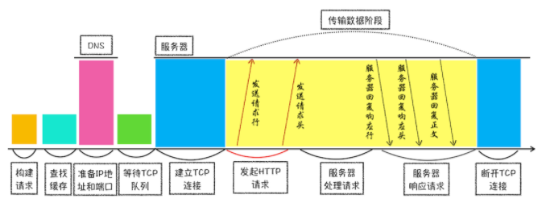

# Browser Tools

## 浏览器的工作原理与前端难题

### 工作经历介绍

我是 2005 年开始工作的，基于对新技术的兴趣与敏感性，2008 年 Chromium 项目一开源，我便第一时间下载体验。随后，在创业阶段的我基于 Chromium 和 IE 发布了一款双核浏览器：太阳花。

这是国内第一款双核浏览器，使用它，除了能享受到 Chrome 的快捷之外，还能兼容只支持 IE 的站点。开发过程中最大的挑战是如何**在 Chromium 中集成 IE 模块**，为此我花了大量时间来研究 Chromium 的进程架构以及渲染流程，好在功夫不负有心人，最终发布的产品也很对得起我的努力，在没有任何宣传的情况下，日活达到了 20 多万。

在 2011 年，我就去了盛大创新院，参与研发 WebOS 项目。WebOS 的愿景是基于 WebKit 内核打造一个能和安卓并存的操作系统。我在团队中负责 HTML5 特性的实现，比如实现 Web Workers、Application Cache、LocalStorage、IndexedDB、CSS3 部分动画效果等。这些工作经历让我对浏览器的整个渲染流程，以及 HTML5 的发展趋势有了更加深入的认知。不过遗憾的是，这个项目没能最终上线。

再之后，我去了顺网科技。顺网科技是一家网吧服务提供商，在顺网我和团队打造了一款给全国网吧使用的“F1 浏览器”，日启量达到 2000 万。由于网吧的电脑环境异常复杂，页面劫持经常发生，所以对页面安全提出来更高的要求；再加上每天千万级别的启动量，所以页面的加载速度和流畅度也至关重要，它们直接决定了用户的流失程度。这段工作经历，让我对浏览器安全有了全新的理解，同时又对页面性能的优化有了系统性的认知。


### 浏览器的发展历史

1995 年，美国网景公司因“网景浏览器”的发布而快速崛起，之后网景试图开发一个依靠浏览器的网络操作系统。这引起了微软的注意和警惕，于是同年微软发布 Windows 95，并捆绑了 IE，大获成功，到 2002 年，微软就已经占据了浏览器市场 80% 的份额。

直到 2008 年 Chrome 浏览器横空出世，这种垄断局面才算被打破。Chrome 浏览器完全颠覆了之前浏览器的架构设计，在速度和安全性上占据了绝对优势，市场份额占比剧增（据 StatCounter 2019 年的统计数据显示，Chrome 占据了 63% 市场份额）。

在 2010 年底，Google 还推出了一款网络操作系统——ChromeOS。

可以看到，浏览器自诞生之日起，其地位就一直很重要，而且这种重要性还在不断加强。我从浏览器的发展历程中梳理出了**三个大的进化路线，希望能让你了解目前的 Web 应用到底能做什么，以及未来能适用于那些新领域**。


#### 应用程序 Web 化

随着云计算的普及和 HTML5 技术的快速发展，越来越多的应用转向了浏览器 / 服务器（B/S）架构，这种改变让浏览器的重要性与日俱增，视频、音频、游戏几大核心场景也都在往 Web 的使用场景切换。


#### Web 应用移动化

对于移动设备应用，Web 天生具有开放的基因，虽然在技术层面还有问题尚待解决（比如，渲染流程过于复杂且性能不及原生应用、离线时用户无法使用、无法接收消息推送、移动端没有一级入口），但 Google 推出了 PWA 方案来整合 Web 和本地程序各自的优势。

顺便说一句，PWA 也是我个人非常期待的方案。


#### Web 操作系统化

在我看来，Web 操作系统有两层含义：一是利用 Web 技术构建一个纯粹的操作系统，如 ChromeOS；二是浏览器的底层结构往操作系统架构方向发展，在整个架构演化的大背景下会牵涉诸多改变，下面列举一些我认为相对重要的改变。

- Chrome 朝着 SOA 的方向演化，未来很多模块都会以服务的形式提供给上层应用使用；
- 在浏览器中引入多种编程语言的支持，比如新支持的 WebAssembly；
- 简化渲染流程，使得渲染过程更加直接高效；
- 加大对系统设备特性的支持；
- 提供对复杂 Web 项目开发的支持。

也就是说，**浏览器已经逐步演化成了操作系统之上的“操作系统”**。


### 学习浏览器工作原理

前面站在大厂的视角，回顾了浏览器的发展历程，梳理了浏览器的进化路线，分析了浏览器发展的大趋势。那接下来，我们再一起看看，开发者为什么需要了解浏览器的工作原理。

#### 评估 Web 开发项目的可行性

随着 Web 特性的极大丰富和浏览器性能的提升，越来越多的项目可以用 Web 来开发。所以，了解浏览器是如何工作的，能够让你更加准确地决策是否可以采用 Web 来开发项目。

举个例子，去年我做了一个健身房虚拟教练项目，时间紧，任务重，其中有大量的高速渲染动画和快速交互的场景需求。如果采用传统的 C++ 来开发界面，那基本上不可能按时交付，而且后期的维护也会非常麻烦。于是我决定采用 Web 方案来开发界面，因为采用 Web 方案可以降低开发成本，缩短交付周期。最终利用这个方案，我实现了这个项目的提前交付，并且效果也很喜人，大家对实现的效果非常满意。

对于这个例子，我认为我所做的最正确的事就是**选对了方案**，但反过来想，如果我对浏览器和 HTML5 的内容不了解，那可能我很容易就放弃了这个最优方案。


#### 更高维度审视页面

作为一名合格的开发者，你还要具备一项重要的技能，那就是：**要能站在用户体验角度来考虑页面性能**。我们看下面几个常见的用户体验指标。

- 当用户请求一个网站时，如果在 1 秒内看不到关键内容，用户会产生任务被中断的感觉。
- 当用户点击某些按钮时，如果 100ms 内无法响应，用户会感受到延迟。
- 如果 Web 中的动画没有达到 60fps，用户会感受到动画的卡顿。

这里的页面加载时长、用户交互反馈时长、Web 动画中的帧数都决定了用户体验的流畅度，并最终决定了用户体验的效果。在用户体验尤其重要的今天，我们必须能够有效地解决这些体验问题，以免给产品造成不可挽回的伤害。

但通常，这些指标是由一系列的复杂因素导致的。如果你要开发流畅的页面，或者诊断 Web 页面中的性能问题，那你就需要了解 URL 是怎么变成页面的，只有弄懂这些之后，你才可以站在全局的角度定位问题或者写出高效的代码。

你当然可以把浏览器看成一个黑盒，左边输入一个 URL，经过黑盒处理之后，右边返回你预期的效果。如果你对黑盒一无所知，你倒依然可以写前端代码，也可以使用很多最佳实践的策略来优化代码，这就如同不了解操作系统的工作原理同样可以在操作系统上写应用一样。

但如果你理解了这个黑盒子是如何工作的，那情况就不同了。你可以站在更高的维度审视你的项目，通过全视野快速定位项目中不合理的地方。比如，首屏的显示就涉及了 DNS、HTTP、DOM 解析、CSS 阻塞、JavaScript 阻塞等技术因素，其中一项没处理好就可能导致整个页面的延时。

而如果你了解了浏览器的工作原理，更加可以把这些知识点串成线，连成网，最终形成自己的知识体系，练就像专家一样思考问题、解决问题的能力。


#### 把握技术的本质

从 2011 年到现在，前端技术出现了大爆炸式增长，各种新技术层出不穷。我认为**Node.js 是前端发展的一个核心推动力**。Node.js 是基于 Chrome 的 JavaScript 引擎 V8 来实现的，它的特点是可以脱离浏览器环境来执行 JavaScript，于是大家惊讶地发现，原来也可以使用 JavaScript 写服务器程序呀！

尽管 Node.js 的诞生时间不长，但其周边已经形成了一个庞大的生态系统。与此同时，各种新标准、新技术纷至沓来，前端生态空前繁荣。

为什么 Node.js 能如此快速地发展？根本原因还是浏览器功能以及整个前端的开发环境，不足以支撑日益增长的需求，所以“变化”是这段时期的主旋律。这种变化直接扩大了前端工程师的知识半径，**这也导致很多前端开发工程师变成了爆栈工程师**。

虽然前端技术变化快，不过我觉得这里有更大的机遇，谁能快速抓住变化，谁就能收获这波变化带来的红利。

我相信，随着脚本执行效率的提高、页面渲染性能的提升和开发工具链的完善，接下来的前端会进入一个相对平稳的阶段。通俗地理解就是：**等到核心技术足以支撑核心需求，那么前端生态会进入一个相对稳定的状态**。

如果了解了浏览器的工作机制，那么你可以梳理出来前端技术的发展脉络，更加深刻地理解当前的技术，同时你也会清楚其不足之处，以及演化方向。那么接下来，我们看看前端技术是如何针对这些核心诉求做演进的？


##### 脚本执行速度问题

比如针对 JavaScript 设计缺陷和执行效率的问题，可以从以下两个途径去解决：

- 不断修订和更新语言本身，这样你就应该知道 ES6、ES7、ES8，或者 TypeScript 出现的必要性。这种修订对目前生态环境的改动是最小的，所以推行起来会比较容易。
- 颠覆性地使用新的语言，这就是 WebAssembly 出现的原因。WebAssembly 需要经过编译器编译，所以体积小、执行速度快，使用它能大幅提升语言的执行效率，但是语言本身的完善，和生态的构建都是需要花很长时间来打造的。


##### 前端模块化开发

比如，随着 Web 应用在各个领域的深入，Web 工程的复杂程度也越来越高，这就产生了模块化开发的需求，于是相应出现了 WebComponents 标准。

我们所熟悉的 React 和 Vue 都在渐进地适应 WebComponents 标准，同时各种前端框架的最佳实践也会反过来影响 WebComponents 标准的制定。

如果理解了浏览器工作原理，那么你会对 WebComponents 中涉及的 Shawdow DOM、HTML Templates 等技术有更深刻的理解。


##### 渲染效率问题

同样，如果理解浏览器的渲染流程，那么你应该知道目前页面的渲染依然存在很大缺陷，然后你就清楚如何避开这些问题，从而开发出更加高效的 Web 应用。与此同时，Chrome 团队也在着手改善这些缺陷，比如正在开发的下一代布局方案 LayoutNG，还有渲染瘦身方案 Slim Paint，其目的都是让渲染变得更加简单和高效。


## Chrome 架构

无论你是想要设计高性能 Web 应用，还是要优化现有的 Web 应用，你都需要了解浏览器中的网络流程、页面渲染过程，JavaScript 执行流程，以及 Web 安全理论，而这些功能是分散在浏览器的各个功能组件中的。

通过浏览器的多进程架构的学习，你就可以把这些分散的知识点串起来，组成一张网，从而让自己能站在更高的维度去理解 Web 应用。

### Chrome 浏览器

因此，**学习浏览器的多进程架构是很有必要的**。需要说明的是，**所有的分析都是基于 Chrome 浏览器的**。

那么多浏览器，为什么偏偏选择 Chrome 浏览器呢？

- 因为 Chrome、微软的 Edge 以及国内的大部分主流浏览器，都是基于 Chromium 二次开发而来；
- 而 Chrome 是 Google 的官方发行版，特性和 Chromium 基本一样，只存在一些产品层面差异；
- 再加上 Chrome 是目前世界上使用率最高的浏览器，所以**Chrome 最具代表性**。

一起看下，Chrome 打开一个页面需要启动多少进程？

- 点击 Chrome 浏览器右上角的“选项”菜单，选择“更多工具”子菜单，点击“任务管理器”，这将打开 Chrome 的任务管理器的窗口，如下图：


和 Windows 任务管理器一样，Chrome 任务管理器也是用来展示运行中 Chrome 使用的进程信息的。从图中可以看到，Chrome 启动了 4 个进程，你也许会好奇，只是打开了 1 个页面，为什么要启动这么多进程呢？

- 目前 Chrome 的最新版本，已经启动 8 个进程了，扩展了实用程序，添加了备用渲染程序。


### 进程和线程

#### 什么是并行处理

计算机中的并行处理就是同一时刻处理多个任务，比如我们要计算下面这三个表达式的值，并显示出结果。

```js
A = 1+2
B = 20/5
C = 7*8
```

在编写代码的时候，我们可以把这个过程拆分为四个任务：

- **任务 1** 是计算 A=1+2；
- **任务 2** 是计算 B=20/5；
- **任务 3** 是计算 C=7*8；
- **任务 4** 是显示最后计算的结果。

正常情况下程序可以使用**单线程**来处理，也就是分四步按照顺序分别执行这四个任务。

如果采用**多线程**，会怎么样呢？我们只需分“两步走”：第一步，使用三个线程同时执行前三个任务；第二步，再执行第四个显示任务。

通过对比分析，你会发现用单线程执行需要四步，而使用多线程只需要两步。因此，**使用并行处理能大大提升性能**。


#### 线程 VS 进程

多线程可以并行处理任务，但是**线程是不能单独存在的，它是由进程来启动和管理的**。

**一个进程就是一个程序的运行实例**。详细解释就是，启动一个程序的时候，操作系统会为该程序创建一块内存，用来存放代码、运行中的数据和一个执行任务的主线程，我们把这样的一个运行环境叫**进程**。

为了让你更好地理解上述计算过程，我画了下面这张对比图：


从图中可以看到，**线程是依附于进程的，而进程中使用多线程并行处理能提升运算效率**。

总结来说，进程和线程之间的关系有以下 4 个特点。


##### 进程中的任意一线程执行出错，都会导致整个进程的崩溃

我们可以模拟以下场景：

```js
A = 1+2
B = 20/0
C = 7*8
```

我把上述三个表达式稍作修改，在计算 B 的值的时候，我把表达式的分母改成 0，当线程执行到 B = 20/0 时，由于分母为 0，线程会执行出错，这样就会导致整个进程的崩溃，当然另外两个线程执行的结果也没有了。


##### 线程之间共享进程中的数据

如下图所示，线程之间可以对进程的公共数据进行读写操作。


从上图可以看出，线程 1、线程 2、线程 3 分别把执行的结果写入 A、B、C 中，然后线程 2 继续从 A、B、C 中读取数据，用来显示执行结果。


##### 当一个进程关闭之后，操作系统会回收进程所占用的内存

当一个进程退出时，操作系统会回收该进程所申请的所有资源；即使其中任意线程因为操作不当导致内存泄漏，当进程退出时，这些内存也会被正确回收。

比如之前的 IE 浏览器，支持很多插件，而这些插件很容易导致内存泄漏，这意味着只要浏览器开着，内存占用就有可能会越来越多，但是当关闭浏览器进程时，这些内存就都会被系统回收掉。


##### 进程之间的内容相互隔离

进程隔离是为保护操作系统中进程互不干扰的技术，每一个进程只能访问自己占有的数据，也就避免出现进程 A 写入数据到进程 B 的情况。

正是因为进程之间的数据是严格隔离的，所以一个进程如果崩溃了，或者挂起了，是不会影响到其他进程的。

如果进程之间需要进行数据的通信，这时候，就需要使用用于进程间通信（IPC）的机制了。


### 单进程浏览器时代

顾名思义，**单进程浏览器是指浏览器的所有功能模块都是运行在同一个进程里**，这些模块包含了网络、插件、JavaScript 运行环境、渲染引擎和页面等。

其实早在 2007 年之前，市面上浏览器都是单进程的。单进程浏览器的架构如下图所示：


如此多的功能模块运行在一个进程里，是导致单进程浏览器**不稳定**、**不流畅**和**不安全**的一个主要因素。

#### 不稳定

早期浏览器需要借助于**插件**来实现诸如 Web 视频、Web 游戏等各种强大的功能，但是插件是最容易出问题的模块，并且还运行在浏览器进程之中，所以一个插件的意外崩溃会引起整个浏览器的崩溃。

除了插件之外，**渲染引擎模块**也是不稳定的，通常一些复杂的 JavaScript 代码就有可能引起渲染引擎模块的崩溃。和插件一样，渲染引擎的崩溃也会导致整个浏览器的崩溃。


#### 不流畅

从上面的“单进程浏览器架构示意图”可以看出，所有页面的渲染模块、JavaScript 执行环境以及插件都是运行在同一个线程中的，这就意味着同一时刻只能有一个模块可以执行。

比如，下面这个无限循环的脚本：

```js
function freeze() {
	while (1) {
		console.log("freeze");
	}
}
freeze();
```

如果让这个脚本运行在一个单进程浏览器的页面里，你感觉会发生什么？

因为这个脚本是无限循环的，所以当其执行时，它会独占整个线程，这样导致其他运行在该线程中的模块就没有机会被执行。因为浏览器中所有的页面都运行在该线程中，所以这些页面都没有机会去执行任务，这样就会导致整个浏览器失去响应，变卡顿。这块内容要继续往深的地方讲就到页面的事件循环系统了。

除了上述**脚本**或者**插件**会让单进程浏览器变卡顿外，**页面的内存泄漏**也是单进程变慢的一个重要原因。通常浏览器的内核都是非常复杂的，运行一个复杂点的页面再关闭页面，会存在内存不能完全回收的情况，这样导致的问题是使用时间越长，内存占用越高，浏览器会变得越慢。


#### 不安全

这里依然可以从插件和页面脚本两个方面来解释该原因。

插件可以使用 C/C++ 等代码编写，通过插件可以获取到操作系统的任意资源，当你在页面运行一个插件时也就意味着这个插件能完全操作你的电脑。如果是个恶意插件，那么它就可以释放病毒、窃取你的账号密码，引发安全性问题。

至于页面脚本，它可以通过浏览器的漏洞来获取系统权限，这些脚本获取系统权限之后也可以对你的电脑做一些恶意的事情，同样也会引发安全问题。

以上这些就是当时浏览器的特点，不稳定，不流畅，而且不安全。想象一下这样的场景：当你正在用浏览器打开多个页面时，突然某个页面崩溃了或者失去响应，随之而来的是整个浏览器的崩溃或者无响应，然后你发现你给老板写的邮件页面也随之消失了，这时你的心情会不会和页面一样崩溃呢？


### 多进程浏览器时代

#### 早期多进程架构

你可以先看看下面这张图，这是 2008 年 Chrome 发布时的进程架构。


从图中可以看出，Chrome 的页面是运行在单独的渲染进程中的，同时页面里的插件也是运行在单独的插件进程之中，而进程之间是通过 IPC 机制进行通信（如图中虚线部分）。

**如何解决不稳定的问题。**由于进程是相互隔离的，所以当一个页面或者插件崩溃时，影响到的仅仅是当前的页面进程或者插件进程，并不会影响到浏览器和其他页面，这就完美地解决了页面或者插件的崩溃会导致整个浏览器崩溃，也就是不稳定的问题。

**不流畅的问题是如何解决的。**同样，JavaScript 也是运行在渲染进程中的，所以即使 JavaScript 阻塞了渲染进程，影响到的也只是当前的渲染页面，而并不会影响浏览器和其他页面，因为其他页面的脚本是运行在它们自己的渲染进程中的。所以当我们再在 Chrome 中运行上面那个死循环的脚本时，没有响应的仅仅是当前的页面。

对于内存泄漏的解决方法那就更简单了，因为当关闭一个页面时，整个渲染进程也会被关闭，之后该进程所占用的内存都会被系统回收，这样就轻松解决了浏览器页面的内存泄漏问题。

**两个安全问题是怎么解决的**。采用多进程架构的额外好处是可以使用**安全沙箱**，你可以把沙箱看成是操作系统给进程上了一把锁，沙箱里面的程序可以运行，但是不能在你的硬盘上写入任何数据，也不能在敏感位置读取任何数据，例如你的文档和桌面。Chrome 把插件进程和渲染进程锁在沙箱里面，这样即使在渲染进程或者插件进程里面执行了恶意程序，恶意程序也无法突破沙箱去获取系统权限。


#### 目前多进程架构

不过 Chrome 的发展是滚滚向前的，相较之前，目前的架构又有了很多新的变化。我们先看看最新的 Chrome 进程架构，你可以参考下图：


从图中可以看出，最新的 Chrome 浏览器包括：1 个浏览器（Browser）主进程、1 个 GPU 进程、1 个网络（NetWork）进程、多个渲染进程和多个插件进程。

下面我们来逐个分析下这几个进程的功能。

- **浏览器进程**。主要负责界面显示、用户交互、子进程管理，同时提供存储等功能。
- **渲染进程**。核心任务是将 HTML、CSS 和 JavaScript 转换为用户可以与之交互的网页，排版引擎 Blink 和 JavaScript 引擎 V8 都是运行在该进程中，默认情况下，Chrome 会为每个 Tab 标签创建一个渲染进程。出于安全考虑，渲染进程都是运行在沙箱模式下。
- **GPU 进程**。其实，Chrome 刚开始发布的时候是没有 GPU 进程的。而 GPU 的使用初衷是为了实现 3D CSS 的效果，只是随后网页、Chrome 的 UI 界面都选择采用 GPU 来绘制，这使得 GPU 成为浏览器普遍的需求。最后，Chrome 在其多进程架构上也引入了 GPU 进程。
- **网络进程**。主要负责页面的网络资源加载，之前是作为一个模块运行在浏览器进程里面的，直至最近才独立出来，成为一个单独的进程。
- **插件进程**。主要是负责插件的运行，因插件易崩溃，所以需要通过插件进程来隔离，以保证插件进程崩溃不会对浏览器和页面造成影响。

现在你应该就可以回答文章开头提到的问题了：仅仅打开了 1 个页面，为什么有 4 个进程？因为打开 1 个页面至少需要 1 个网络进程、1 个浏览器进程、1 个 GPU 进程以及 1 个渲染进程，共 4 个；如果打开的页面有运行插件的话，还需要再加上 1 个插件进程。

不过凡事都有两面性，虽然多进程模型提升了浏览器的稳定性、流畅性和安全性，但同样不可避免地带来了一些问题：

- **更高的资源占用**。因为每个进程都会包含公共基础结构的副本（如 JavaScript 运行环境），这就意味着浏览器会消耗更多的内存资源。
- **更复杂的体系架构**。浏览器各模块之间耦合性高、扩展性差等问题，会导致现在的架构已经很难适应新的需求了。

对于上面这两个问题，Chrome 团队一直在寻求一种弹性方案，既可以解决资源占用高的问题，也可以解决复杂的体系架构的问题。


#### 未来面向服务的架构

为了解决这些问题，在 2016 年，Chrome 官方团队使用“**面向服务的架构**”（Services Oriented Architecture，简称**SOA**）的思想设计了新的 Chrome 架构。

也就是说 Chrome 整体架构会朝向现代操作系统所采用的“面向服务的架构” 方向发展，原来的各种模块会被重构成独立的服务（Service），每个服务（Service）都可以在独立的进程中运行，访问服务（Service）必须使用定义好的接口，通过 IPC 来通信，从而**构建一个更内聚、松耦合、易于维护和扩展的系统**，更好实现 Chrome 简单、稳定、高速、安全的目标。

Chrome 最终要把 UI、数据库、文件、设备、网络等模块重构为基础服务，类似操作系统底层服务，下面是 Chrome“面向服务的架构”的进程模型图。


目前 Chrome 正处在老的架构向服务化架构过渡阶段，这将是一个漫长的迭代过程。

Chrome 正在逐步构建 Chrome 基础服务（Chrome Foundation Service），如果你认为 Chrome 是“便携式操作系统”，那么 Chrome 基础服务便可以被视为该操作系统的“基础”系统服务层。

同时 Chrome 还提供灵活的弹性架构，在强大性能设备上会以多进程的方式运行基础服务，但是如果在资源受限的设备上（如下图），Chrome 会将很多服务整合到一个进程中，从而节省内存占用。


### 总结

本文我主要是从 Chrome 进程架构的视角，分析了浏览器的进化史。

最初的浏览器都是单进程的，它们不稳定、不流畅且不安全，之后出现了 Chrome，创造性地引入了多进程架构，并解决了这些遗留问题。

随后 Chrome 试图应用到更多业务场景，如移动设备、VR、视频等，为了支持这些场景，Chrome 的架构体系变得越来越复杂，这种架构的复杂性倒逼 Chrome 开发团队必须进行架构的重构，最终 Chrome 团队选择了面向服务架构（SOA）形式，这也是 Chrome 团队现阶段的一个主要任务。

鉴于目前架构的复杂性，要完整过渡到面向服务架构，估计还需要好几年时间才能完成。不过 Chrome 开发是一个渐进的过程，新的特性会一点点加入进来，这也意味着我们随时能看到 Chrome 新的变化。

总体说来，**Chrome 是以一个非常快速的速度在进化，越来越多的业务和应用都逐渐转至浏览器来开发，身为开发人员，我们不能坐视不管，而应该紧跟其步伐，收获这波技术红利**。


### 思考

回顾浏览器的进化路线，你认为推动浏览器发展的主要动力是什么？（需求，时代的进步）


## IP、UDP、TCP 协议

在衡量 Web 页面性能的时候有一个重要的指标叫“**FP（First Paint）**”，是**指从页面加载到首次开始绘制的时长**。这个指标直接影响了用户的跳出率，更快的页面响应意味着更多的 PV、更高的参与度，以及更高的转化率。

那什么影响 FP 指标呢？其中一个重要的因素是**网络加载速度**。

要想优化 Web 页面的加载速度，你需要对网络有充分的了解。而理解网络的关键是要对网络协议有深刻的认识，不管你是使用 HTTP，还是使用 WebSocket，它们都是基于 TCP/IP 的，如果你对这些原理有足够了解，也就清楚如何去优化 Web 性能，或者能更轻松地定位 Web 问题了。此外，TCP/IP 的设计思想还有助于拓宽你的知识边界，从而在整体上提升你对项目的理解和解决问题的能力。

因此，我会给你**重点介绍在 Web 世界中的 TCP/IP 是如何工作的**。

**互联网，实际上是一套理念和协议组成的体系架构**。其中，协议是一套众所周知的规则和标准，如果各方都同意使用，那么它们之间的通信将变得毫无障碍。

互联网中的数据是通过数据包来传输的。如果发送的数据很大，那么该数据就会被拆分为很多小数据包来传输。比如你现在听的音频数据，是拆分成一个个小的数据包来传输的，并不是一个大的文件一次传输过来的。

在网络中，一个文件通常会被拆分为很多数据包来进行传输，而数据包在传输过程中又有很大概率丢失或者出错。**那么如何保证页面文件能被完整地送达浏览器呢？**


### IP

数据包要在互联网上进行传输，就要符合**网际协议**（Internet Protocol，简称**IP**）标准。

互联网上不同的在线设备都有唯一的地址，地址只是一个数字，这和大部分家庭收件地址类似，你只需要知道一个家庭的具体地址，就可以往这个地址发送包裹，这样物流系统就能把物品送到目的地。

**计算机的地址就称为 IP 地址，访问任何网站实际上只是你的计算机向另外一台计算机请求信息。**

如果要想把一个数据包从主机 A 发送给主机 B，那么在传输之前，数据包上会被附加上主机 B 的 IP 地址信息，这样在传输过程中才能正确寻址。额外地，数据包上还会附加上主机 A 本身的 IP 地址，有了这些信息主机 B 才可以回复信息给主机 A。这些附加的信息会被装进一个叫 IP 头的数据结构里。

IP 头是 IP 数据包开头的信息，包含 IP 版本、源 IP 地址、目标 IP 地址、生存时间等信息。如果你要详细了解 IP 头信息，可以参考[该链接](https://zh.wikipedia.org/wiki/传输控制协议)。

为了方便理解，我先把网络简单分为三层结构，如下图：


下面我们一起来看下一个数据包从主机 A 到主机 B 的旅程：

- 上层将含有“极客时间”的数据包交给网络层；
- 网络层再将 IP 头附加到数据包上，组成新的 **IP 数据包**，并交给底层；
- 底层通过物理网络将数据包传输给主机 B；
- 数据包被传输到主机 B 的网络层，在这里主机 B 拆开数据包的 IP 头信息，并将拆开来的数据部分交给上层；
- 最终，含有“极客时间”信息的数据包就到达了主机 B 的上层了。


### UDP

IP 是非常底层的协议，只负责把数据包传送到对方电脑，但是对方电脑并不知道把数据包交给哪个程序，是交给浏览器还是交给王者荣耀？

因此，需要基于 IP 之上开发能和应用打交道的协议，最常见的是“**用户数据包协议**（User Datagram Protocol）”，简称**UDP**。

UDP 中一个最重要的信息是**端口号**，端口号其实就是一个数字，每个想访问网络的程序都需要绑定一个端口号。通过端口号 UDP 就能把指定的数据包发送给指定的程序了，所以**IP 通过 IP 地址信息把数据包发送给指定的电脑，而 UDP 通过端口号把数据包分发给正确的程序**。

和 IP 头一样，端口号会被装进 UDP 头里面，UDP 头再和原始数据包合并组成新的 UDP 数据包。UDP 头中除了目的端口，还有源端口号等信息。

为了支持 UDP 协议，我把前面的三层结构扩充为四层结构，在网络层和上层之间增加了传输层，如下图所示：


下面我们一起来看下一个数据包从主机 A 旅行到主机 B 的路线：

- 上层将含有“极客时间”的数据包交给传输层；
- 传输层会在数据包前面附加上**UDP 头**，组成新的 UDP 数据包，再将新的 UDP 数据包交给网络层；
- 网络层再将 IP 头附加到数据包上，组成新的 IP 数据包，并交给底层；
- 数据包被传输到主机 B 的网络层，在这里主机 B 拆开 IP 头信息，并将拆开来的数据部分交给传输层；
- 在传输层，数据包中的 UDP 头会被拆开，**并根据 UDP 中所提供的端口号，把数据部分交给上层的应用程序**；
- 最终，含有“极客时间”信息的数据包就旅行到了主机 B 上层应用程序这里。

在使用 UDP 发送数据时，有各种因素会导致数据包出错，虽然 UDP 可以校验数据是否正确，但是对于错误的数据包，UDP 并不提供重发机制，只是丢弃当前的包，而且 UDP 在发送之后也无法知道是否能达到目的地。

虽说**UDP 不能保证数据可靠性，但是传输速度却非常快**，所以 UDP 会应用在一些关注速度、但不那么严格要求数据完整性的领域，如在线视频、互动游戏（王者荣耀）等。


### TCP

对于浏览器请求，或者邮件这类要求数据传输可靠性（reliability）的应用，如果使用 UDP 来传输会存在**两个问题**：

- 数据包在传输过程中容易丢失；
- 大文件会被拆分成很多小的数据包来传输，这些小的数据包会经过不同的路由，并在不同的时间到达接收端，而 UDP 协议并不知道如何组装这些数据包，从而把这些数据包还原成完整的文件。

基于这两个问题，我们引入 TCP 了。**TCP（Transmission Control Protocol，传输控制协议）是一种面向连接的、可靠的、基于字节流的传输层通信协议**。相对于 UDP，TCP 有下面两个特点:

- 对于数据包丢失的情况，TCP 提供重传机制；
- TCP 引入了数据包排序机制，用来保证把乱序的数据包组合成一个完整的文件。

和 UDP 头一样，TCP 头除了包含了目标端口和本机端口号外，还提供了用于排序的序列号，以便接收端通过序号来重排数据包。

下面看看 TCP 下的单个数据包的传输流程：


通过上图你应该可以了解一个数据包是如何通过 TCP 来传输的。TCP 单个数据包的传输流程和 UDP 流程差不多，不同的地方在于，通过 TCP 头的信息保证了一块大的数据传输的完整性。

下面我们再看下**完整的 TCP 连接过程**，通过这个过程你可以明白 TCP 是如何保证**重传机制和数据包的排序**功能的。

从下图可以看出，一个完整的 TCP 连接的生命周期包括了“**建立连接**”“**传输数据**”和“**断开连接**”三个阶段。


- **首先，建立连接阶段**。这个阶段是通过“三次握手”来建立客户端和服务器之间的连接。TCP 提供面向连接的通信传输。**面向连接**是指在数据通信开始之前先做好两端之间的准备工作。所谓**三次握手**，是指在建立一个 TCP 连接时，客户端和服务器总共要发送三个数据包以确认连接的建立。
- **其次，传输数据阶段**。在该阶段，**接收端需要对每个数据包进行确认操作**，也就是接收端在接收到数据包之后，需要发送确认数据包给发送端。所以当发送端发送了一个数据包之后，在规定时间内没有接收到接收端反馈的确认消息，则判断为数据包丢失，并触发发送端的重发机制。同样，一个大的文件在传输过程中会被拆分成很多小的数据包，这些数据包到达接收端后，接收端会按照 TCP 头中的序号为其排序，从而保证组成完整的数据。
- **最后，断开连接阶段**。数据传输完毕之后，就要终止连接了，涉及到最后一个阶段“四次挥手”来保证双方都能断开连接。

到这里你应该就明白了，TCP 为了保证数据传输的可靠性，牺牲了数据包的传输速度，因为“三次握手”和“数据包校验机制”等把传输过程中的**数据包的数量提高了一**倍。


### 总结

好了，这一节就到这里，下面我来做一个简单的总结。

- 互联网中的数据是通过数据包来传输的，数据包在传输过程中容易丢失或出错。
- IP 负责把数据包送达目的主机。
- UDP 负责把数据包送达具体应用。
- 而 TCP 保证了数据完整地传输，它的连接可分为三个阶段：建立连接、传输数据和断开连接。

其实了解 TCP 协议，是为了全方位了解 HTTP，包括其实际功能和局限性，之后才会更加深刻地理解为什么要推出 HTTP/2，以及为什么要推出 QUIC 协议，也就是未来的 HTTP/3。


### 思考

HTTP 协议是基于 TCP 协议的，问题是：你怎么理解 HTTP 和 TCP 的关系？


## HTTP 协议

TCP 协议保证数据完整传输，一个 TCP 连接过程包括了建立连接、传输数据和断开连接三个阶段。

而 HTTP 协议，正是建立在 TCP 连接基础之上的。**HTTP 是一种允许浏览器向服务器获取资源的协议，是 Web 的基础**，通常由浏览器发起请求，用来获取不同类型的文件，例如 HTML 文件、CSS 文件、JavaScript 文件、图片、视频等。

此外，**HTTP 也是浏览器使用最广的协议**。

不知道你是否有过下面这些疑问：

1. 为什么通常在第一次访问一个站点时，打开速度很慢，当再次访问这个站点时，速度就很快了？
2. 当登录过一个网站之后，下次再访问该站点，就已经处于登录状态了，这是怎么做到的呢？

这一切的秘密都隐藏在 HTTP 的请求过程中。通过分析一个 HTTP 请求过程中每一步的状态来了解完整的 HTTP 请求过程。


### 浏览器发起 HTTP 请求

如果你在浏览器地址栏里键入极客时间网站的地址：http://time.geekbang.org/index.html， 那么接下来，浏览器会完成哪些动作呢？

#### 构建请求

首先，浏览器构建**请求行**信息（如下所示），构建好后，浏览器准备发起网络请求。

```http
GET /index.html HTTP1.1
```


#### 查找缓存

在真正发起网络请求之前，浏览器会先在浏览器缓存中查询是否有要请求的文件。其中，**浏览器缓存是一种在本地保存资源副本，以供下次请求时直接使用的技术**。

当浏览器发现请求的资源已经在浏览器缓存中存有副本，它会拦截请求，返回该资源的副本，并直接结束请求，而不会再去源服务器重新下载。这样做的好处有：

- 缓解服务器端压力，提升性能（获取资源的耗时更短了）；
- 对于网站来说，缓存是实现快速资源加载的重要组成部分。

当然，如果缓存查找失败，就会进入网络请求过程了。


#### 准备 IP 地址和端口

在了解网络请求之前，我们需要先看看 HTTP 和 TCP 的关系。

因为浏览器使用**HTTP 协议作为应用层协议**，用来封装请求的文本信息；并使用**TCP/IP 作传输层协议**将它发到网络上，所以在 HTTP 工作开始之前，浏览器需要通过 TCP 与服务器建立连接。也就是说**HTTP 的内容是通过 TCP 的传输数据阶段来实现的**，你可以结合下图更好地理解这二者的关系。


那接下来你可以思考这么“一连串”问题：

- HTTP 网络请求的第一步是做什么呢？结合上图看，是和服务器建立 TCP 连接。
- 那建立连接的信息都有了吗？建立 TCP 连接的第一步就是需要准备 IP 地址和端口号。
- 那怎么获取 IP 地址和端口号呢？这得看看我们现在有什么，我们有一个 URL 地址，那么是否可以利用 URL 地址来获取 IP 和端口信息呢？

数据包都是通过 IP 地址传输给接收方的。由于 IP 地址是数字标识，比如极客时间网站的 IP 是 39.106.233.176, 难以记忆，但使用极客时间的域名（time.geekbang.org）就好记多了，所以基于这个需求又出现了一个服务，负责把域名和 IP 地址做一一映射关系。这套域名映射为 IP 的系统就叫做“**域名系统**”，简称**DNS**（Domain Name System）。

所以，这样一路推导下来，你会发现在**第一步浏览器会请求 DNS 返回域名对应的 IP**。当然浏览器还提供了**DNS 数据缓存服务**，如果某个域名已经解析过了，那么浏览器会缓存解析的结果，以供下次查询时直接使用，这样也会减少一次网络请求。

拿到 IP 之后，接下来就需要获取端口号了。通常情况下，如果 URL 没有特别指明端口号，那么 HTTP 协议默认是 80 端口，HTTPS 协议默认是 443 端口。


#### 等待 TCP 队列

现在已经把端口和 IP 地址都准备好了，那么下一步是不是可以建立 TCP 连接了呢？

答案依然是“不行”。Chrome 有个机制，同一个域名同时**最多只能建立 6 个 TCP 连接**，如果在同一个域名下同时有 10 个请求发生，那么其中 4 个请求会进入排队等待状态，直至进行中的请求完成。

当然，如果当前请求数量少于 6，会直接进入下一步，建立 TCP 连接。


#### 建立 TCP 连接

排队等待结束之后，终于可以快乐地和服务器握手了，在 HTTP 工作开始之前，浏览器通过 TCP 与服务器建立连接。


#### 发送 HTTP 请求

一旦建立了 TCP 连接，浏览器就可以和服务器进行通信了。而 HTTP 中的数据正是在这个通信过程中传输的。

你可以结合下图来理解，浏览器是如何发送请求信息给服务器的。


首先浏览器会向服务器发送**请求行**，它包括了**请求方法、请求 URI（Uniform Resource Identifier）和 HTTP 版本协议**。

发送请求行，就是告诉服务器浏览器需要什么资源，最常用的请求方法是**Get**。比如，直接在浏览器地址栏键入极客时间的域名（time.geekbang.org），这就是告诉服务器要 Get 它的首页资源。

另外一个常用的请求方法是**POST**，它用于发送一些数据给服务器，比如登录一个网站，就需要通过 POST 方法把用户信息发送给服务器。如果使用 POST 方法，那么浏览器还要准备数据给服务器，这里准备的数据是通过**请求体**来发送。

在浏览器发送请求行命令之后，还要以**请求头**形式发送其他一些信息，把浏览器的一些基础信息告诉服务器。比如包含了浏览器所使用的操作系统、浏览器内核等信息，以及当前请求的域名信息、浏览器端的 Cookie 信息，等等。


### 服务器处理 HTTP 请求

历经千辛万苦，HTTP 的请求信息终于被送达了服务器。接下来，服务器会根据浏览器的请求信息来准备相应的内容。

#### 返回请求

一旦服务器处理结束，便可以返回数据给浏览器了。你可以通过工具软件 curl 来查看返回请求数据，具体使用方法是在命令行中输入以下命令：

```sh
curl -i  https://time.geekbang.org/
```

注意这里加上了`-i`是为了返回响应行、响应头和响应体的数据，返回的结果如下图所示，你可以结合这些数据来理解服务器是如何响应浏览器的。


首先服务器会返回**响应行**，包括协议版本和状态码。

但并不是所有的请求都可以被服务器处理的，那么一些无法处理或者处理出错的信息，怎么办呢？服务器会通过请求行的**状态码**来告诉浏览器它的处理结果，比如：

- 最常用的状态码是 200，表示处理成功；
- 如果没有找到页面，则会返回**404**。

随后，正如浏览器会随同请求发送请求头一样，服务器也会随同响应向浏览器发送**响应头**。响应头包含了服务器自身的一些信息，比如服务器生成返回数据的时间、返回的数据类型（JSON、HTML、流媒体等类型），以及服务器要在客户端保存的 Cookie 等信息。

发送完响应头后，服务器就可以继续发送**响应体**的数据，通常，响应体就包含了 HTML 的实际内容。

以上这些就是服务器响应浏览器的具体过程。


#### 断开连接

通常情况下，一旦服务器向客户端返回了请求数据，它就要关闭 TCP 连接。不过如果浏览器或者服务器在其头信息中加入了：

```http
Connection:Keep-Alive 
```

那么 TCP 连接在发送后将仍然保持打开状态，这样浏览器就可以继续通过同一个 TCP 连接发送请求。**保持 TCP 连接可以省去下次请求时需要建立连接的时间，提升资源加载速度**。

比如，一个 Web 页面中内嵌的图片就都来自同一个 Web 站点，如果初始化了一个持久连接，你就可以复用该连接，以请求其他资源，而不需要重新再建立新的 TCP 连接。


#### 重定向

到这里似乎请求流程快结束了，不过还有一种情况你需要了解下，比如当你在浏览器中打开 geekbang.org 后，你会发现最终打开的页面地址是 https://www.geekbang.org。

这两个 URL 之所以不一样，是因为涉及到了一个**重定向操作**。跟前面一样，你依然可以使用 curl 来查看下请求 geekbang.org 会返回什么内容？

在控制台输入如下命令：

```sh
curl -I geekbang.org
```

注意这里输入的参数是`-I`，和`-i`不一样，`-I`表示只需要获取响应头和响应行数据，而不需要获取响应体的数据，最终返回的数据如下图所示：


从图中你可以看到，响应行返回的状态码是 301，状态 301 就是告诉浏览器，我需要重定向到另外一个网址，而需要重定向的网址正是包含在响应头的 Location 字段中，接下来，浏览器获取 Location 字段中的地址，并使用该地址重新导航，这就是一个完整重定向的执行流程。

这也就解释了为什么输入的是 geekbang.org，最终打开的却是 https://www.geekbang.org 了。

不过也不要认为这种跳转是必然的。如果你打开 https://12306.cn，你会发现这个站点是打不开的。这是因为 12306 的服务器并没有处理跳转，所以必须要手动输入完整的 https://www.12306.com 才能打开页面。


### 问题解答

相信你现在已经了解了 HTTP 的请求流程，那现在我们再回过头来看看文章开头提出的问题。

#### 为什么很多站点第二次打开速度会很快？（Cache）

如果第二次页面打开很快，主要原因是第一次加载页面过程中，缓存了一些耗时的数据。

那么，哪些数据会被缓存呢？从上面介绍的核心请求路径可以发现，**DNS 缓存**和**页面资源缓存**这两块数据是会被浏览器缓存的。其中，DNS 缓存比较简单，它主要就是在浏览器本地把对应的 IP 和域名关联起来。

我们重点看下浏览器资源缓存，下面是缓存处理的过程：


首先，我们看下服务器是通过什么方式让浏览器缓存数据的？

从上图的第一次请求可以看出，当服务器返回**HTTP 响应头**给浏览器时，浏览器是**通过响应头中的 Cache-Control 字段来设置是否缓存该资源**。通常，我们还需要为这个资源设置一个缓存过期时长，而这个时长是通过 Cache-Control 中的 Max-age 参数来设置的，比如上图设置的缓存过期时间是 2000 秒。

```http
Cache-Control:Max-age=2000
```

这也就意味着，在该缓存资源还未过期的情况下, 如果再次请求该资源，会直接返回缓存中的资源给浏览器。

但如果缓存过期了，浏览器则会继续发起网络请求，并且在**HTTP 请求头**中带上：

```http
If-None-Match:"4f80f-13c-3a1xb12a"
```

服务器收到请求头后，会根据 If-None-Match 的值来判断请求的资源是否有更新。

- 如果没有更新，就**返回 304 状态码**，相当于服务器告诉浏览器：“这个缓存可以继续使用，这次就不重复发送数据给你了。”
- 如果资源有更新，服务器就直接返回最新资源给浏览器。

关于缓存的具体细节可以参考这篇 [HTTP 缓存](https://developer.mozilla.org/zh-CN/docs/Web/HTTP/Caching_FAQ) 。

简要来说，很多网站第二次访问能够秒开，是因为这些网站把很多资源都缓存在了本地，浏览器缓存直接使用本地副本来回应请求，而不会产生真实的网络请求，从而节省了时间。同时，DNS 数据也被浏览器缓存了，这又省去了 DNS 查询环节。


#### 登录状态是如何保持的？(Cookie)

通过上面的介绍，你已经了解了缓存是如何工作的。下面我们再一起看下登录状态是如何保持的。

- 用户打开登录页面，在登录框里填入用户名和密码，点击确定按钮。点击按钮会触发页面脚本生成用户登录信息，然后调用 POST 方法提交用户登录信息给服务器。
- 服务器接收到浏览器提交的信息之后，查询后台，验证用户登录信息是否正确，如果正确的话，会生成一段表示用户身份的字符串，并把该字符串写到响应头的 Set-Cookie 字段里，如下所示，然后把响应头发送给浏览器。

```http
Set-Cookie: UID=3431uad;
```

- 浏览器在接收到服务器的响应头后，开始解析响应头，如果遇到响应头里含有 Set-Cookie 字段的情况，浏览器就会把这个字段信息保存到本地。比如把`UID=3431uad`保持到本地。
- 当用户再次访问时，浏览器会发起 HTTP 请求，但在发起请求之前，浏览器会读取之前保存的 Cookie 数据，并把数据写进请求头里的 Cookie 字段里（如下所示），然后浏览器再将请求头发送给服务器。

```http
Cookie: UID=3431uad;
```

- 服务器在收到 HTTP 请求头数据之后，就会查找请求头里面的“Cookie”字段信息，当查找到包含`UID=3431uad`的信息时，服务器查询后台，并判断该用户是已登录状态，然后生成含有该用户信息的页面数据，并把生成的数据发送给浏览器。
- 浏览器在接收到该含有当前用户的页面数据后，就可以正确展示用户登录的状态信息了。

好了，通过这个流程你可以知道浏览器页面状态是通过使用 Cookie 来实现的。Cookie 流程可以参考下图：


简单地说，如果服务器端发送的响应头内有 Set-Cookie 的字段，那么浏览器就会将该字段的内容保持到本地。当下次客户端再往该服务器发送请求时，客户端会自动在请求头中加入 Cookie 值后再发送出去。服务器端发现客户端发送过来的 Cookie 后，会去检查究竟是从哪一个客户端发来的连接请求，然后对比服务器上的记录，最后得到该用户的状态信息。


### 总结

画了下面这张详细的“HTTP 请求示意图”，用来展现浏览器中的 HTTP 请求所经历的各个阶段。



从图中可以看到，浏览器中的 HTTP 请求从发起到结束一共经历了如下八个阶段：构建请求、查找缓存、准备 IP 和端口、等待 TCP 队列、建立 TCP 连接、发起 HTTP 请求、服务器处理请求、服务器返回请求和断开连接。

通过 HTTP 请求路径解答了两个经常会碰到的问题，一个涉及到了 Cache 流程，另外一个涉及到如何使用 Cookie 来进行状态管理。


### 思考

思考题：结合今天所讲 HTTP 请求的各个阶段，如果一个页面的网络加载时间过久，你是如何分析卡在哪个阶段的？

- 本地网络环境差
- NDS 解析慢
- 服务器响应慢
- 本地浏览器渲染慢


## 浏览器的导航流程

“在浏览器里，从输入 URL 到页面展示，这中间发生了什么？ ”这是一道经典的面试题，能比较全面地考察应聘者知识的掌握程度，其中涉及到了网络、操作系统、Web 等一系列的知识。

就一起来探索下这个流程，下图是“从输入 URL 到页面展示完整流程示意图”：


从图中可以看出，**整个过程需要各个进程之间的配合**，先来快速回顾下浏览器进程、渲染进程和网络进程的主要职责。

- 浏览器进程主要负责用户交互、子进程管理和文件储存等功能。
- 网络进程是面向渲染进程和浏览器进程等提供网络下载功能。
- 渲染进程的主要职责是把从网络下载的 HTML、JavaScript、CSS、图片等资源解析为可以显示和交互的页面。因为渲染进程所有的内容都是通过网络获取的，会存在一些恶意代码利用浏览器漏洞对系统进行攻击，所以运行在渲染进程里面的代码是不被信任的。 Chrome 会让渲染进程运行在安全沙箱里，就是为了保证系统的安全。

结合上图来看下这个完整的流程，把其中几个核心的节点用蓝色背景标记出来。这个过程可以大致描述为如下：

- 首先，用户从浏览器进程里**输入请求信息**；
- 然后，网络进程**发起 URL 请求**；
- 服务器响应 URL 请求之后，浏览器进程就又要开始**准备渲染进程**了；
- 渲染进程准备好之后，需要先向渲染进程提交页面数据，我们称之为**提交文档**阶段；
- 渲染进程接收完文档信息之后，便开始**解析页面和加载子资源**，完成页面的渲染。

这其中，**用户发出 URL 请求到页面开始解析的这个过程，就叫做导航**。


### 从输入 URL 到页面展示

知道了浏览器的几个主要进程的职责之后，那么接下来，我们就从浏览器的地址栏开始讲起。

#### 用户输入

当用户在地址栏中输入一个查询关键字时，地址栏会判断输入的关键字是**搜索内容**，还是**请求的 URL**。

- 如果是搜索内容，地址栏会使用浏览器默认的搜索引擎，来合成新的带搜索关键字的 URL。
- 如果判断输入内容符合 URL 规则，比如输入的是 time.geekbang.org，那么地址栏会根据规则，把这段内容加上协议，合成为完整的 URL，如 https://time.geekbang.org。

当用户输入关键字并键入回车之后，浏览器便进入下图的状态：


从图中可以看出，当浏览器刚开始加载一个地址之后，标签页上的图标便进入了加载状态。但此时图中页面显示的依然是之前打开的页面内容，并没立即替换为极客时间的页面。因为需要等待**提交文档阶段，页面内容才会被替换**。


#### URL 请求过程

接下来，便进入了页面资源请求过程。这时，浏览器进程会通过进程间通信（IPC）把 URL 请求发送至网络进程，网络进程接收到 URL 请求后，会在这里发起真正的 URL 请求流程。

那具体流程是怎样的呢？

首先，网络进程会查找本地缓存是否缓存了该资源。如果有缓存资源，那么直接返回资源给浏览器进程；如果在缓存中没有查找到资源，那么直接进入网络请求流程。这请求前的第一步是要进行 DNS 解析，以获取请求域名的服务器 IP 地址。如果请求协议是 HTTPS，那么还需要建立 TLS 连接。

接下来就是利用 IP 地址和服务器建立 TCP 连接。连接建立之后，浏览器端会构建请求行、请求头等信息，并把和该域名相关的 Cookie 等数据附加到请求头中，然后向服务器发送构建的请求信息。

服务器接收到请求信息后，会根据请求信息生成响应数据（包括响应行、响应头和响应体等信息），并发给网络进程。等网络进程接收了响应行和响应头之后，就开始解析响应头的内容了。（下面将服务器返回的响应头和响应行统称为响应头。）


##### 重定向（statue code）

在接收到服务器返回的响应头后，网络进程开始解析响应头，如果发现返回的状态码是 301 或者 302，那么说明服务器需要浏览器重定向到其他 URL。这时网络进程会从响应头的 Location 字段里面读取重定向的地址，然后再发起新的 HTTP 或者 HTTPS 请求，一切又重头开始了。

比如，我们在终端里输入以下命令：

```sh
curl -I http://time.geekbang.org/
```

`curl -I + URL`的命令是接收服务器返回的响应头的信息。执行命令后，我们看到服务器返回的响应头信息如下：


从图中可以看出，极客时间服务器会通过重定向的方式把所有 HTTP 请求转换为 HTTPS 请求。也就是说你使用 HTTP 向极客时间服务器请求时，服务器会返回一个包含有 301 或者 302 状态码响应头，并把响应头的 Location 字段中填上 HTTPS 的地址，这就是告诉了浏览器要重新导航到新的地址上。

下面我们再使用 HTTPS 协议对极客时间发起请求，看看服务器的响应头信息是什么样子的。

```sh
curl -I https://time.geekbang.org/
```

我们看到服务器返回如下信息：


从图中可以看出，服务器返回的响应头的状态码是 200，这是告诉浏览器一切正常，可以继续往下处理该请求了。

好了，以上是重定向内容的介绍。**在导航过程中，如果服务器响应行的状态码包含了 301、302 一类的跳转信息，浏览器会跳转到新的地址继续导航；如果响应行是 200，那么表示浏览器可以继续处理该请求**。


##### 响应数据类型处理（Content-Type）

在处理了跳转信息之后，我们继续导航流程的分析。URL 请求的数据类型，有时候是一个下载类型，有时候是正常的 HTML 页面，那么浏览器是如何区分它们呢？

答案是 Content-Type。

**Content-Type 是 HTTP 头中一个非常重要的字段， 它告诉浏览器服务器返回的响应体数据是什么类型**，然后浏览器会根据 Content-Type 的值来决定如何显示响应体的内容。

这里我们还是以极客时间为例，看看极客时间官网返回的 Content-Type 值是什么。在终端输入以下命令：

```sh
curl -I https://time.geekbang.org/
```

返回信息如下图：


从图中可以看到，响应头中的 Content-type 字段的值是 text/html，这就是告诉浏览器，服务器返回的数据是**HTML 格式**。

接下来我们再来利用 curl 来请求极客时间安装包的地址，如下所示：

```sh
curl -I https://res001.geekbang.org/apps/geektime/android/2.3.1/official/geektime_2.3.1_20190527-2136_offical.apk
```

请求后返回的响应头信息如下：


从返回的响应头信息来看，其 Content-Type 的值是 application/octet-stream，显示数据是**字节流类型**的，通常情况下，浏览器会按照**下载类型**来处理该请求。

如果服务器配置 Content-Type 不正确，比如将 text/html 类型配置成 application/octet-stream 类型，那么浏览器可能会曲解文件内容，比如会将一个本来是用来展示的页面，变成了一个下载文件。

所以，不同 Content-Type 的后续处理流程也截然不同。

- 如果 Content-Type 字段的值被浏览器判断为**下载类型，那么该请求会被提交给浏览器的下载管理器，同时该 URL 请求的导航流程就此结束**。
- 但如果是**HTML，那么浏览器则会继续进行导航流程**。由于 Chrome 的页面渲染是运行在渲染进程中的，所以接下来就需要准备渲染进程了。


#### 准备渲染进程

##### 同一站点

默认情况下，Chrome 会为每个页面分配一个渲染进程，也就是说，每打开一个新页面就会配套创建一个新的渲染进程。但是，也有一些例外，在某些情况下，浏览器会让多个页面直接运行在同一个渲染进程中。

比如我从极客时间的首页里面打开了另外一个页面——前端训练营，我们看下图的 Chrome 的任务管理器截图：


从图中可以看出，打开的这三个页面都是运行在同一个渲染进程中，进程 ID 是 23601。

**那什么情况下多个页面会同时运行在一个渲染进程中呢？**

先了解下什么是同一站点（same-site）。

具体地讲，我们将“**同一站点**”定义为**根域名**（例如，geekbang.org）加上**协议**（例如，https:// 或者 http://），还包含了该根域名下的所有子域名和不同的端口，比如下面这三个：

```http
https://time.geekbang.org
https://www.geekbang.org
https://www.geekbang.org:8080
```

它们都是属于**同一站点**，因为它们的协议都是 HTTPS，而且根域名也都是 geekbang.org。

Chrome 的默认策略是，每个标签对应一个渲染进程。但**如果从一个页面打开了另一个新页面，而新页面和当前页面属于同一站点的话，那么新页面会复用父页面的渲染进程**。官方把这个默认策略叫 process-per-site-instance。


##### 非同一站点

那若新页面和当前页面不属于同一站点，情况又会发生什么样的变化呢？

比如我通过极客邦页面里的链接打开 InfoQ 的官网（https://www.infoq.cn/ ）， 因为 infoq.cn 和 geekbang.org 不属于同一站点，所以 infoq.cn 会使用一个新的渲染进程，你可以参考下图：


从图中任务管理器可以看出：

- 由于极客邦和极客时间的标签页拥有**相同的协议和根域名**，所以它们属于**同一站点**，并运行在同一个渲染进程中；
- 而 infoq.cn 的根域名不同于 geekbang.org，也就是说 InfoQ 和极客邦不属于同一站点，因此它们会运行在两个不同的渲染进程之中。


##### 小结

总结来说，打开一个新页面采用的**渲染进程策略**就是：

- 通常情况下，打开新的页面都会使用单独的渲染进程；
- 如果从 A 页面打开 B 页面，且 A 和 B 都属于**同一站点**的话，那么 B 页面复用 A 页面的渲染进程；如果是其他情况，浏览器进程则会为 B 创建一个新的渲染进程。

渲染进程准备好之后，还不能立即进入文档解析状态，因为此时的文档数据还在网络进程中，并没有提交给渲染进程，所以下一步就进入了提交文档阶段。


#### 提交文档

这里的“文档”是指 URL 请求的响应体数据。

- “提交文档”的消息是由浏览器进程发出的，渲染进程接收到“提交文档”的消息后，会和网络进程建立传输数据的“**管道**”。
- 等文档数据传输完成之后，渲染进程会返回“**确认提交**”的消息给浏览器进程。
- 浏览器进程在收到“确认提交”的消息后，会**更新浏览器界面状态**，包括了安全状态、地址栏的 URL、前进后退的历史状态，并更新 Web 页面。

更新内容如下图所示：


这也就解释了为什么在浏览器的地址栏里面输入了一个地址后，之前的页面没有立马消失，而是要加载一会儿才会更新页面。

到这里，一个完整的导航流程就“走”完了，这之后就要进入渲染阶段了。


#### 渲染阶段

一旦文档被提交，渲染进程便开始页面解析和子资源加载了，关于这个阶段的完整过程，会在下一篇文章中介绍。这里只需要先了解一旦页面生成完成，渲染进程会发送一个消息给浏览器进程，浏览器接收到消息后，会停止标签图标上的加载动画。如下所示：


至此，一个完整的页面就生成了。那文章开头的“从输入 URL 到页面展示，这中间发生了什么？”这个过程极其“串联”的问题也就解决了。


### 总结

简单总结下这篇文章的要点：

- 服务器可以根据响应头来控制浏览器的行为，如跳转、网络数据类型判断。
- Chrome 默认采用每个标签对应一个渲染进程，但是如果两个页面属于同一站点，那这两个标签会使用同一个渲染进程。
- 浏览器的导航过程涵盖了从用户发起请求到提交文档给渲染进程的中间所有阶段。

导航流程很重要，它是网络加载流程和渲染流程之间的一座桥梁，如果理解了导航流程，就能完整串起来整个页面显示流程，这对理解浏览器的工作原理起到了点睛的作用。


### 思考

小作业：在上一篇文章中我们介绍了 HTTP 请求过程，在本文我们又介绍了导航流程，那么如果再有面试官问你“从输入 URL 到页面展示，这中间发生了什么？”这个问题，你知道怎么回答了吗？可以用你自己的语言组织下，就当为你的面试做准备。

- 浏览器的导航流程
- 网络请求的过程


## 浏览器的渲染流程


